# Beetle

Last Updated: April 22, 2025 8:47 PM

---

**Return**

🐻 [Naturalist Add-On Wiki](/www.notion.so/1a7a9a61c3f1800c8e32e893d6e7f430?pvs=21)

---

Beetles are arthropods that cannot see very well. You’ll find these bugs underground, where they rely on sounds or vibrations. They come in many colors, including black, brown, green, red, white, and yellow. Beetles can be caught via a capture net, but good luck catching them as these bugs can fly!

<aside>

### Beetle

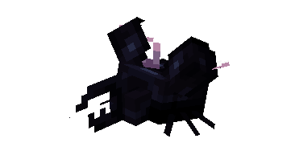

---

**Health: 5** [♥️♥️♥️]

---

**Classification:** [Arthropod](/minecraft.fandom.com/wiki/Arthropods)

---

**Behavior:** Passive 

---

**Spawn:**

**Random Variants:** [Plains, Jungle, & Bamboo Jungle](/minecraft.fandom.com/wiki/Dripstone_Caves)

**White Beetle:** [Lush Caves](/minecraft.fandom.com/wiki/Lush_Caves) & [Dripstone Caves](/minecraft.fandom.com/wiki/Dripstone_Caves)

---

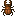

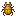

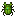

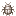

</aside>

---

### 🌎 Spawning

Beetles will spawn in groups of 1-2 and have 6 variants that will spawn underground in [Plains, Jungle, & Bamboo Jungle](/minecraft.fandom.com/wiki/Dripstone_Caves) biomes. The white beetle is the only one that will spawn in [Lush Caves](/minecraft.fandom.com/wiki/Lush_Caves) & [Dripstone Caves](/minecraft.fandom.com/wiki/Dripstone_Caves). 

---

### ⚔️ Drops

Beetle [drops](/minecraft.fandom.com/wiki/Drops) upon death:

- 0 - 1 Bug Wing.
    - ⚔️ The maximum amount is increased by 1 per level of [Looting](/minecraft.fandom.com/wiki/Looting), for a maximum of 0-3 with Looting III.
- 🟢1 - 3 [Experience](/minecraft.fandom.com/wiki/Experience) Orbs if killed by Player.

---

### 🧠 Behavior

Beetles are passive bugs that will take flight once a player approaches to attempt to flee. They do not flee from animals or mobs.

**Capture Net:**

Beetles can be caught in capture nets. If a beetle is caught, the beetle (in its variant) will enter a player’s inventory as an item. If the inventory is full, the beetle will drop to the ground in front of the player.

- A beetle is used by pressing ”use” on any surface (top, bottom, or side) of a block. When used on a top surface, the beetle appears with its feet immediately adjacent to the surface. This interaction is much like a [spawn egg](/minecraft.fandom.com/wiki/Spawn_Egg). The surfaces of blocks are prioritized for spawning; if none are within reach, mobs can also be spawned in [water](/minecraft.fandom.com/wiki/Water).
- Beetles can be fed to other animals for taming/[breeding](/minecraft.fandom.com/wiki/Breeding).

---

### 🖼️ Gallery

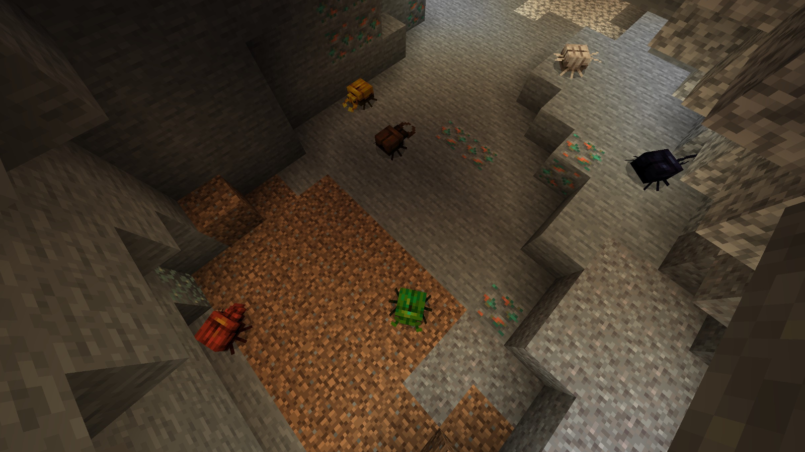

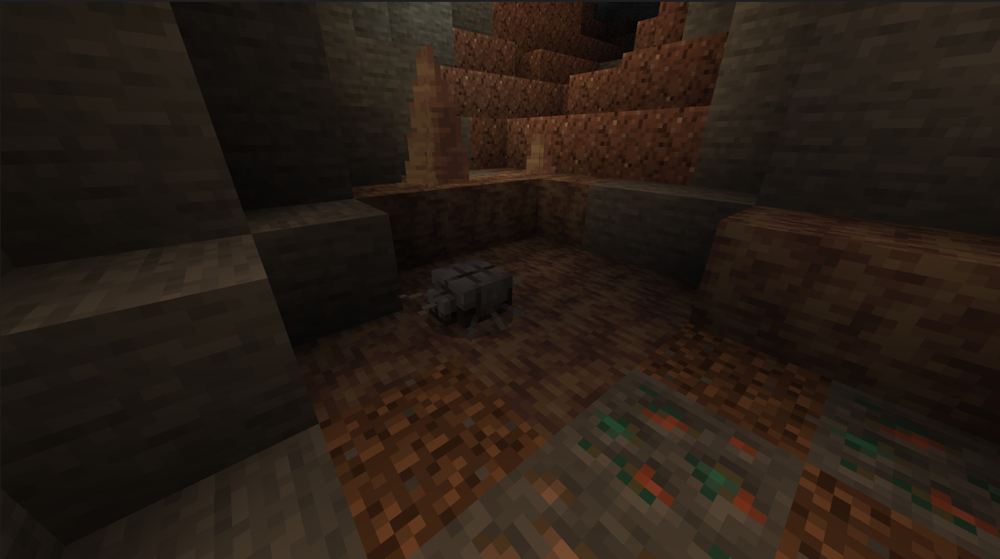

---

### 🎨 Variants

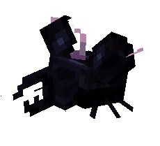

                Black Beetle

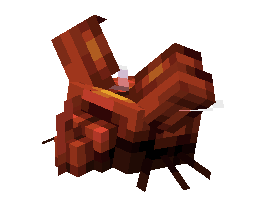

              Red Beetle

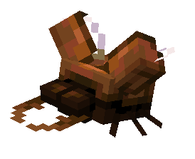

            Brown Beetle

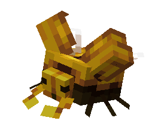

             Yellow Beetle

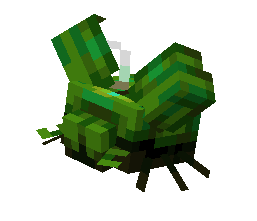

               Green Beetle

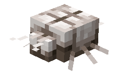

              White Beetle

---

<aside>
 Have additional questions? Want to be a part of our community? → [Join our Discord!](/discord.com/invite/starfishstudios)

</aside>

<aside>

[**Marketplace](/www.minecraft.net/en-us/marketplace/creator?name=Starfish%20Studios)      [CurseForge](/www.curseforge.com/members/starfish_studios/projects)      [TikTok](/www.tiktok.com/@starfishstudios)      [Instagram](/www.instagram.com/starfishstudiosinc/)      [Twitter](/twitter.com/starfishstudios)      [YouTube](/www.youtube.com/@starfishstudios)      [Website](/starfish-studios.com/)**

</aside>
