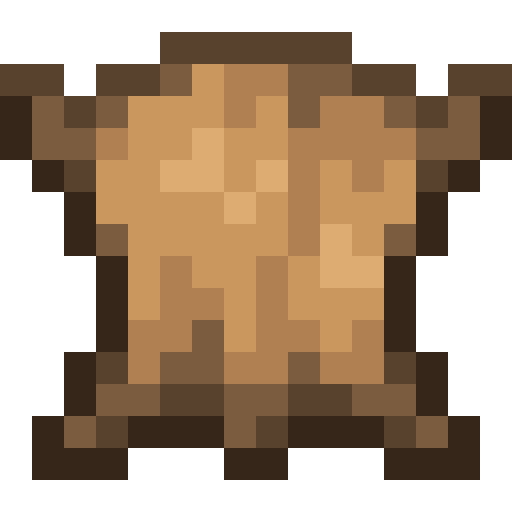
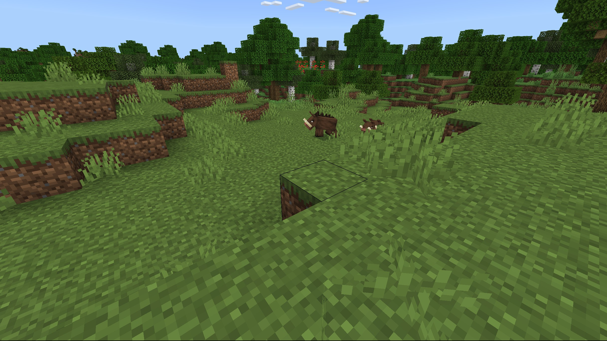
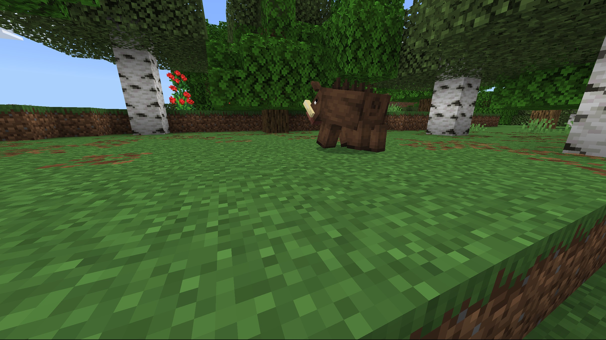

# Boar

Last Updated: April 22, 2025 8:47 PM

---

**Return**

🐻 [Naturalist Add-On Wiki](/www.notion.so/1a7a9a61c3f1800c8e32e893d6e7f430?pvs=21)

---

Wild boars are one of the most invasive species in the world. They earned this title because they damage crops, properties, vegetation, and soil when they are searching for food. Boars have poorly developed eyes but are capable of finding food sources, and their large snout provides them with an excellent sense of smell. 

<aside>

### **Boar**

---

**Health: 14** [♥️♥️♥️]

---

**Classification:** [Animal](/minecraft.fandom.com/wiki/Animal)

---

**Behavior:** Neutral

---

**Spawn:** [Plains](/minecraft.wiki/w/Plains) & [Forest](/minecraft.wiki/w/Forest)

---

</aside>

---

### 🌎 Spawning

Boars will spawn in groups of 1-4 in the [plains](/minecraft.wiki/w/Plains) and [forest](/minecraft.wiki/w/Forest) biomes as long as [grass](/minecraft.fandom.com/wiki/Grass_Block) is nearby! They will spawn in the daytime with [light levels](/minecraft.fandom.com/wiki/Light) between 6-15.

---

### ⚔️ Drops

Adult boar [drops](/minecraft.fandom.com/wiki/Drops) upon death:

- 0 - 3 [Raw Porkchop](/minecraft.wiki/w/Raw_Porkchop)
    - ⚔️ The maximum amount is increased by 1 per level of [Looting](/minecraft.fandom.com/wiki/Looting), for a maximum of 0-6 with Looting III.
- 0 - 3 [Cooked Porkchop](/minecraft.wiki/w/Cooked_Porkchop)
    - ⚔️ Cooked Porkchops can be dropped when killed on land with [Smelting](/minecraft.fandom.com/wiki/Fire_Aspect) or [Flame](/minecraft.fandom.com/wiki/Flame) enchantment.
- 0 - 2 Fat
- 0 - 2 Hide
- 🟢 1 - 3 [Experience](/minecraft.fandom.com/wiki/Experience) Orbs if killed by Player.
- 🟢 1 - 7 Experience Orbs upon [breeding](/minecraft.fandom.com/wiki/Breeding).

*Farrows yield no items nor experience.*

---

### 🧠 Behavior

Boars can exist in both passive and hostile states. Boars will avoid players as much as possible. If they are attacked, they will be aggressive towards their attacker and will not stop until either the attacker dies or they reach half health, at which point they will run away.

Unlike their pig counterparts, they **cannot** be equipped with [saddles](/minecraft.fandom.com/wiki/Saddle).

**Fun Fact:** When a boar is struck by [lightning](/minecraft.fandom.com/wiki/Lightning), it transforms into a [zoglin](/minecraft.fandom.com/wiki/Zoglin).

---

### 🥚Breeding

Adult boars with full health can be [bred](/minecraft.fandom.com/wiki/Breeding) with [carrots](/minecraft.wiki/w/Carrot), [beetroots](/minecraft.wiki/w/Beetroot), and [potatoes](/minecraft.wiki/w/Potato). There is a 5-minute cooldown for breeding, during which the boars will not accept any carrots, beetroots, or potatoes.

Upon successful breeding, a farrow will be born. The growth of farrows can be slowly accelerated by using carrots, beetroots, and potatoes. Farrows will stay near their parents until they are grown adults.

---

### 🖼️ Gallery

---

<aside>
 Have additional questions? Want to be a part of our community? → [Join our Discord!](/discord.com/invite/starfishstudios)

</aside>

<aside>

[**Marketplace](/www.minecraft.net/en-us/marketplace/creator?name=Starfish%20Studios)      [CurseForge](/www.curseforge.com/members/starfish_studios/projects)      [TikTok](/www.tiktok.com/@starfishstudios)      [Instagram](/www.instagram.com/starfishstudiosinc/)      [Twitter](/twitter.com/starfishstudios)      [YouTube](/www.youtube.com/@starfishstudios)      [Website](/starfish-studios.com/)**

</aside>
