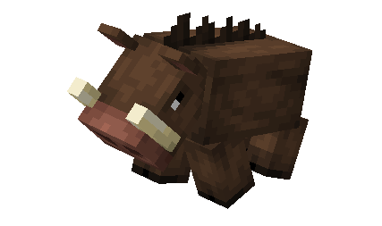
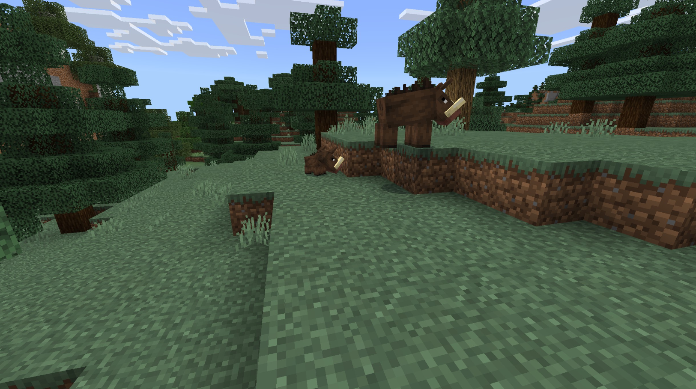

# Sanglier

Dernière mise à jour : 22 avril 2025 20h47

---

**Retour**

🐻 [Wiki de l'extension Naturalist](/www.notion.so/1a7a9a61c3f1800c8e32e893d6e7f430?pvs=21)

---

Les sangliers sauvages sont l'une des espèces les plus invasives au monde. Ils ont gagné ce titre car ils endommagent les cultures, les propriétés, la végétation et le sol lorsqu'ils recherchent de la nourriture. Les sangliers ont une vue peu développée mais sont capables de trouver des sources de nourriture, et leur grand museau leur fournit un excellent odorat.

<aside>

### **Sanglier**

---

**Santé : 14** [♥️♥️♥️]

---

**Classification :** [Animal](/minecraft.fandom.com/wiki/Animal)

---

**Comportement :** Neutre

---

**Apparition :** [Plaines](/minecraft.wiki/w/Plains) et [Forêt](/minecraft.wiki/w/Forest)

---

</aside>

---

### 🌎 Apparition

Les sangliers apparaîtront en groupes de 1 à 4 dans les biomes de [plaines](/minecraft.wiki/w/Plains) et de [forêt](/minecraft.wiki/w/Forest) tant qu'il y a de l'[herbe](/minecraft.fandom.com/wiki/Grass_Block) à proximité ! Ils apparaîtront pendant la journée avec des [niveaux de lumière](/minecraft.fandom.com/wiki/Light) entre 6 et 15.

---

### ⚔️ Butin

Le sanglier adulte [laisse tomber](/minecraft.fandom.com/wiki/Drops) à sa mort :

- 0 - 3 [Côte de porc crue](/minecraft.wiki/w/Raw_Porkchop)
    - ⚔️ La quantité maximale est augmentée de 1 par niveau de [Butin](/minecraft.fandom.com/wiki/Looting), pour un maximum de 0-6 avec Butin III
- 0 - 3 [Côte de porc cuite](/minecraft.wiki/w/Cooked_Porkchop)
    - ⚔️ Les côtes de porc cuites peuvent être obtenues lorsqu'elles sont tuées sur terre avec l'enchantement [Fonte](/minecraft.fandom.com/wiki/Fire_Aspect) ou [Flamme](/minecraft.fandom.com/wiki/Flame)
- 0 - 2 Graisse
- 0 - 2 Peau
- 🟢 1 - 3 Orbes d'[expérience](/minecraft.fandom.com/wiki/Experience) si tué par un joueur
- 🟢 1 - 7 Orbes d'expérience lors de la [reproduction](/minecraft.fandom.com/wiki/Breeding)

*Les marcassins ne donnent ni objets ni expérience.*

---

### 🧠 Comportement

Les sangliers peuvent exister dans des états passifs et hostiles. Les sangliers éviteront les joueurs autant que possible. S'ils sont attaqués, ils seront agressifs envers leur attaquant et ne s'arrêteront pas tant que l'attaquant ne sera pas mort ou qu'ils n'auront pas atteint la moitié de leur santé, moment auquel ils s'enfuiront.

Contrairement à leurs homologues cochons, ils **ne peuvent pas** être équipés de [selles](/minecraft.fandom.com/wiki/Saddle).

**Fait amusant :** Lorsqu'un sanglier est frappé par la [foudre](/minecraft.fandom.com/wiki/Lightning), il se transforme en [zoglin](/minecraft.fandom.com/wiki/Zoglin).

---

### 🥚Reproduction

Les sangliers adultes en pleine santé peuvent se [reproduire](/minecraft.fandom.com/wiki/Breeding) avec des [carottes](/minecraft.wiki/w/Carrot), des [betteraves](/minecraft.wiki/w/Beetroot) et des [pommes de terre](/minecraft.wiki/w/Potato). Il y a un temps de recharge de 5 minutes pour la reproduction, pendant lequel les sangliers n'accepteront aucune carotte, betterave ou pomme de terre.

Après une reproduction réussie, un marcassin naîtra. La croissance des marcassins peut être lentement accélérée en utilisant des carottes, des betteraves et des pommes de terre. Les marcassins resteront près de leurs parents jusqu'à ce qu'ils soient des adultes.

---

### 🖼️ Galerie

---

<aside>
 Des questions supplémentaires ? Vous voulez faire partie de notre communauté ? → [Rejoignez notre Discord !](/discord.com/invite/starfishstudios)

</aside>

<aside>

[**Marketplace](/www.minecraft.net/en-us/marketplace/creator?name=Starfish%20Studios)      [CurseForge](/www.curseforge.com/members/starfish_studios/projects)      [TikTok](/www.tiktok.com/@starfishstudios)      [Instagram](/www.instagram.com/starfishstudiosinc/)      [Twitter](/twitter.com/starfishstudios)      [YouTube](/www.youtube.com/@starfishstudios)      [Website](/starfish-studios.com/)**

</aside> 