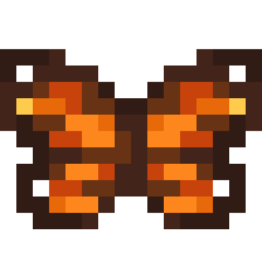

# Butterfly

Last Updated: April 22, 2025 8:47 PM

---

**Return**

🐻 [Naturalist Add-On Wiki](/www.notion.so/1a7a9a61c3f1800c8e32e893d6e7f430?pvs=21)

---

Butterflies are unique arthropods with each one ranging in beautiful colored wings. The wings are covered by thousands of tiny scales that reflect light in different colors. Butterflies are quick in flight, with a top speed of 12 miles per hour, so if you want to capture one with a capture net, then you must be faster!

<aside>

### **Butterfly**

---

**Health: 10** [♥️♥️♥️]

---

**Classification:** [Arthropod](/minecraft.fandom.com/wiki/Arthropods)

---

**Behavior:** Passive

---

**Spawn:** [Forest](/minecraft.wiki/w/Forest), [Flower Forest](/minecraft.wiki/w/Flower_Forest), & [Swamp](/minecraft.wiki/w/Swamp)

---

</aside>

---

### 🌎 Spawning

Butterflies spawn in a kaleidoscope of 1-3 in [forest](/minecraft.wiki/w/Forest), [flower forest](/minecraft.wiki/w/Flower_Forest), and [swamp](/minecraft.wiki/w/Swamp) biomes. Butterflies thrive in warmer biomes, so they’ll avoid anything frozen! They will spawn during the day with [light levels](/minecraft.fandom.com/wiki/Light) of 9-15.

Butterflies spawn in a total of 5 random variants: ***Monarchs, Swallowtails, Clouded Yellows, Cabbage Whites, and Blue Morphos***.

---

### ⚔️ Drops

Butterfly [drops](/minecraft.fandom.com/wiki/Drops) upon death:

- 0 - 1 [Bone Meal](/minecraft.wiki/w/Bone_Meal)
    - ⚔️ The maximum amount is increased by 1 per level of [Looting](/minecraft.fandom.com/wiki/Looting), for a maximum of 0-3 with Looting III
- 🟢 1 - 3 [Experience](/minecraft.fandom.com/wiki/Experience) Orbs if killed by Player.
- 🟢 1 - 7 Experience Orbs upon [breeding](/minecraft.fandom.com/wiki/Breeding).

---

### 🧠 Behavior

Butterflies ****are flying [passive mobs](/minecraft.fandom.com/wiki/Passive_mob) that can be found flying around in forest biomes. Similar to [bees](/minecraft.fandom.com/wiki/Bee), they also pollinate flowers and crops but do not create any byproducts like [honeycomb](/minecraft.fandom.com/wiki/Honeycomb). Butterfly pollination is identical to [bee pollination](/minecraft.fandom.com/wiki/Bee#Pollinating), except they do not return to a hive to produce honeycomb like a bee would.

Chrysalises can be picked up with [Shears](/minecraft.fandom.com/wiki/Shears) — if Shears are not used, they will be destroyed.

**Weakness:**

Butterflies are considered [arthropods](/minecraft.fandom.com/wiki/Arthropod) and take increased [damage](/minecraft.fandom.com/wiki/Damage) from the [Bane of Arthropods](/minecraft.fandom.com/wiki/Bane_of_Arthropods) enchantment.

**Capture Net:**

Butterflies can be caught in capture nets. If a butterfly is caught, the butterfly (in its variant) will enter a player’s inventory as an item. If the inventory is full, the butterfly will drop to the ground in front of the player.

- A butterfly is used by pressing ”use” on any surface (top, bottom, or side) of a block. When used on a top surface, the butterfly appears with its feet immediately adjacent to the surface. This interaction is much like a [spawn egg](/minecraft.fandom.com/wiki/Spawn_Egg). The surfaces of blocks are prioritized for spawning; if none are within reach, mobs can also be spawned in [water](/minecraft.fandom.com/wiki/Water).
- Butterflies can be fed to other animals for taming/[breeding](/minecraft.fandom.com/wiki/Breeding).

---

### 🥚Breeding

Butterflies can be bred with [red flowers](/minecraft.wiki/w/Poppy), [yellow flowers](/minecraft.wiki/w/Dandelion), [wither roses](/minecraft.wiki/w/Wither_Rose), [sunflowers](/minecraft.wiki/w/Sunflower), [lilacs](/minecraft.wiki/w/Lilac), [rose bushes](/minecraft.wiki/w/Rose_Bush), [peonies](/minecraft.wiki/w/Peony), [flowering azalea](/minecraft.wiki/w/Flowering_Azalea), [azalea leaves flowered](/minecraft.wiki/w/Leaves#Flowering_Azalea), and [mangrove propagules](/minecraft.wiki/w/Mangrove_Propagule). There is a 5-minute cooldown for breeding, during which butterflies do not accept any items for breeding.

Upon successful breeding, a caterpillar will be born. Caterpillars can be fed the same items that butterflies eat to breed; however, they will not instantly grow up to be a butterfly. Caterpillars will find a nearby [log](/minecraft.wiki/w/Log#Pale_Oak) to form their cocoon to begin metamorphosis. Each feedable item will decrease the timer that caterpillars have before they begin to look for a log to cocoon on.

---

### 🖼️ Gallery

---

### 🎨 Variants

                Blue Morpho

                Cabbage White

               Clouded Yellow

                              Monarch

                             Swallowtail

---

<aside>
 Have additional questions? Want to be a part of our community? → [Join our Discord!](/discord.com/invite/starfishstudios)

</aside>

<aside>

[**Marketplace](/www.minecraft.net/en-us/marketplace/creator?name=Starfish%20Studios)      [CurseForge](/www.curseforge.com/members/starfish_studios/projects)      [TikTok](/www.tiktok.com/@starfishstudios)      [Instagram](/www.instagram.com/starfishstudiosinc/)      [Twitter](/twitter.com/starfishstudios)      [YouTube](/www.youtube.com/@starfishstudios)      [Website](/starfish-studios.com/)**

</aside>
