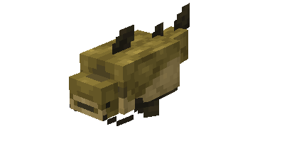
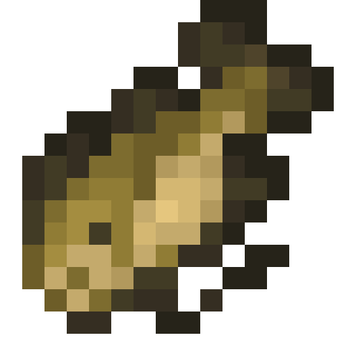
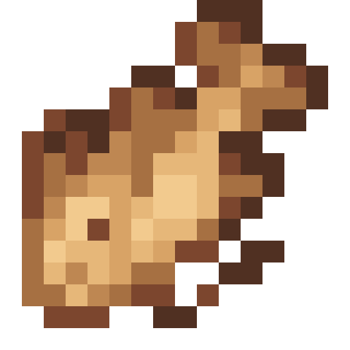
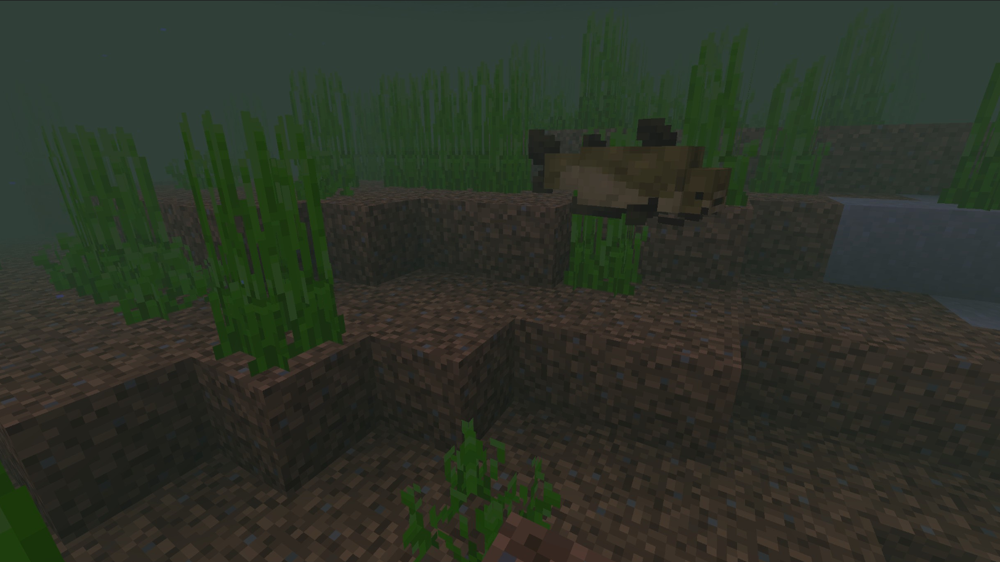
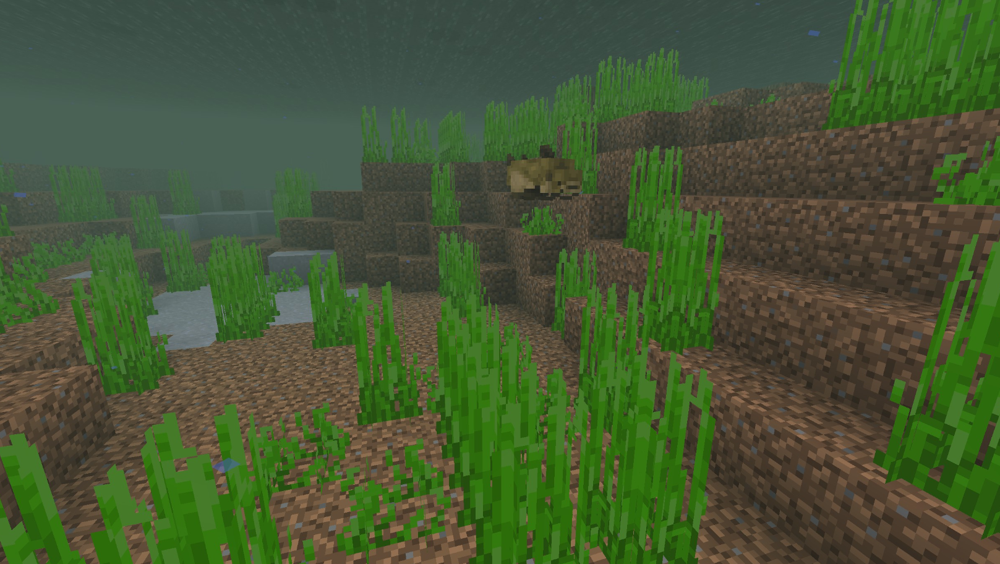

# Catfish

Last Updated: April 22, 2025 8:47 PM

---

**Return**

🐻 [Naturalist Add-On Wiki](/www.notion.so/1a7a9a61c3f1800c8e32e893d6e7f430?pvs=21)

---

Catfish are bottom-dweller fish that spend most of their time at or near the bottom of bodies of water. Their flattened bodies and downward-facing mouths are well-suited for scavenging on the river. They have taste buds not just in their mouths but all over their bodies that help them detect food, even in dark or murky waters.

<aside>

### **Catfish**

---

**Health: 3** [♥️♥️♥️]

---

**Classification:** [Animal](/minecraft.fandom.com/wiki/Animal) / [Aquatic](/minecraft.fandom.com/wiki/Aquatic)

---

**Behavior:** Passive

---

**Spawn:** [Swamps & Variants](/minecraft.fandom.com/wiki/Swamp)

---

</aside>

---

### 🌎 Spawning

Catfish will spawn by themselves underwater in ****[swamps & their variants](/minecraft.fandom.com/wiki/Swamp) of biomes. You will spot these fish as long as the biomes are not frozen. They can be found between Y 0 and Y 64.

---

### ⚔️ Drops

Catfish [drops](/minecraft.fandom.com/wiki/Drops) upon death:

- 1 Raw Catfish
    - ⚔️ The maximum amount is increased by 1 per level of [Looting](/minecraft.fandom.com/wiki/Looting), for a maximum of 0-3 with Looting III.
- 1 Cooked Catfish
    - ⚔️ Cooked Catfish can be dropped when killed on land with [Smelting](/minecraft.fandom.com/wiki/Fire_Aspect) or [Flame](/minecraft.fandom.com/wiki/Flame) enchantment. This will not work when Catfish is killed underwater.
- 🟢 1 - 3 [Experience](/minecraft.fandom.com/wiki/Experience) Orbs if killed by Player.

---

### 🧠 Behavior

Catfish are passive aquatic creatures that tend to fend for themselves when swimming in swamps and variants.

The player may collect catfish by using a [water bucket](/minecraft.fandom.com/wiki/Water_bucket) on it, which gives the player a bucket of catfish. Catfish placed with buckets do not despawn naturally. When that fish bucket is used against a block, it empties the bucket, placing water with the bass swimming in it.

**Weakness:**

Catfish are unable to survive out of water. Outside of water, they flop around for a while until, eventually, they start to suffocate and die. Catfish will flop on their sides. Catfish cannot be put in a [cauldron](/minecraft.fandom.com/wiki/Cauldron).

Catfish are vulnerable to weapons that have the [Impaling](Bass%201dd816019a9f81379eecf7c25ed7e23f.md) enchantment.

---

### 🖼️ Gallery

---

<aside>
 Have additional questions? Want to be a part of our community? → [Join our Discord!](/discord.com/invite/starfishstudios)

</aside>

<aside>

[**Marketplace](/www.minecraft.net/en-us/marketplace/creator?name=Starfish%20Studios)      [CurseForge](/www.curseforge.com/members/starfish_studios/projects)      [TikTok](/www.tiktok.com/@starfishstudios)      [Instagram](/www.instagram.com/starfishstudiosinc/)      [Twitter](/twitter.com/starfishstudios)      [YouTube](/www.youtube.com/@starfishstudios)      [Website](/starfish-studios.com/)**

</aside>
