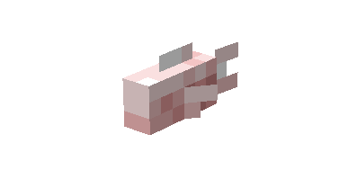
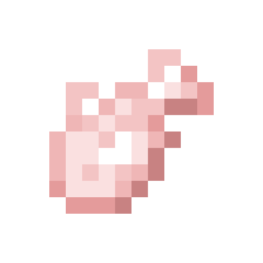
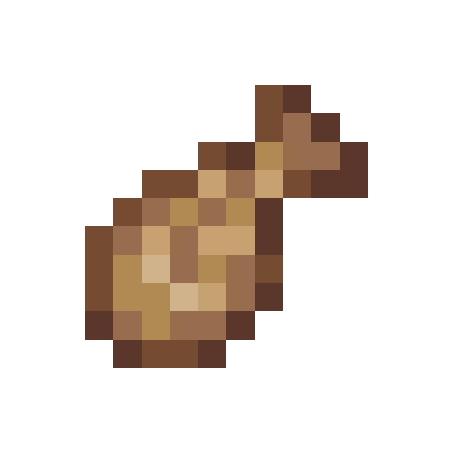
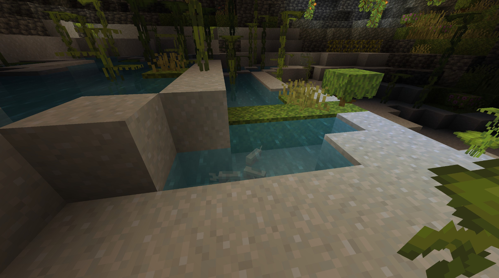
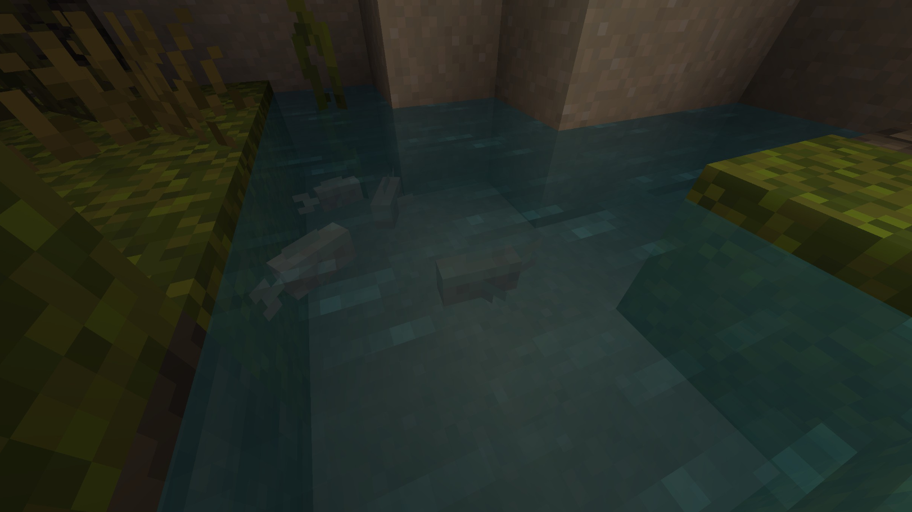

# Cavefish

Last Updated: April 22, 2025 8:47 PM

---

**Return**

🐻 [Naturalist Add-On Wiki](/www.notion.so/1a7a9a61c3f1800c8e32e893d6e7f430?pvs=21)

---

Cavefish are passive fish that dwell in cave environments. Their pale colors are due to the lack of melanin pigment, and they have reduced eyesight to adapt to dark cave environments. Many species of cavefish have no eyes at all!

<aside>

### **Cavefish**

---

**Health: 3** [♥️♥️♥️]

---

**Classification:** [Animal](/minecraft.fandom.com/wiki/Animal) / [Aquatic](/minecraft.fandom.com/wiki/Aquatic)

---

**Behavior:** Passive

---

**Spawn:** [Lush Caves](/minecraft.wiki/w/Lush_Caves) & [Dripstone Caves](/minecraft.wiki/w/Dripstone_Caves)

---

</aside>

---

### 🌎 Spawning

Cavefish will spawn in groups of 1-5 within [lush caves](/minecraft.wiki/w/Lush_Caves) and [dripstone caves](/minecraft.wiki/w/Dripstone_Caves). They are exclusive to underground and underwater. If you find a canyon where a lush cave or dripstone cave can see the sun, it is best to keep hunting for another one! They will spawn between Y 30 and Y -64.

---

### ⚔️ Drops

Cavefish [drops](/minecraft.fandom.com/wiki/Drops) upon death:

- 1 - 3 Raw Cavefish
    - ⚔️ The maximum amount is increased by 1 per level of [Looting](/minecraft.fandom.com/wiki/Looting), for a maximum of 1-6 with Looting III.
- 1 - 3 Cooked Cavefish
    - ⚔️ Cooked Cavefish can be dropped when killed on land with [Smelting](/minecraft.fandom.com/wiki/Fire_Aspect) or [Flame](/minecraft.fandom.com/wiki/Flame) enchantment. This will not work when the Cavefish is killed underwater.
- 🟢 3 [Experience](/minecraft.fandom.com/wiki/Experience) Orbs if killed by Player.

---

### 🧠 Behavior

Cavefish are passive aquatic creatures that tend to swim in schools with a maximum of five per school.

The player may collect cavefish by using a [water bucket](/minecraft.fandom.com/wiki/Water_bucket) on it, which gives the player a bucket of cavefish. Cavefish placed with buckets do not despawn naturally. When that fish bucket is used against a block, it empties the bucket, placing water with the cavefish swimming in it.

**Weakness:**

Cavefish are unable to survive out of water. Outside of water, they flop around for a while until, eventually, they start to suffocate and die. Cavefish will flop on their sides. Cavefish cannot be put in a [cauldron](/minecraft.fandom.com/wiki/Cauldron).

---

### 🖼️ Gallery

---

<aside>
 Have additional questions? Want to be a part of our community? → [Join our Discord!](/discord.com/invite/starfishstudios)

</aside>

<aside>

[**Marketplace](/www.minecraft.net/en-us/marketplace/creator?name=Starfish%20Studios)      [CurseForge](/www.curseforge.com/members/starfish_studios/projects)      [TikTok](/www.tiktok.com/@starfishstudios)      [Instagram](/www.instagram.com/starfishstudiosinc/)      [Twitter](/twitter.com/starfishstudios)      [YouTube](/www.youtube.com/@starfishstudios)      [Website](/starfish-studios.com/)**

</aside>
