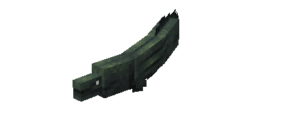
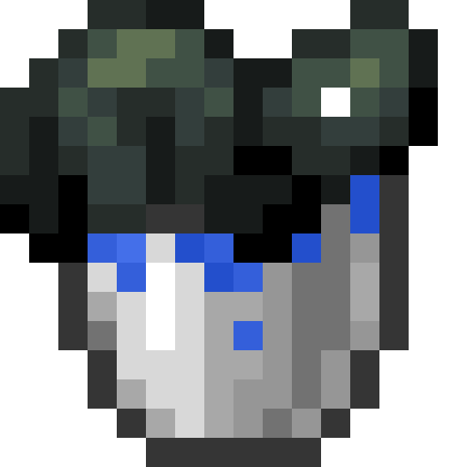
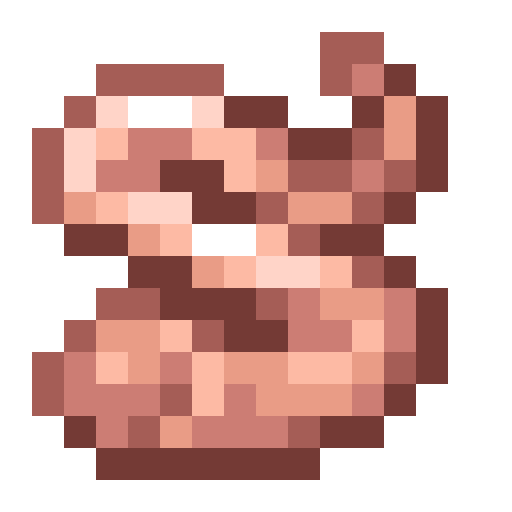
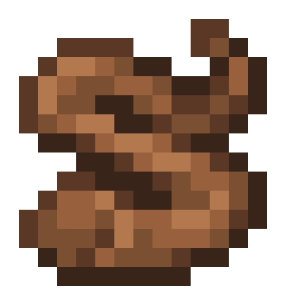
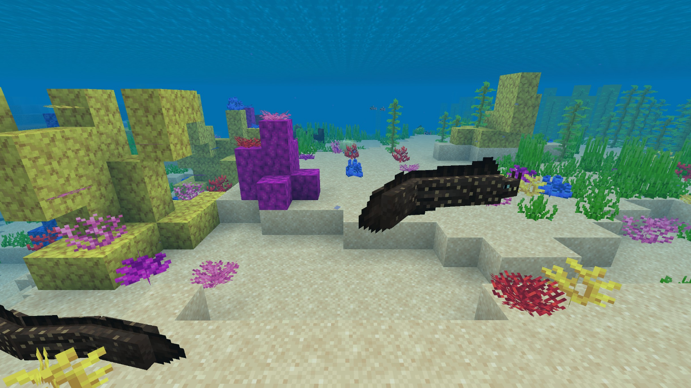
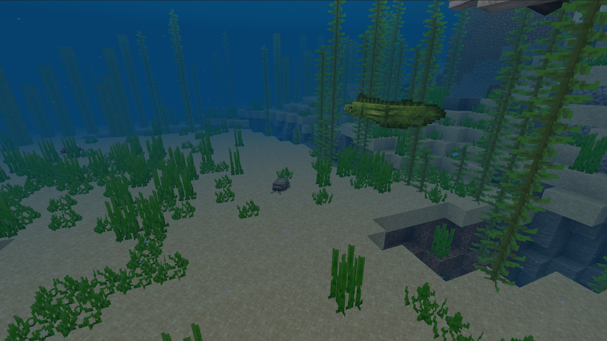
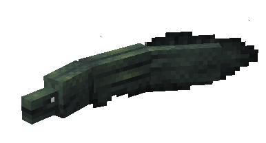
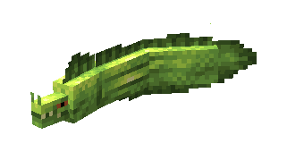
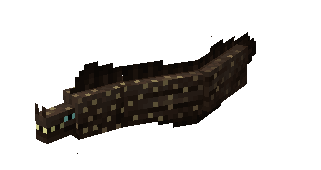

# Eel

Last Updated: April 22, 2025 8:47 PM

---

**Return**

🐻 [Naturalist Add-On Wiki](/www.notion.so/1a7a9a61c3f1800c8e32e893d6e7f430?pvs=21)

---

Eels are not technically classified as fish; they belong to a group called anguilliform. They are distinct creatures and known for their long, slimy, and slippery bodies, which help them navigate through tight spaces and protect them from predators. Eels hunt with their sense of smell, not their eyes, to detect food in their environment. Eels are incredibly territorial and have strong bites to help fend off any unwelcome visitors to their homes.

<aside>

### **Eel**

---

**Health: 8** [♥️♥️♥️]

---

**Classification:** [Animal](/minecraft.fandom.com/wiki/Animal) / [Aquatic](/minecraft.fandom.com/wiki/Aquatic)

---

**Behavior:** Neutral

---

**Spawn:** [Overworld Biomes](/minecraft.wiki/w/Overworld)

*(See breakdown below)*

---

</aside>

---

### 🌎 Spawning

There are 3 variations of the eel with their own unique set of spawn conditions.

| Eel Variation | Spawn Biomes | Will Not Spawn | Spawn Group | Y Level |
| --- | --- | --- | --- | --- |
| Electric Eel | [Deep Ocean](/minecraft.wiki/w/Deep_Ocean) |  | 1-2 | 0 - 50 |
| Moray | [Ocean](/minecraft.wiki/w/Ocean) | [Deep Ocean](/minecraft.wiki/w/Deep_Ocean)
[Frozen Ocean](/minecraft.wiki/w/Frozen_Ocean)
[Warm Ocean](/minecraft.wiki/w/Warm_Ocean) | 1-4 | 0 - 64 |
| Spotted Moray | [Warm Ocean](/minecraft.wiki/w/Warm_Ocean) |  | 1-3 | 0 - 64 |

---

### ⚔️ Drops

Eel [drops](/minecraft.fandom.com/wiki/Drops) upon death:

- 1 Raw Eel
    - ⚔️ The maximum amount is increased by 1 per level of [Looting](/minecraft.fandom.com/wiki/Looting), for a maximum of 1-3 with Looting III.
- 1 Cooked Eel
    - ⚔️ Cooked Eel can be dropped when killed on land with [Smelting](/minecraft.fandom.com/wiki/Fire_Aspect) or [Flame](/minecraft.fandom.com/wiki/Flame) enchantment. This will not work when the Eel is killed underwater.
- 🟢 3 [Experience](/minecraft.fandom.com/wiki/Experience) Orbs if killed by Player.

---

### 🧠 Behavior

Eels are neutral mobs that swim around ocean biomes. Eels will bite if the player gets too close, and the Electric Eel variant will sting the player (much like a pufferfish) when it is brushed up against. 

The player may collect eels by using a [water bucket](/minecraft.fandom.com/wiki/Water_bucket) on it, which gives the player a bucket of electric eel/bucket of moray/bucket of spotted moray. Eels placed with buckets do not despawn naturally. When that fish bucket is used against a block, it empties the bucket, placing water with the eel swimming in it.

**Weakness:**

Eels are unable to survive out of water. Outside of water, they flop around for a while until, eventually, they start to suffocate and die. Eels will flop on their sides. Eels cannot be put in a [cauldron](/minecraft.fandom.com/wiki/Cauldron).

---

### 🖼️ Gallery

---

### 🎨 Variants

             Electric Eel

               Moray

           Spotted Moray

---

<aside>
 Have additional questions? Want to be a part of our community? → [Join our Discord!](/discord.com/invite/starfishstudios)

</aside>

<aside>

[**Marketplace](/www.minecraft.net/en-us/marketplace/creator?name=Starfish%20Studios)      [CurseForge](/www.curseforge.com/members/starfish_studios/projects)      [TikTok](/www.tiktok.com/@starfishstudios)      [Instagram](/www.instagram.com/starfishstudiosinc/)      [Twitter](/twitter.com/starfishstudios)      [YouTube](/www.youtube.com/@starfishstudios)      [Website](/starfish-studios.com/)**

</aside>
