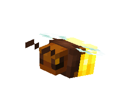
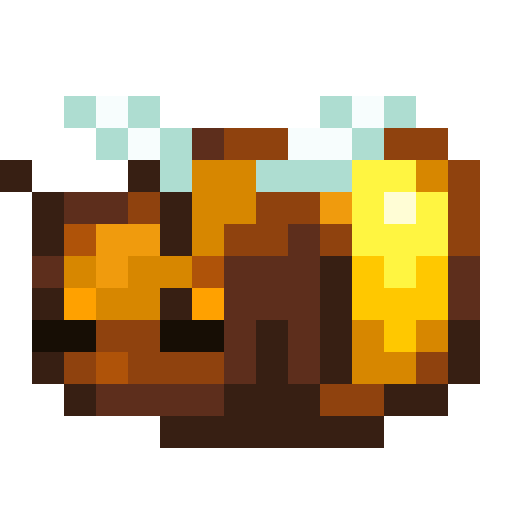
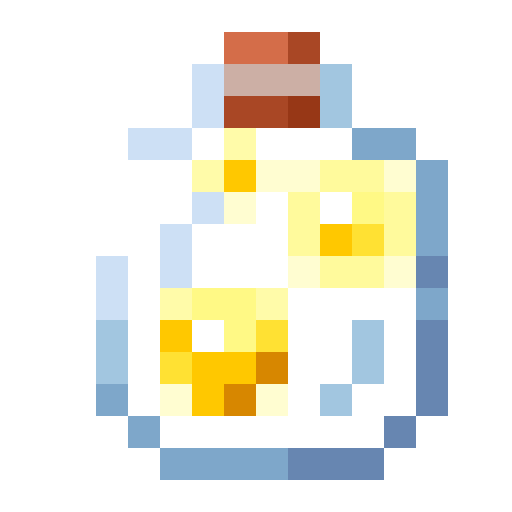
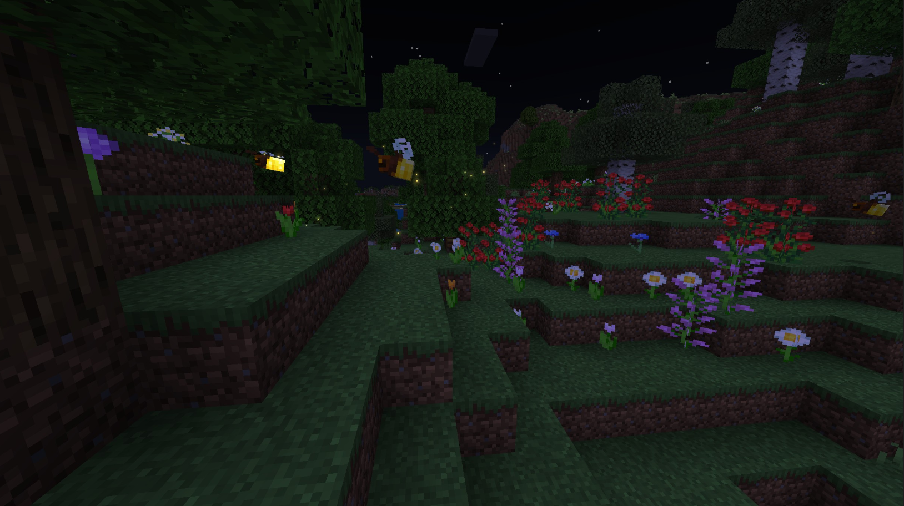
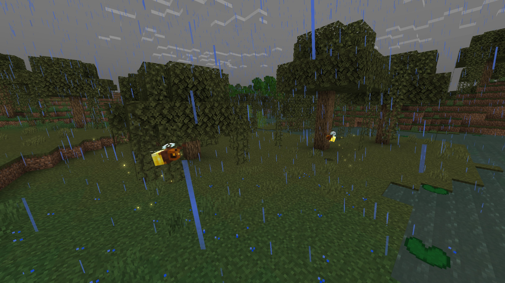
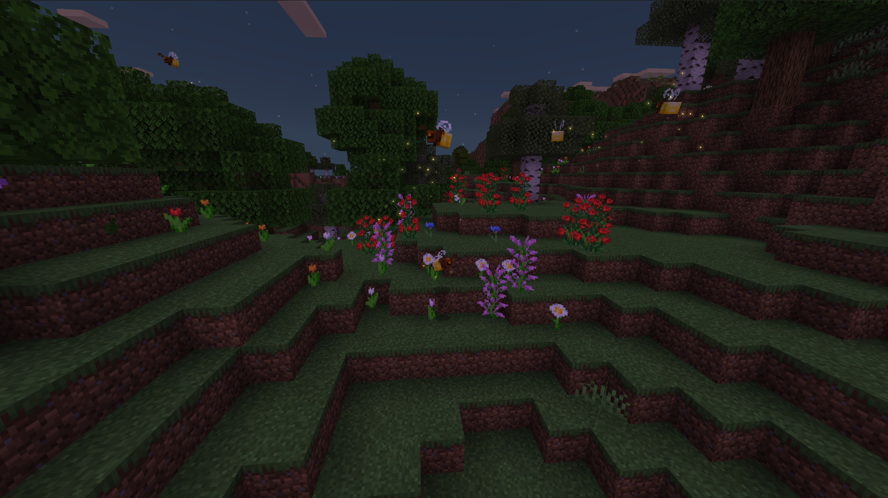

# Firefly

Last Updated: April 22, 2025 8:47 PM

---

**Return**

🐻 [Naturalist Add-On Wiki](/www.notion.so/1a7a9a61c3f1800c8e32e893d6e7f430?pvs=21)

---

Fireflies are not actually flies, but they are considered beetles. They are bioluminescent, producing their own light, which makes them easily identifiable at night. Large groups of fireflies sometimes blink in unison, but their light blinks are a way of communicating with each other!

<aside>

### **Firefly**

---

**Health: 6** [♥️♥️♥️]

---

**Classification:** [Arthropod](/minecraft.fandom.com/wiki/Arthropods)

---

**Behavior:** Passive

---

**Spawn:** [Forest](/minecraft.wiki/w/Forest), [Flower Forest](/minecraft.wiki/w/Flower_Forest), [Grove](/minecraft.wiki/w/Grove), [Mangrove Swamp](/minecraft.fandom.com/wiki/Swamp), [Mooshroom Island](/minecraft.wiki/w/Mushroom_Fields), & [Swamp](/minecraft.fandom.com/wiki/Swamp)

---

</aside>

---

### 🌎 Spawning

Fireflies spawn in a glow of 2-3 in the [forest](/minecraft.wiki/w/Forest), [flower forest](/minecraft.wiki/w/Flower_Forest), [grove](/minecraft.wiki/w/Grove), [mangrove swamp](/minecraft.fandom.com/wiki/Swamp), [mooshroom island](/minecraft.wiki/w/Mushroom_Fields), and [swamp](/minecraft.fandom.com/wiki/Swamp) biomes. You will not find these bugs in frozen variants of the biomes listed or in [extreme hills](/minecraft.wiki/w/Windswept_Hills). They will only spawn at night with [light levels](/minecraft.fandom.com/wiki/Light) of 0-7. They will spawn as long as there is [grass](/minecraft.fandom.com/wiki/Grass_Block), [mud](/minecraft.fandom.com/wiki/Mud), or [leaves](/minecraft.wiki/w/Leaves) around. They are easily identifiable with their emissive textures to make them glow!

---

### ⚔️ Drops

Firefly [drops](/minecraft.fandom.com/wiki/Drops) upon death (only if killed by Player):

- 0 - 1 [Glowstone Dust](/minecraft.wiki/w/Glowstone_Dust)
    - ⚔️ The maximum amount is increased by 1 per level of [Looting](/minecraft.fandom.com/wiki/Looting), for a maximum of 0-3 with Looting III.
- 0 - 1 Bug Wing
    - ⚔️ The maximum amount is increased by 1 per level of [Looting](/minecraft.fandom.com/wiki/Looting), for a maximum of 0-3 with Looting III.
- 🟢 1 - 3 [Experience](/minecraft.fandom.com/wiki/Experience) Orbs if killed by Player.

---

### 🧠 Behavior

Fireflies are passive arthropods that fly around aimlessly, flickering their glowing behind off and on in random intervals.

Fireflies will despawn under the following conditions:

- Daylight and not nametagged.
- Daylight and not in a persistent condition such as a boat.

 

**Capture Net:**

Fireflies can be caught in capture nets. If a firefly is caught, it will enter a player’s inventory as an item. If the inventory is full, the firefly will drop to the ground in front of the player.

- A firefly is used by pressing ”use” on any surface (top, bottom, or side) of a block. When used on a top surface, the firefly appears on the surface. This interaction is much like a [spawn egg](/minecraft.fandom.com/wiki/Spawn_Egg). The surfaces of blocks are prioritized for spawning; if none are within reach, mobs can also be spawned in [water](/minecraft.fandom.com/wiki/Water).
- Fireflies can be fed to other animals for taming/[breeding](/minecraft.fandom.com/wiki/Breeding).

**Jar:**

Fireflies can be caught in empty jars. If a firefly is caught, the jar will turn into a firefly jar in the player’s inventory. The firefly jar is a placeable item within the world that provides an excellent light source as it blinks off and on.

---

### 🖼️ Gallery

---

<aside>
 Have additional questions? Want to be a part of our community? → [Join our Discord!](/discord.com/invite/starfishstudios)

</aside>

<aside>

[**Marketplace](/www.minecraft.net/en-us/marketplace/creator?name=Starfish%20Studios)      [CurseForge](/www.curseforge.com/members/starfish_studios/projects)      [TikTok](/www.tiktok.com/@starfishstudios)      [Instagram](/www.instagram.com/starfishstudiosinc/)      [Twitter](/twitter.com/starfishstudios)      [YouTube](/www.youtube.com/@starfishstudios)      [Website](/starfish-studios.com/)**

</aside>
