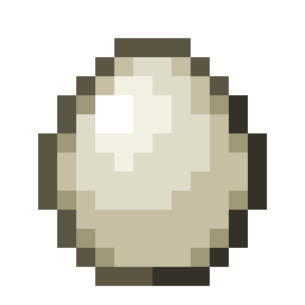

# Goose

Last Updated: April 22, 2025 8:47 PM

---

**Return**

🐻 [Naturalist Add-On Wiki](/www.notion.so/1a7a9a61c3f1800c8e32e893d6e7f430?pvs=21)

---

Geese are social animals that are often seen in large groups known as flocks. They have a strong sense of community and rely on each other for protection and foraging. These birds migrate to warmer temperatures and fly in a V-shaped formation to conserve energy and communicate during flight. Geese are herbivorous and love to munch on seeds!

<aside>

### **Goose**

---

**Health: 9** [♥️♥️♥️]

---

**Classification:** [Animal](/minecraft.fandom.com/wiki/Animal)

---

**Behavior:** Passive

---

**Spawn:** [Birch Forest](/minecraft.wiki/w/Birch_Forest), [Birch Forest Hills](/minecraft.wiki/w/Birch_Forest_Hills), [Birch Forest Mutated](/minecraft.wiki/w/Old_Growth_Birch_Forest), [Plains](/minecraft.wiki/w/Plains), & [Rivers](/minecraft.wiki/w/River)

---

</aside>

---

### 🌎 Spawning

Geese will spawn in a flock of 1-5 during the daytime with [light levels](/minecraft.fandom.com/wiki/Light) between 9-15. They will spawn in the [birch forest](/minecraft.wiki/w/Birch_Forest), [birch forest hills](/minecraft.wiki/w/Birch_Forest_Hills), [birch forest mutated](/minecraft.wiki/w/Old_Growth_Birch_Forest), [plains](/minecraft.wiki/w/Plains), and [river](/minecraft.wiki/w/River) biomes. You’ll find them near [grass](/minecraft.wiki/w/Short_Grass), [dirt](/minecraft.wiki/w/Dirt), [mud](/minecraft.fandom.com/wiki/Mud), [sand](/minecraft.wiki/w/Sand), and [water](/minecraft.wiki/w/Water)!

---

### ⚔️ Drops

Adult goose [drops](/minecraft.fandom.com/wiki/Drops) upon death:

- 0 - 2 [Feather](/minecraft.wiki/w/Feather)
    - ⚔️ The maximum amount is increased by 1 per level of [Looting](/minecraft.fandom.com/wiki/Looting), for a maximum of 0-4 with Looting III.
- 0 - 1 Raw Goose
    - ⚔️ The maximum amount is increased by 1 per level of [Looting](/minecraft.fandom.com/wiki/Looting), for a maximum of 0-3 with Looting III.
- 0 - 1 Cooked Goose
    - ⚔️ Cooked Goose can be dropped when killed on land with [Smelting](/minecraft.fandom.com/wiki/Fire_Aspect) or [Flame](/minecraft.fandom.com/wiki/Flame) enchantment. This will not work when the Goose is killed in the water.
- 🟢 1 - 3 [Experience](/minecraft.fandom.com/wiki/Experience) Orbs if killed by Player.
- 🟢 1 - 7 Experience Orbs upon [breeding](/minecraft.fandom.com/wiki/Breeding).

*Goslings yield no items nor experience.*

---

### 🧠 Behavior

Geese are passive birds that can be found in flocks of up to 5 birds. You can find them swimming in nearby waters or slapping their webbed feet on the ground. Geese love to swim; they will bring in their legs and float on water as they move about. They wander around aimlessly, but they will follow a player with seeds much like a chicken does!

---

### ❤️ Taming, Healing, & Feeding

Geese can be tamed with [wheat seeds](/minecraft.wiki/w/Wheat_Seeds), [beetroot seeds](/minecraft.wiki/w/Beetroot_Seeds), [melon seeds](/minecraft.wiki/w/Melon_Seeds), [pumpkin seeds](/minecraft.wiki/w/Pumpkin_Seeds), [pitcher pods](/minecraft.wiki/w/Pitcher_Pod), and [torchflower seeds](/minecraft.wiki/w/Torchflower_Seeds). There is a 33% chance of successful taming. Once they are tamed, you will see hearts appear and a bow at the base of their neck signifying you have tamed the goose. You can [dye](/minecraft.fandom.com/wiki/Dye) the bow to your color of choice or use [shears](/minecraft.fandom.com/wiki/Shears) to cut off the bow. If you shear off the bow, it can be reapplied by using a dye color of your choice.

Tamed geese can be commanded to sit or to follow.

- Geese will teleport to the player if the player is further than 10 blocks away.
- Geese will not teleport to the player if they are commanded to sit.

If a goose you have tamed gets injured, you can feed it wheat seeds, beetroot seeds, melon seeds, pumpkin seeds, pitcher pods, and torchflower seeds to increase its [health](/minecraft.fandom.com/wiki/Health) until it is maxed. 1 seed or pod increases the goose’s health points by 2. An injured goose will be unable to breed until it is healed. 

---

### 🥚Breeding

Adult geese with full health can be [bred](/minecraft.fandom.com/wiki/Breeding) with [wheat seeds](/minecraft.wiki/w/Wheat_Seeds), [beetroot seeds](/minecraft.wiki/w/Beetroot_Seeds), [melon seeds](/minecraft.wiki/w/Melon_Seeds), [pumpkin seeds](/minecraft.wiki/w/Pumpkin_Seeds), [pitcher pods](/minecraft.wiki/w/Pitcher_Pod), and [torchflower seeds](/minecraft.wiki/w/Torchflower_Seeds). There is a 5-minute cooldown for breeding, during which the goose does not accept seeds for breeding but will if they get injured and need to heal.

Upon successful breeding, a gosling will be born. The growth of goslings can be slowly accelerated by using seeds.

---

### 🖼️ Gallery

---

### 🎨 Variants

                   Goose

              White Goose

              Baby Goose

---

<aside>
 Have additional questions? Want to be a part of our community? → [Join our Discord!](/discord.com/invite/starfishstudios)

</aside>

<aside>

[**Marketplace](/www.minecraft.net/en-us/marketplace/creator?name=Starfish%20Studios)      [CurseForge](/www.curseforge.com/members/starfish_studios/projects)      [TikTok](/www.tiktok.com/@starfishstudios)      [Instagram](/www.instagram.com/starfishstudiosinc/)      [Twitter](/twitter.com/starfishstudios)      [YouTube](/www.youtube.com/@starfishstudios)      [Website](/starfish-studios.com/)**

</aside>
