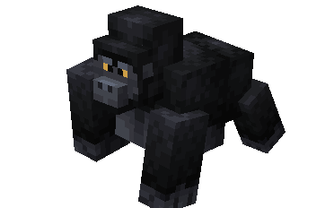
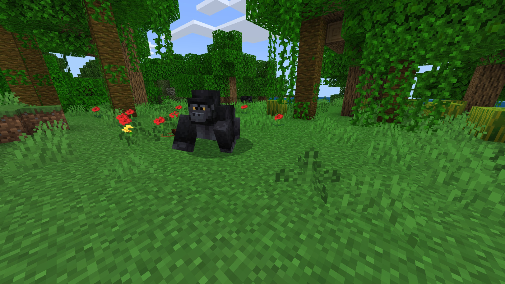
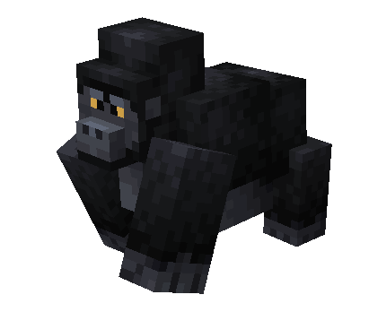
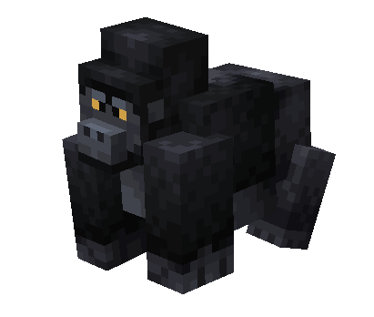

# Gorilla

Last Updated: April 22, 2025 8:47 PM

---

**Return**

🐻 [Naturalist Add-On Wiki](/www.notion.so/1a7a9a61c3f1800c8e32e893d6e7f430?pvs=21)

---

Gorillas primarily reside in central Africa, and they are the largest primates in the world. They are mostly herbivores and will eat up to 30kg of plants per day! Gorillas have a large range of personalities and are incredibly protective of their young. Gorillas are roughly six times stronger than the average human, so be sure to keep your distance unless you have their favorite foods!

<aside>

### **Gorilla**

---

**Health: 30** [♥️♥️♥️]

---

**Classification:** [Animal](/minecraft.fandom.com/wiki/Animal)

---

**Behavior:** Passive unless provoked

---

**Spawn:** [Jungle](/minecraft.wiki/w/Jungle)

---

</aside>

---

### 🌎 Spawning

Gorillas will spawn by themselves in the [jungle](/minecraft.wiki/w/Jungle) biome. They will spawn with [light levels](/minecraft.fandom.com/wiki/Light) between 9-15.

---

### ⚔️ Drops

Adult gorillas [drops](/minecraft.fandom.com/wiki/Drops) upon death:

- 1 - 2 Fur
- 🟢 1 - 3 [Experience](/minecraft.fandom.com/wiki/Experience) Orbs if killed by Player
- 🟢 1 - 7 Experience Orbs upon [breeding](/minecraft.fandom.com/wiki/Breeding)

*Infants yield no items nor experience.*

---

### 🧠 Behavior

Gorillas can exist in a passive or hostile state. The cubs are passive; adults are hostile when provoked with infants *(unless killed in one hit‌)*. — If an infant is attacked, unless killed in one hit‌, all adults within the area become hostile toward the player or mob, regardless of [difficulty](/minecraft.fandom.com/wiki/Difficulty). When they are aggravated, they will beat their chest before pursuing their target.

---

### 🥚Breeding

Adult gorillas can be [bred](/minecraft.fandom.com/wiki/Breeding) with [melon slices](/minecraft.wiki/w/Melon_Slice) and [pumpkins.](/minecraft.wiki/w/Pumpkin) There is a 5-minute cooldown for breeding, during which the gorilla does not accept melon slices or pumpkins for breeding.

Upon successful breeding, an infant will be born. The growth of infants cannot be accelerated by food items. Occasionally, you will spot the infant riding on their parent’s back!

---

### 🖼️ Gallery

---

### 🎨 Variants

                                    Gorilla

                          Silverback Gorilla

---

<aside>
 Have additional questions? Want to be a part of our community? → [Join our Discord!](/discord.com/invite/starfishstudios)

</aside>

<aside>

[**Marketplace](/www.minecraft.net/en-us/marketplace/creator?name=Starfish%20Studios)      [CurseForge](/www.curseforge.com/members/starfish_studios/projects)      [TikTok](/www.tiktok.com/@starfishstudios)      [Instagram](/www.instagram.com/starfishstudiosinc/)      [Twitter](/twitter.com/starfishstudios)      [YouTube](/www.youtube.com/@starfishstudios)      [Website](/starfish-studios.com/)**

</aside>
