# Hamster

Last Updated: April 22, 2025 8:47 PM

---

**Return**

🐻 [Naturalist Add-On Wiki](/www.notion.so/1a7a9a61c3f1800c8e32e893d6e7f430?pvs=21)

---

Hamsters are small rodents that store food in their cheek pouches for transportation. Their cheek pouches can expand to double the size of their heads! A hamster’s teeth never stop growing, so they gnaw on various objects to file them down and ensure their teeth stay healthy. Hamsters have a mixed diet of seeds, fruits, vegetables, and occasionally small amounts of meat.

<aside>

### **Hamster**

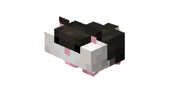

---

**Health: 5** [♥️♥️♥️]

---

**Classification:** [Animal](/minecraft.fandom.com/wiki/Animal)

---

**Behavior:** Passive

---

**Spawn:** [Plains](/minecraft.wiki/w/Plains), [Forest](/minecraft.wiki/w/Forest), & [Birch Forest](/minecraft.wiki/w/Birch_Forest)

---

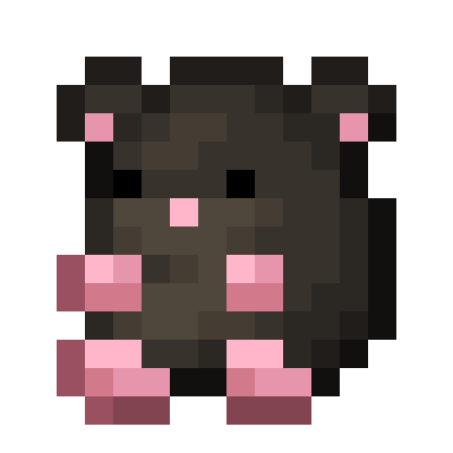

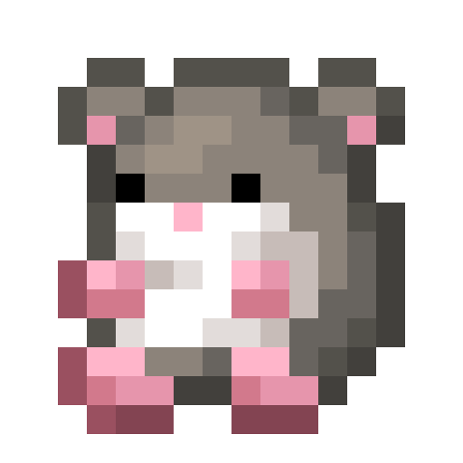

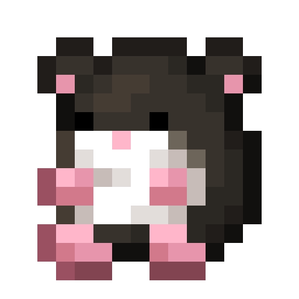

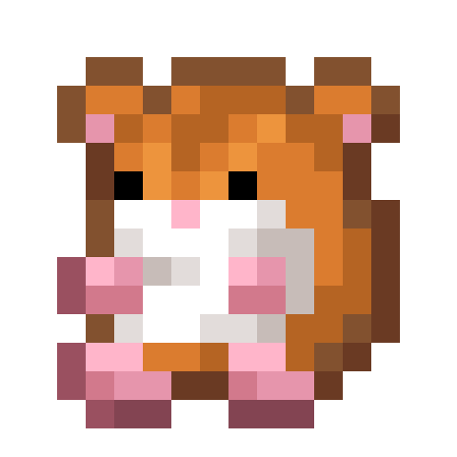

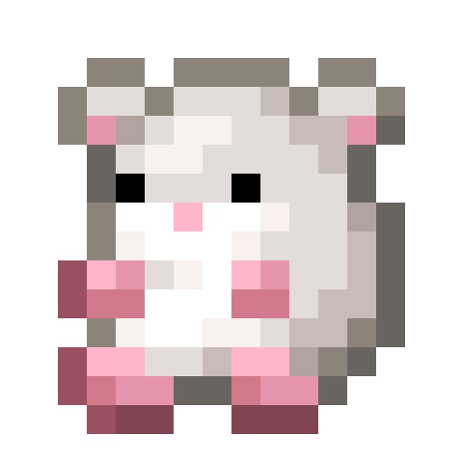

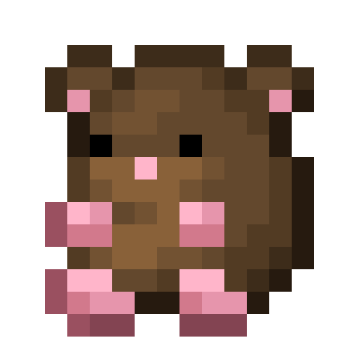

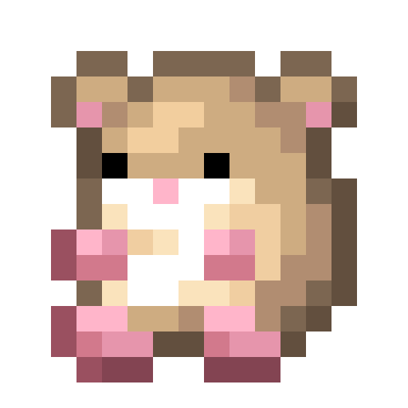

</aside>

---

### 🌎 Spawning

Hamsters will spawn in a horde of 2-4 in the [plains](/minecraft.wiki/w/Plains), [forest](/minecraft.wiki/w/Forest), and [birch forest](/minecraft.wiki/w/Birch_Forest) biomes. You will not find them in frozen biomes, but you will still find them in cold biomes. They spawn on [grass](/minecraft.fandom.com/wiki/Grass_Block), [sand](/minecraft.wiki/w/Sand), and [snow](/minecraft.wiki/w/Snow_Block) during the daytime with [light levels](/minecraft.fandom.com/wiki/Light) of 7-15.

---

### ⚔️ Drops

Hamster [drops](/minecraft.fandom.com/wiki/Drops) upon death:

- 1 - 2 Fur
    - ⚔️ The maximum amount is increased by 1 per level of [Looting](/minecraft.fandom.com/wiki/Looting), for a maximum of 2-4 with Looting III.
- 🟢 1 - 3 [Experience](/minecraft.fandom.com/wiki/Experience) Orbs if killed by Player.
- 🟢 1 - 7 Experience Orbs upon [breeding](/minecraft.fandom.com/wiki/Breeding).

*Pups yield no items nor experience.*

---

### 🧠 Behavior

Hamsters are passive rodents that enjoy their time stuffing their cheeks with food. They walk around aimlessly, but sometimes, lava becomes the new attraction, and they will drop into it. Hamsters will occasionally chase away creepers that are nearby, so it may be good to keep a few around!

**Capture Net:**

Hamsters can be caught in capture nets. If a hamster is caught, the hamster (in its variant) will enter a player’s inventory as an item. If the inventory is full, the hamster will drop to the ground in front of the player.

- A hamster is used by pressing ”use” on any surface (top, bottom, or side) of a block. When used on a top surface, the hamster appears with its feet immediately adjacent to the surface. This interaction is much like a [spawn egg](/minecraft.fandom.com/wiki/Spawn_Egg). The surfaces of blocks are prioritized for spawning; if none are within reach, mobs can also be spawned in [water](/minecraft.fandom.com/wiki/Water).

**Hamster Wheel:**

Hamsters can randomly ride the hamster wheel if there is one nearby. 

If you have captured a hamster with the capture net, you can place a hamster on a hamster wheel, which they will run on until they are removed. 

---

### ❤️ Taming, Healing, & Feeding

Hamsters can be tamed with various seeds, produce, and [rotten flesh](/minecraft.wiki/w/Rotten_Flesh). There is a 70% chance of successful taming. Once they are tamed, you will see hearts appear and a bow appear on their heads, signifying you have tamed the hamster. You can [dye](/minecraft.fandom.com/wiki/Dye) the bow to your color of choice or use [shears](/minecraft.fandom.com/wiki/Shears) to cut off the bow. If you shear off the bow, it can be reapplied by using a dye color of your choice.

Tamed hamsters can be commanded to sit or follow:

- Hamsters will teleport to the player if the player is further than 10 blocks away.
- Hamsters will not teleport to the player if they are commanded to sit.

If a hamster you have tamed gets injured, you can feed it various seeds, produce, and rotten flesh to increase its health until it is maxed. Each item increases the hamster’s health points by 2. An injured hamster will be unable to breed until it is healed.

**List of items for taming:**
**Seeds:** [Beetroot Seeds](/minecraft.wiki/w/Beetroot_Seeds), [Melon Seeds](/minecraft.wiki/w/Melon_Seeds), [Pumpkin Seeds](/minecraft.wiki/w/Pumpkin_Seeds), [Torchflower Seeds](/minecraft.wiki/w/Torchflower_Seeds), and [Wheat Seeds](/minecraft.wiki/w/Wheat_Seeds).
**Produce:** [Beetroot](/minecraft.wiki/w/Beetroot), [Potato](/minecraft.wiki/w/Potato), [Poisonous Potato](/minecraft.wiki/w/Poisonous_Potato), [Carrot](/minecraft.wiki/w/Carrot), [Golden Carrot](/minecraft.wiki/w/Golden_Carrot), [Apple](/minecraft.wiki/w/Apple), [Golden Apple](/minecraft.wiki/w/Golden_Apple), [Enchanted Golden Apple](/minecraft.wiki/w/Enchanted_Golden_Apple), [Melon Slice](/minecraft.wiki/w/Melon_Slice), [Sweet Berries](/minecraft.wiki/w/Sweet_Berries), and [Glow Berries](/minecraft.wiki/w/Glow_Berries).

**Other:** [Rotten Flesh](/minecraft.wiki/w/Rotten_Flesh). 

---

### 🥚Breeding

Hamsters are required to be tamed before they are capable of breeding. Adult hamsters can be [bred](/minecraft.fandom.com/wiki/Breeding) with various seeds, produce, and rotten flesh. There is a 5-minute cooldown for breeding, during which the hamster does not accept any items for breeding, but they will if they get injured and need to heal.

Upon successful breeding, a pup will be born. The growth of pups can be slowly accelerated by using any of the items listed below.

**List of items for breeding:**
**Seeds:** [Beetroot Seeds](/minecraft.wiki/w/Beetroot_Seeds), [Melon Seeds](/minecraft.wiki/w/Melon_Seeds), [Pumpkin Seeds](/minecraft.wiki/w/Pumpkin_Seeds), [Torchflower Seeds](/minecraft.wiki/w/Torchflower_Seeds), and [Wheat Seeds](/minecraft.wiki/w/Wheat_Seeds).
**Produce:** [Beetroot](/minecraft.wiki/w/Beetroot), [Potato](/minecraft.wiki/w/Potato), [Poisonous Potato](/minecraft.wiki/w/Poisonous_Potato), [Carrot](/minecraft.wiki/w/Carrot), [Golden Carrot](/minecraft.wiki/w/Golden_Carrot), [Apple](/minecraft.wiki/w/Apple), [Golden Apple](/minecraft.wiki/w/Golden_Apple), [Enchanted Golden Apple](/minecraft.wiki/w/Enchanted_Golden_Apple), [Melon Slice](/minecraft.wiki/w/Melon_Slice), [Sweet Berries](/minecraft.wiki/w/Sweet_Berries), and [Glow Berries](/minecraft.wiki/w/Glow_Berries).

**Other:** [Rotten Flesh](/minecraft.wiki/w/Rotten_Flesh). 

---

### 🖼️ Gallery

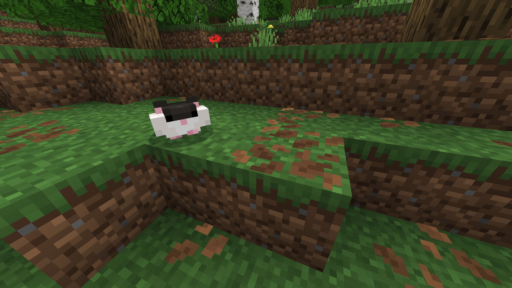

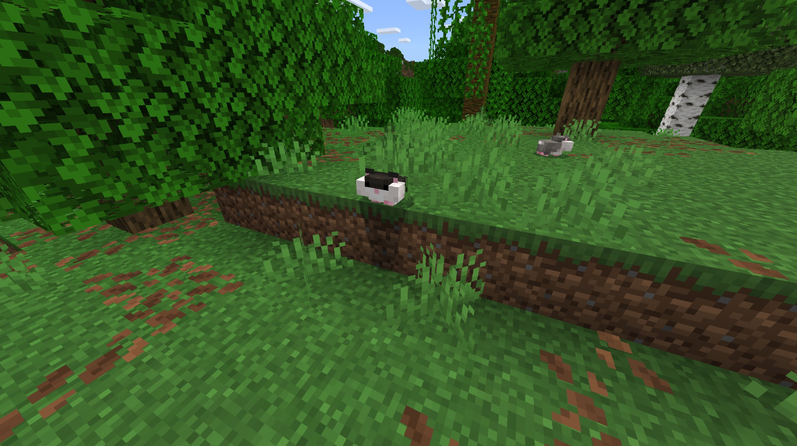

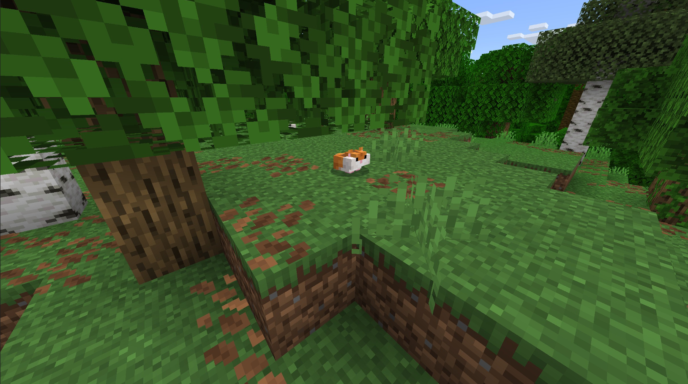

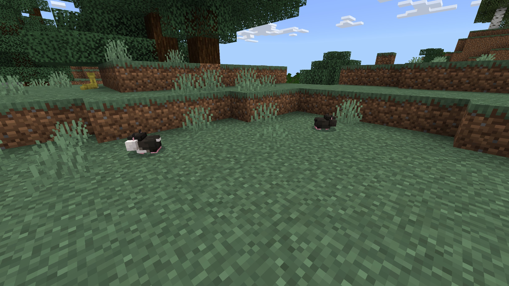

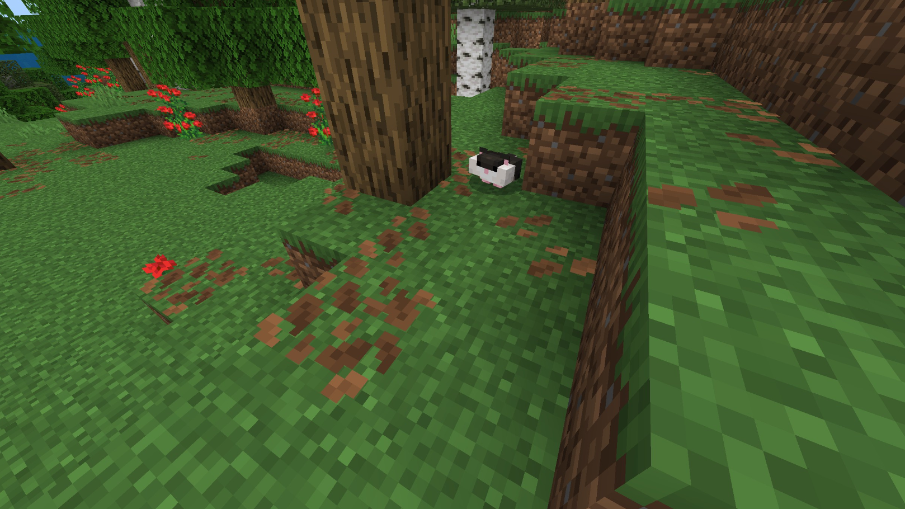

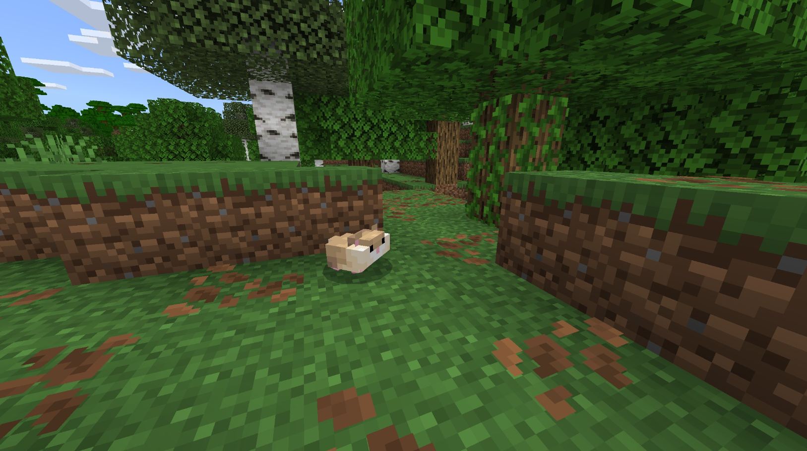

---

### 🎨 Variants

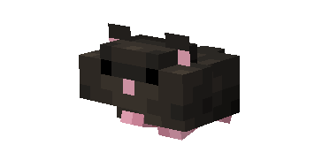

                Black

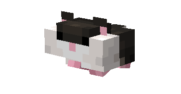

         Black & White

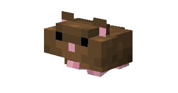

               Brown

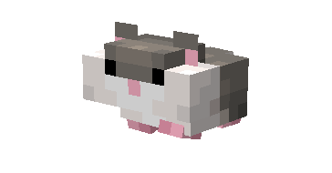

        Grey & White

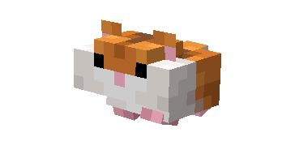

             Orange

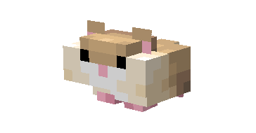

      Peaches & Cream

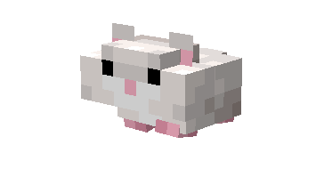

               White

---

<aside>
 Have additional questions? Want to be a part of our community? → [Join our Discord!](/discord.com/invite/starfishstudios)

</aside>

<aside>

[**Marketplace](/www.minecraft.net/en-us/marketplace/creator?name=Starfish%20Studios)      [CurseForge](/www.curseforge.com/members/starfish_studios/projects)      [TikTok](/www.tiktok.com/@starfishstudios)      [Instagram](/www.instagram.com/starfishstudiosinc/)      [Twitter](/twitter.com/starfishstudios)      [YouTube](/www.youtube.com/@starfishstudios)      [Website](/starfish-studios.com/)**

</aside>
