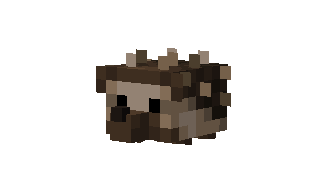
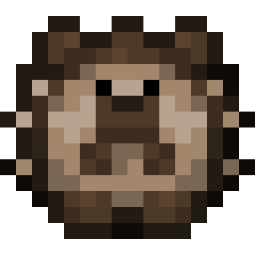
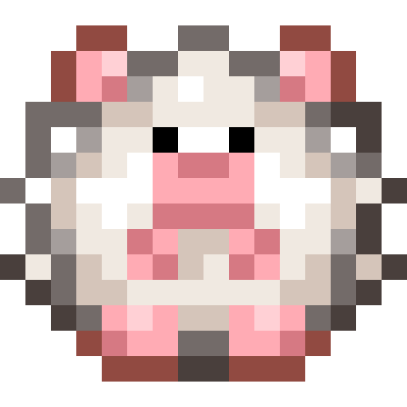
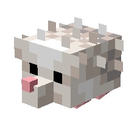
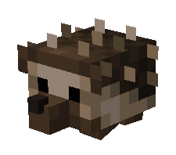

# Hedgehog

Last Updated: April 22, 2025 8:47 PM

---

**Return**

🐻 [Naturalist Add-On Wiki](/www.notion.so/1a7a9a61c3f1800c8e32e893d6e7f430?pvs=21)

---

There are many different species of hedgehogs, none of which are native to America! They have upwards of 5,000 to 7,000 quills that raise and lower in response to threatening situations. Unlike porcupines, these spikes are not barbed, and they are not poisonous. Regardless of how adorable these hedgehogs are, it’s illegal to own a hedgehog as a pet in some states in the USA!

<aside>

### **Hedgehog**

---

**Health: 18** [♥️♥️♥️]

---

**Classification:** [Animal](/minecraft.fandom.com/wiki/Animal)

---

**Behavior:** Passive

---

**Spawn:** [Forest](/minecraft.wiki/w/Forest), [Flower Forest](/minecraft.wiki/w/Flower_Forest), [Meadow](/minecraft.wiki/w/Meadow), [Plains](/minecraft.wiki/w/Plains), & [Taiga](/minecraft.wiki/w/Taiga)

---

</aside>

---

### 🌎 Spawning

A bed of 1-3 hedgehogs will spawn in the [forest](/minecraft.wiki/w/Forest), [flower forest](/minecraft.wiki/w/Flower_Forest), [meadow](/minecraft.wiki/w/Meadow), [plains](/minecraft.wiki/w/Plains), and [taiga](/minecraft.wiki/w/Taiga) biomes. They will spawn during the day with [light levels](/minecraft.fandom.com/wiki/Light) of 7-15.

---

### ⚔️ Drops

Hedgehog [drops](/minecraft.fandom.com/wiki/Drops) upon death:

- 0 - 1 Feather
- 1 Bonemeal
- 🟢 1 - 3 [Experience](/minecraft.fandom.com/wiki/Experience) Orbs if killed by Player.

---

### 🧠 Behavior

Hedgehogs are passive mobs that meander luscious biomes. They avoid players, so when approached, hedgehogs will curl into a ball to hide from the player, not moving, like tortoises, snails, and [armadillos](/minecraft.wiki/w/Armadillo), unless the player is holding sweet berries.

- While curled up, touching them will cause damage to the Player, similar to [Pufferfish](/minecraft.wiki/w/Pufferfish).

**Capture Net:**

Hedgehogs can be caught in capture nets. If a hedgehog is caught, the hedgehog (in its variant) will enter a player’s inventory as an item. If the inventory is full, the hedgehog will drop to the ground in front of the player.

- A hedgehog is used by pressing ”use” on any surface (top, bottom, or side) of a block. When used on a top surface, the hedgehog appears with its feet immediately adjacent to the surface. This interaction is much like a [spawn egg](/minecraft.fandom.com/wiki/Spawn_Egg). The surfaces of blocks are prioritized for spawning; if none are within reach, mobs can also be spawned in [water](/minecraft.fandom.com/wiki/Water).
- Hedgehog items can be thrown like a projectile that shoots them like a spiky ball, and they will land undamaged. They can also be thrown at mobs to inflict damage.

---

### ❤️ Taming, Healing, & Feeding

Hedgehogs can be tamed with [sweet berries](/minecraft.wiki/w/Sweet_Berries). There is a 50% chance of successful taming. Once they are tamed, you will see hearts appear, and they will wear shoes on their feet, signifying you have tamed the hedgehog. You can [dye](/minecraft.fandom.com/wiki/Dye) the shoes to your color of choice or use shears to cut off the shoes. If you [shear](/minecraft.fandom.com/wiki/Shears) off the shoes, it can be reapplied by using a dye color of your choice. 

Tamed hedgehogs can be commanded to sit or follow.

- Hedgehogs will teleport to the player if the player is further than 10 blocks away.
- Hedgehogs will not teleport to the player if they are commanded to sit.

If a hedgehog you have tamed gets injured, you can feed it sweet berries to increase its [health](/minecraft.fandom.com/wiki/Health) until it is maxed. 1 sweet berry increases the hedgehog’s health points by 2. An injured hedgehog will be unable to breed until it is healed.

---

### 🥚Breeding

Adult hedgehogs are required to be tamed before they can be bred. They can be bred with beetles (red, brown, green, yellow, and black). There is a 5-minute cooldown for breeding, during which the hedgehogs do not accept beetles for breeding. 

Upon successful breeding, a pup will be born. The growth of pups can be slowly accelerated by feeding them sweet berries.

---

### 🖼️ Gallery

---

### 🎨 Variants

          White Hedgehog

          Brown Hedgehog

             Dark Hedgehog

<aside>
 Have additional questions? Want to be a part of our community? → [Join our Discord!](/discord.com/invite/starfishstudios)

</aside>

<aside>

[**Marketplace](/www.minecraft.net/en-us/marketplace/creator?name=Starfish%20Studios)      [CurseForge](/www.curseforge.com/members/starfish_studios/projects)      [TikTok](/www.tiktok.com/@starfishstudios)      [Instagram](/www.instagram.com/starfishstudiosinc/)      [Twitter](/twitter.com/starfishstudios)      [YouTube](/www.youtube.com/@starfishstudios)      [Website](/starfish-studios.com/)**

</aside>
