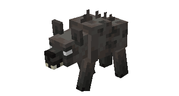
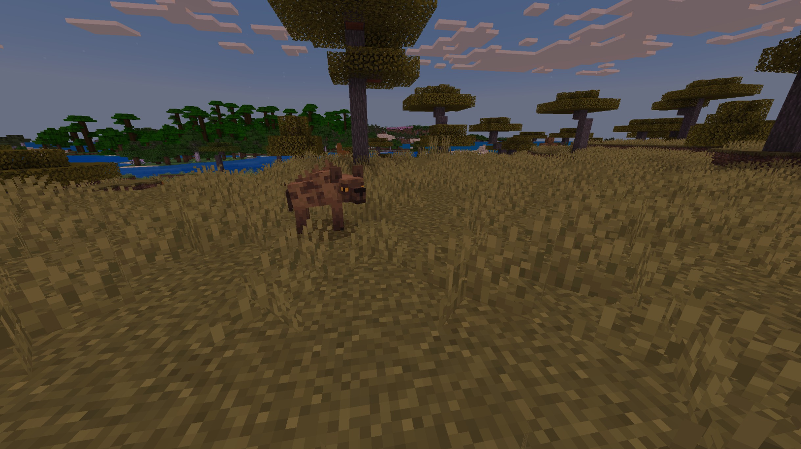
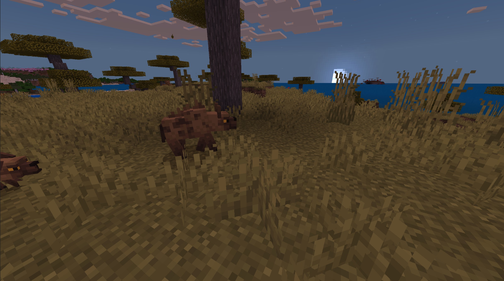
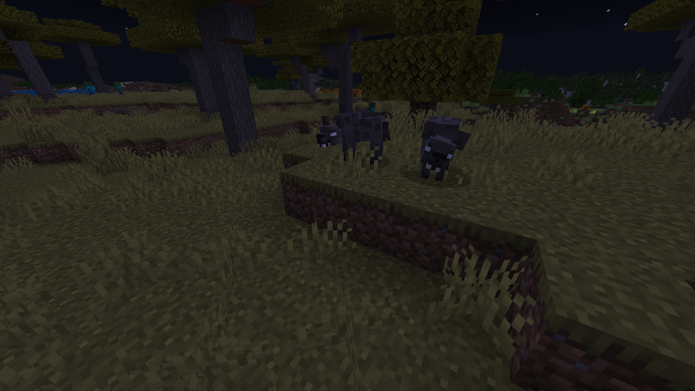
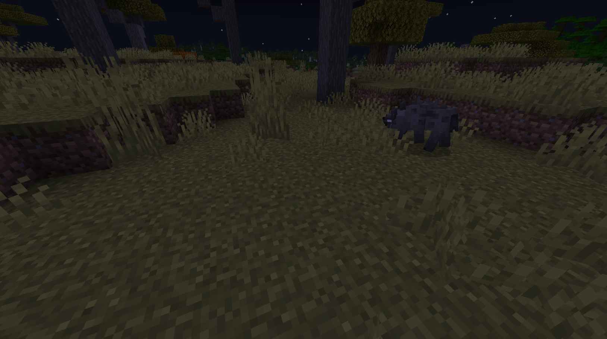
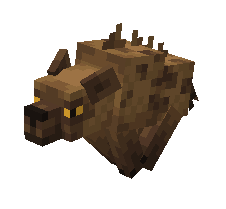
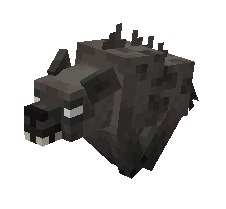

# Hyena

Last Updated: April 22, 2025 8:47 PM

---

**Return**

🐻 [Naturalist Add-On Wiki](/www.notion.so/1a7a9a61c3f1800c8e32e893d6e7f430?pvs=21)

---

Hyenas are highly vocal animals that utilize a variety of sounds to communicate with each other. Their laugh is one of the most well-known sounds worldwide. They are more than just scavengers, they are skilled hunters that are capable of taking down large beasts with their ferocious bite.

<aside>

### **Hyena**

---

**Health: 11** [♥️♥️♥️]

---

**Classification:** [Animal](/minecraft.fandom.com/wiki/Animal)

---

**Behavior:** Neutral

---

**Spawn:** [Mesa](/minecraft.wiki/w/Badlands) & [Savanna](/minecraft.wiki/w/Savanna)

---

</aside>

---

### 🌎 Spawning

A cackle of 2-5 hyenas will spawn in the [mesa](/minecraft.wiki/w/Badlands) and [savanna](/minecraft.wiki/w/Savanna) biomes. They will spawn with [light levels](/minecraft.fandom.com/wiki/Light) of 7-15.

A cackle of 1-3 ravenous hyenas will spawn in the mesa and savanna biomes. They will spawn with light levels of 0-9.

---

### ⚔️ Drops

Hyena [drops](/minecraft.fandom.com/wiki/Drops) upon death:

- 0 - 1 Tooth
    - ⚔️ The maximum amount is increased by 1 per level of [Looting](/minecraft.fandom.com/wiki/Looting), for a maximum of 1-6 with Looting III
- 0 - 1 Bushmeat
    - ⚔️ The maximum amount is increased by 1 per level of [Looting](/minecraft.fandom.com/wiki/Looting), for a maximum of 1-6 with Looting III
    - ⚔️ Cooked bushmeat can be dropped when killed on land by s[melting](/minecraft.fandom.com/wiki/Fire_Aspect) or f[lame](/minecraft.fandom.com/wiki/Flame) enchantment. This will not work when the hyena is killed in water.
- 🟢 1 - 3 [Experience](/minecraft.fandom.com/wiki/Experience) Orbs if killed by Player.
- 🟢 1 - 7 Experience Orbs upon [breeding](/minecraft.fandom.com/wiki/Breeding).

*Cubs yield no items nor experience.*

---

### 🧠 Behavior

Hyenas can exist in a passive or hostile state. The cubs are passive; adults are hostile when provoked with cubs. If a cub is attacked, unless killed in one hit‌, all adults within the area become hostile toward the player or mob, regardless of [difficulty](/minecraft.fandom.com/wiki/Difficulty). Players are not hyenas’ only target, they will attack players or mobs with half health or less. They will attack mobs like [zombies](/minecraft.fandom.com/wiki/Zombie) and [skeletons](/minecraft.fandom.com/wiki/Skeleton).

- Once a hyena reaches half health, they will run from players or hostile mobs.
- Hyenas avoid lions at all times.

Hyenas sleep during the day. If hit while sleeping, they will wake up in an aggressive state and will go back to sleep once they either kill their target or lose sight of them.

Ravenous Hyenas spawn exclusively at night and are hostile. These hyenas cannot be tamed and will attack both players and mobs.

---

### ❤️ Taming, Healing, & Feeding

Adult hyenas can be tamed with [bones](/minecraft.wiki/w/Bone). There is a 50% chance of successful taming. Once they are tamed, you will see hearts appear and a collar around their neck, signifying you have tamed the animal. You can [dye](/minecraft.fandom.com/wiki/Dye) the collar to your color of choice or use [shears](/minecraft.fandom.com/wiki/Shears) to cut off the collar. If you shear off a collar, it can be reapplied by using a dye color of your choice.

Tamed Hyenas can be commanded to sit or to follow.

- Hyenas will teleport to the player if the player is further than 10 blocks away.
- Hyenas will not teleport to the player if they are commanded to sit.

If the hyena you have tamed gets injured, you can feed the beaver bones to increase its [health](/minecraft.fandom.com/wiki/Health) until it is maxed. 1 bone increases the hyena's health points by 2. An injured hyena will be unable to breed until healed.

**Note:** *Ravenous hyenas cannot be tamed.*

---

### 🥚Breeding

Adult hyenas with full health can be bred with [rotten flesh](/minecraft.wiki/w/Rotten_Flesh). There is a 5-minute cooldown for breeding, during which the hyena will not accept rotten flesh but will accept bones if they get injured and need to heal.
Upon successful breeding, a cub will be born. The growth of cubs can be slowly accelerated by using bones and rotten flesh. 

**Note:** *Ravenous Hyenas cannot be bred.*

---

### 🖼️ Gallery

---

### 🎨 Variants

                         Hyena

                  Ravenous Hyena

<aside>
 Have additional questions? Want to be a part of our community? → [Join our Discord!](/discord.com/invite/starfishstudios)

</aside>

<aside>

[**Marketplace](/www.minecraft.net/en-us/marketplace/creator?name=Starfish%20Studios)      [CurseForge](/www.curseforge.com/members/starfish_studios/projects)      [TikTok](/www.tiktok.com/@starfishstudios)      [Instagram](/www.instagram.com/starfishstudiosinc/)      [Twitter](/twitter.com/starfishstudios)      [YouTube](/www.youtube.com/@starfishstudios)      [Website](/starfish-studios.com/)**

</aside>
