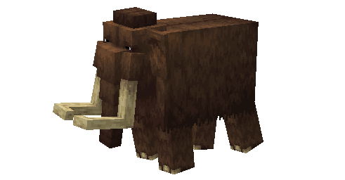
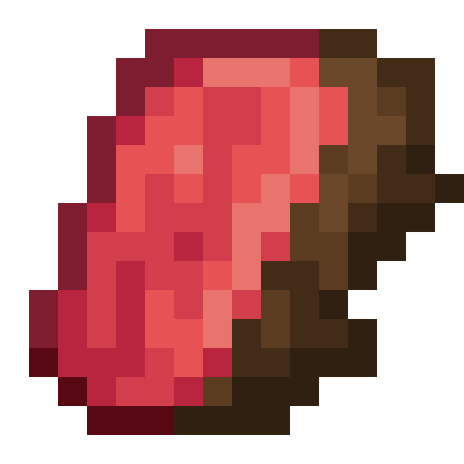
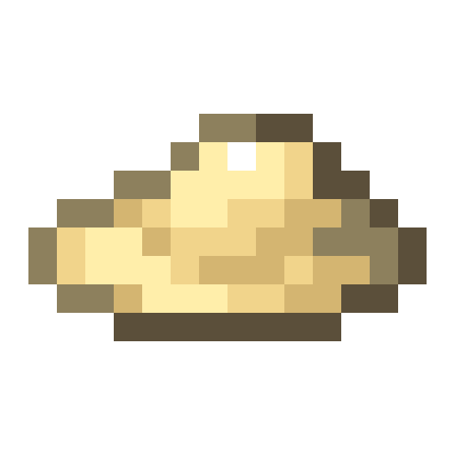
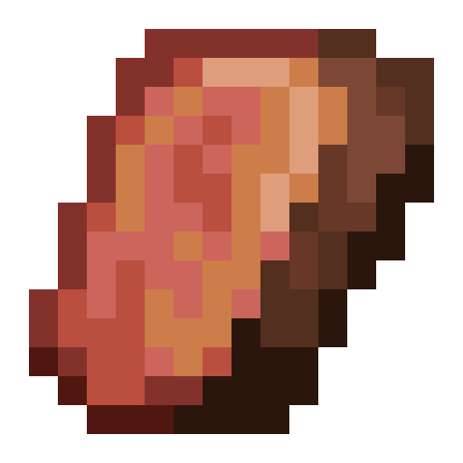
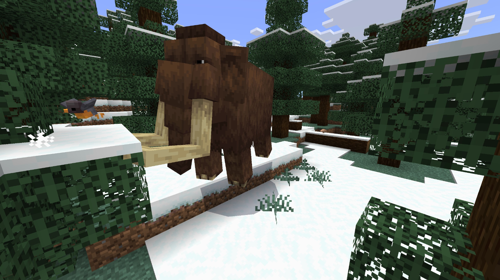
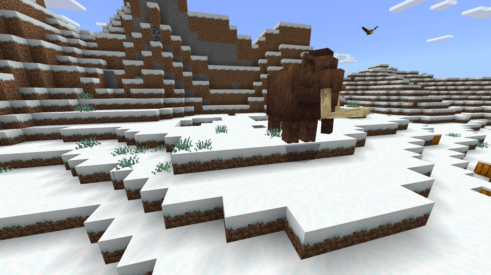
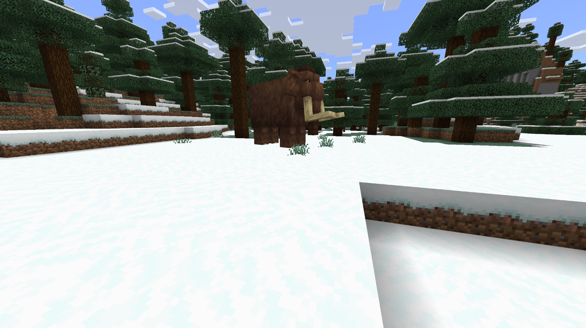

# Mammoth

Last Updated: April 22, 2025 8:47 PM

---

**Return**

🐻 [Naturalist Add-On Wiki](/www.notion.so/1a7a9a61c3f1800c8e32e893d6e7f430?pvs=21)

---

Mammoths thrived during the Ice Age but, unfortunately, are currently extinct. They were large herbivores that were closely related to elephants. They were commonly hunted by humans for their tusks to make weapons out of them. These animals were fairly large, weighing around 8 tons and standing 13-15 feet tall.

<aside>

### **Mammoth**

---

**Health: 50** [♥️♥️♥️]

---

**Classification:** 

---

**Behavior:** 

---

**Spawn:** [Frozen Peaks](/minecraft.wiki/w/Frozen_Peaks), [Ice Plains](/minecraft.wiki/w/Snowy_Plains), & [Snowy Slopes](/minecraft.wiki/w/Snowy_Slopes)

---

</aside>

---

### 🌎 Spawning

A herd of 1-4 mammoths will spawn in the [frozen peaks](/minecraft.wiki/w/Frozen_Peaks), [ice plains](/minecraft.wiki/w/Snowy_Plains), and [snowy slopes](/minecraft.wiki/w/Snowy_Slopes) biomes. They will spawn during the daytime with light levels between 7-15. 

**Note:** If in a [frozen peaks](/minecraft.wiki/w/Frozen_Peaks) biome, there must be [grass](/minecraft.fandom.com/wiki/Grass_Block), [leaves](/minecraft.wiki/w/Leaves), and [logs](/minecraft.wiki/w/Log) around for these mammoths to spawn.

---

### ⚔️ Drops

Mammoth [drops](/minecraft.fandom.com/wiki/Drops) upon death:

- 2 - 3 Fat
- 2 - 3 Fur
- 2 - 3 Mammoth Meat
- 1 [Saddle](/minecraft.wiki/w/Saddle)
    - A saddle will only drop if the animal was saddled before death.
- 🟢 1 - 3 [Experience](/minecraft.fandom.com/wiki/Experience) Orbs if killed by Player.
- 🟢 1 - 7 Experience Orbs upon [breeding](/minecraft.fandom.com/wiki/Breeding).

Calves yield no items nor experience

---

### 🧠 Behavior

Mammoths roam the snowy biomes aimlessly unless there are bees nearby. Mammoths will flee from bees until they are out of range.

Mammoth calves will follow their parents until they are mature adults. If their parent wanders away, the calf will quickly run to catch up. Mammoths do not attack players that come near their calves, like bears, but they will attack if a player attacks the calf first!

Once a mammoth is tamed, it can be [saddled](/minecraft.wiki/w/Saddle).

---

### ❤️ Taming, Healing, & Feeding

Mammoths can be tamed by riding the mammoth until it no longer kicks you off its back. Mammoths are temperamental creatures that may not like someone riding on their back until they get comfortable with you. If you feed an elephant [wheat](/minecraft.wiki/w/Wheat), [sugar](/minecraft.wiki/w/Sugar), [apple](/minecraft.wiki/w/Apple), [golden apple](/minecraft.wiki/w/Golden_Apple), [enchanted golden apple](/minecraft.wiki/w/Enchanted_Golden_Apple), or a [golden carrot](/minecraft.wiki/w/Golden_Carrot), their temper will decrease, and the mammoth will start to be friendlier with you until you can tame it. Once they are tamed, you will see hearts appear. There is no visual indication that they are tamed other than the hearts; however, a mammoth will let you ride it once it is tamed, and you can put a [saddle](/minecraft.wiki/w/Saddle) on it. 

Tamed mammoths cannot be commanded, nor will they follow a player at any time. To keep your mammoths within a certain area, you can put a [lead](/minecraft.wiki/w/Lead) on them and tie them to a [fence](/minecraft.wiki/w/Wooden_Fence) or build a corral around them. 

Tamed mammoths cannot be commanded, nor will they follow a player at any time. To keep your mammoth within a certain area, you can put a [lead](/minecraft.wiki/w/Lead) on them and tie them to a [fence](/minecraft.wiki/w/Wooden_Fence) or build a corral around them. 

---

### 🖼️ Gallery

---

<aside>
 Have additional questions? Want to be a part of our community? → [Join our Discord!](/discord.com/invite/starfishstudios)

</aside>

<aside>

[**Marketplace](/www.minecraft.net/en-us/marketplace/creator?name=Starfish%20Studios)      [CurseForge](/www.curseforge.com/members/starfish_studios/projects)      [TikTok](/www.tiktok.com/@starfishstudios)      [Instagram](/www.instagram.com/starfishstudiosinc/)      [Twitter](/twitter.com/starfishstudios)      [YouTube](/www.youtube.com/@starfishstudios)      [Website](/starfish-studios.com/)**

</aside>
