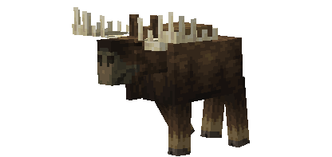
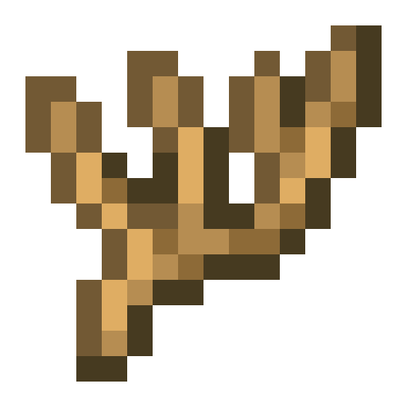
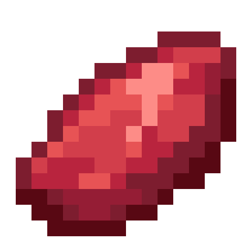
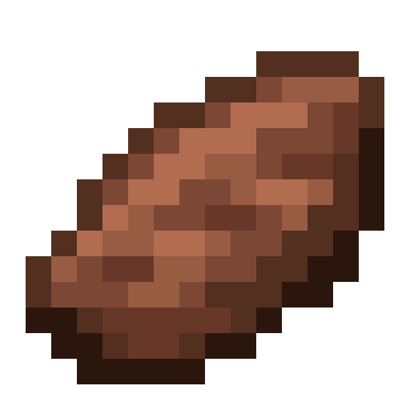
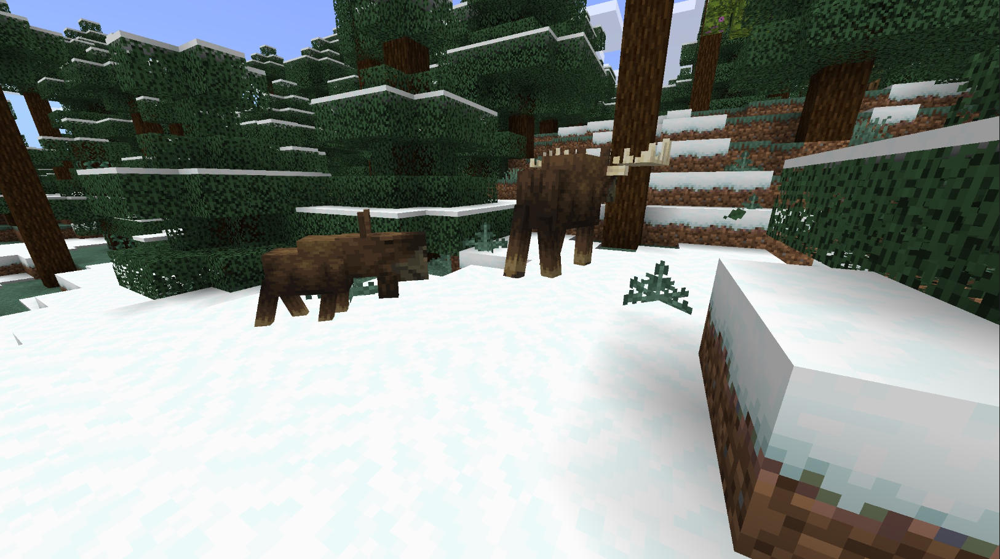
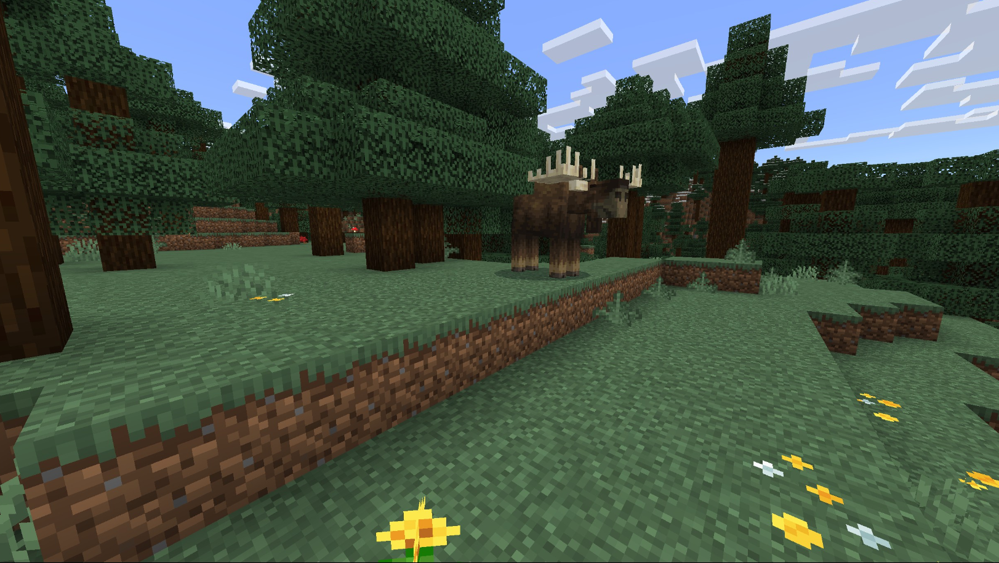
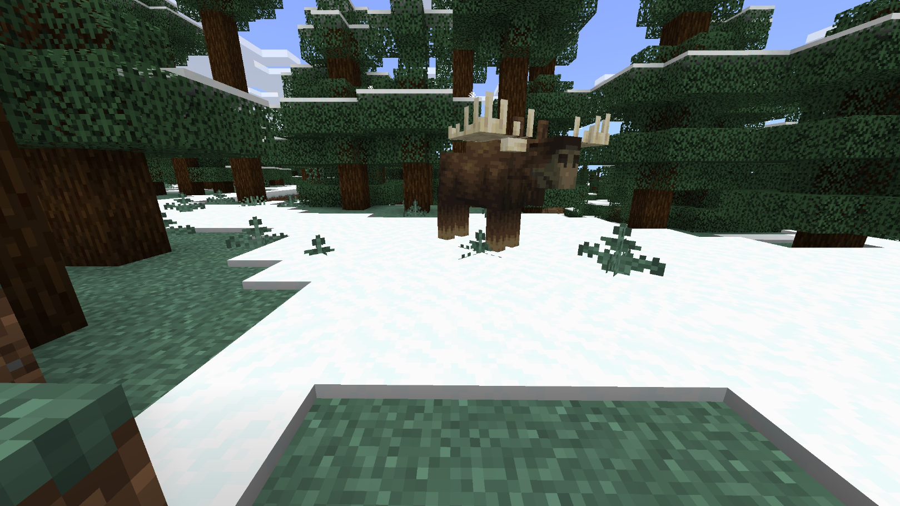

# Moose

Last Updated: April 22, 2025 8:47 PM

---

**Return**

🐻 [Naturalist Add-On Wiki](/www.notion.so/1a7a9a61c3f1800c8e32e893d6e7f430?pvs=21)

---

Moose are all-terrain animals who primarily reside in the colder regions of the northern hemisphere. They are herbivores and live off of the land around them, consuming fruits, berries, and vegetables that they can find. These animals are distinct with the flap of skin under their chins, called a bell, and their large antlers that can grow up to 6 feet long!

<aside>

### **Moose**

---

**Health: 40** [♥️♥️♥️]

---

**Classification:** [Animal](/minecraft.fandom.com/wiki/Animal)

---

**Behavior:** Passive unless provoked

---

**Spawn:** [Cold Taiga](/minecraft.wiki/w/Snowy_Taiga), [Forest](/minecraft.wiki/w/Forest), [Mega Taiga](/minecraft.wiki/w/Old_Growth_Pine_Taiga), [Mega Taiga Hills](/minecraft.wiki/w/Giant_Tree_Taiga_Hills), [Mountains](/minecraft.wiki/w/Mountains), & [Taiga](/minecraft.wiki/w/Taiga)

---

</aside>

---

### 🌎 Spawning

A herd of 1-2 moose will spawn in the cold taiga, forest, mega taiga, mega taiga hills, mountains, and taiga biomes. They will spawn during the daytime with [light levels](/minecraft.fandom.com/wiki/Light) between 9-15.

---

### ⚔️ Drops

Adult moose [drops](/minecraft.fandom.com/wiki/Drops) upon death:

- 0 - 1 Antler
    - ⚔️ The maximum amount is increased by 1 per level of [Looting](/minecraft.fandom.com/wiki/Looting), for a maximum of 1-3 with Looting III
- 1 - 2 Raw Moose Meat
    - ⚔️ The maximum amount is increased by 1 per level of [Looting](/minecraft.fandom.com/wiki/Looting), for a maximum of 1-6 with Looting III.
- 1 - 2 Cooked Moose Meat
    - ⚔️ Cooked Moose Meat can be dropped when killed on land with [Smelting](/minecraft.fandom.com/wiki/Fire_Aspect) or [Flame](/minecraft.fandom.com/wiki/Flame) enchantment.
- 1 [Saddle](/minecraft.wiki/w/Saddle)
    - A saddle will only drop if the animal was saddled before death.
- 🟢 1 - 3 [Experience](/minecraft.fandom.com/wiki/Experience) Orbs if killed by Player
- 🟢 1 - 7 Experience Orbs upon [breeding](/minecraft.fandom.com/wiki/Breeding).

*Calves yield no items nor experience.*

---

### 🧠 Behavior

A moose can exist in a passive or hostile state. The calves are passive; adults are hostile when provoked and with calves that get attacked. — If a calf is attacked, unless killed in one hit‌, the moose parent will become hostile toward the player or mob, regardless of [difficulty](/minecraft.fandom.com/wiki/Difficulty). Moose will get angry and fight back with their large antlers, swinging them at the player until either the player is out of sight or dies.

Calves will follow their parents until they are grown into mature adults.

A moose can be [saddled](/minecraft.wiki/w/Saddle) once they are tamed. The saddle can be removed by riding the moose and opening their inventory.

---

### ❤️ Taming, Healing, & Feeding

A moose can be tamed with [apples](/minecraft.wiki/w/Apple), [carrots](/minecraft.wiki/w/Carrot), and [sweet berries](/minecraft.wiki/w/Sweet_Berries). There is a 100% chance of successful taming. Once they are tamed, you will see hearts appear and a collar with a gold medallion hanging around their neck, signifying you have tamed the moose. You can dye the collar to your color of choice or use shears to cut off the collar. If you shear off the collar, it can be reapplied by using a dye color of your choice.

Tamed moose cannot be commanded, nor will they follow a player at any time. To keep your moose within a certain area, you can put a lead on them and tie them to a fence or build a corral around them. 

If a moose you have tamed gets injured, you can feed the moose an apple or carrot to increase its health until it is maxed. 1 apple or carrot will increase the moose’s health points by 2. An injured moose will be unable to breed until it is healed.

---

### 🥚Breeding

A moose is required to be tamed before it can be [bred](/minecraft.fandom.com/wiki/Breeding). Adult moose can be bred with [apples](/minecraft.wiki/w/Apple), [carrots](/minecraft.wiki/w/Carrot), and [sweet berries](/minecraft.wiki/w/Sweet_Berries). There is a 5-minute cooldown for breeding, during which the moose will no longer accept apples, carrots, and sweet berries but will if they get injured and need to heal.

Upon successful breeding, a calf will be born. The growth of calves can be slowly accelerated by using apples and sweet berries.

---

### 🖼️ Gallery

---

<aside>
 Have additional questions? Want to be a part of our community? → [Join our Discord!](/discord.com/invite/starfishstudios)

</aside>

<aside>

[**Marketplace](/www.minecraft.net/en-us/marketplace/creator?name=Starfish%20Studios)      [CurseForge](/www.curseforge.com/members/starfish_studios/projects)      [TikTok](/www.tiktok.com/@starfishstudios)      [Instagram](/www.instagram.com/starfishstudiosinc/)      [Twitter](/twitter.com/starfishstudios)      [YouTube](/www.youtube.com/@starfishstudios)      [Website](/starfish-studios.com/)**

</aside>
