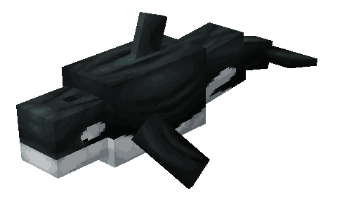
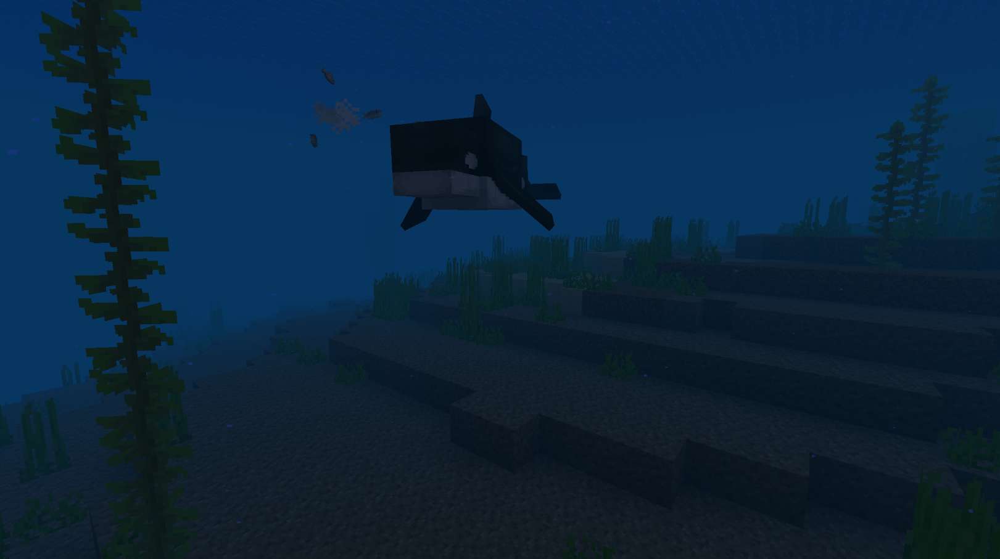
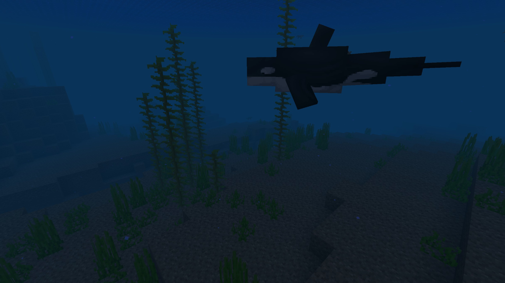

# Orca

Last Updated: April 22, 2025 8:47 PM

---

**Return**

🐻 [Naturalist Add-On Wiki](/www.notion.so/1a7a9a61c3f1800c8e32e893d6e7f430?pvs=21)

---

Orcas are the largest members of the dolphin family that navigate oceanic waters with sonar called echolocation. They can swim up to 30 mph and travel 75-100 miles or more per day. These unique creatures hunt in pods and consume sea creatures ranging from small fish to large seals. 

<aside>

### **Orca**

---

**Health: 40** [♥️♥️♥️]

---

**Classification:** [Aquatic](/minecraft.fandom.com/wiki/Aquatic)

---

**Behavior:** Neutral

---

**Spawn:** [Ocean](/minecraft.wiki/w/Ocean)

---

</aside>

---

### 🌎 Spawning

A pod of 1-3 orcas will spawn in the [ocean](/minecraft.wiki/w/Ocean) biome. You can find these large tooth whales between Y coordinates Y -50 & Y 64.

---

### ⚔️ Drops

Ocra [drops](/minecraft.fandom.com/wiki/Drops) upon death:

- 1 - 2 [Raw Cod](/minecraft.wiki/w/Raw_Cod), [Raw Salmon](/minecraft.wiki/w/Raw_Salmon), Raw Catfish, or Raw Bass
- 1 Fat
- 🟢 1 - 3 [Experience](/minecraft.fandom.com/wiki/Experience) Orbs if killed by Player

---

### 🧠 Behavior

Orcas are large aquatic beasts that roam the oceans in a pod. They are mostly passive, but they feast on fish and the occasional penguin. They will not attack pufferfish, though, as they are not tasty snacks!

Orcas will attack a player when they are provoked. They swim much faster when chasing their target and are relentless until either the player is out of sight or dies.

**Weakness:**

Orcas are unable to survive out of water. Outside of water, they will attempt to navigate back to a water source. If they are unsuccessful, they start to suffocate and die. 

---

### 🖼️ Gallery

---

<aside>
 Have additional questions? Want to be a part of our community? → [Join our Discord!](/discord.com/invite/starfishstudios)

</aside>

<aside>

[**Marketplace](/www.minecraft.net/en-us/marketplace/creator?name=Starfish%20Studios)      [CurseForge](/www.curseforge.com/members/starfish_studios/projects)      [TikTok](/www.tiktok.com/@starfishstudios)      [Instagram](/www.instagram.com/starfishstudiosinc/)      [Twitter](/twitter.com/starfishstudios)      [YouTube](/www.youtube.com/@starfishstudios)      [Website](/starfish-studios.com/)**

</aside>
