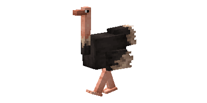
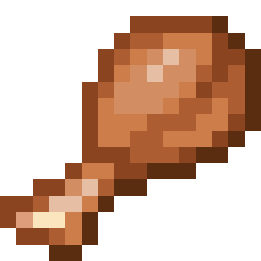
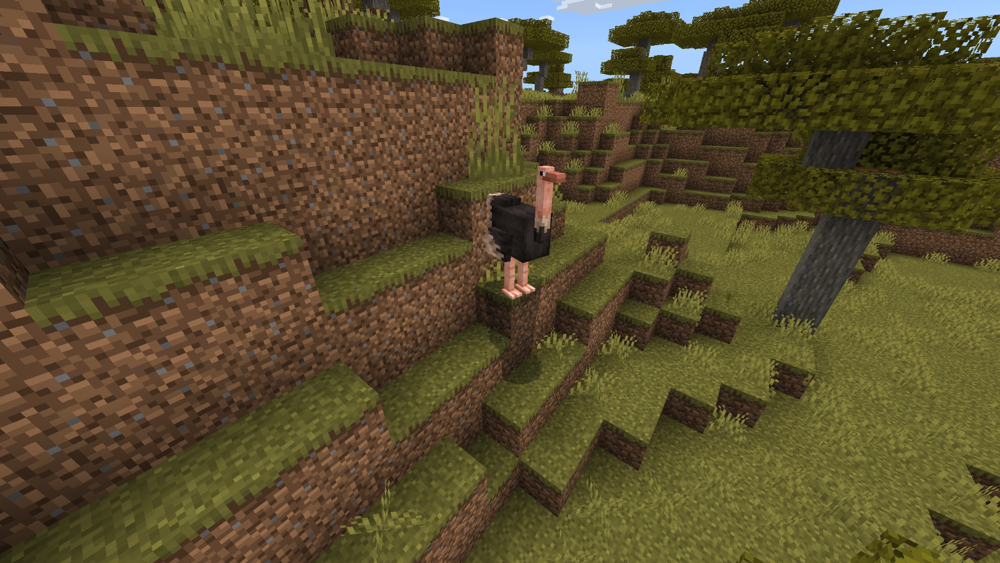
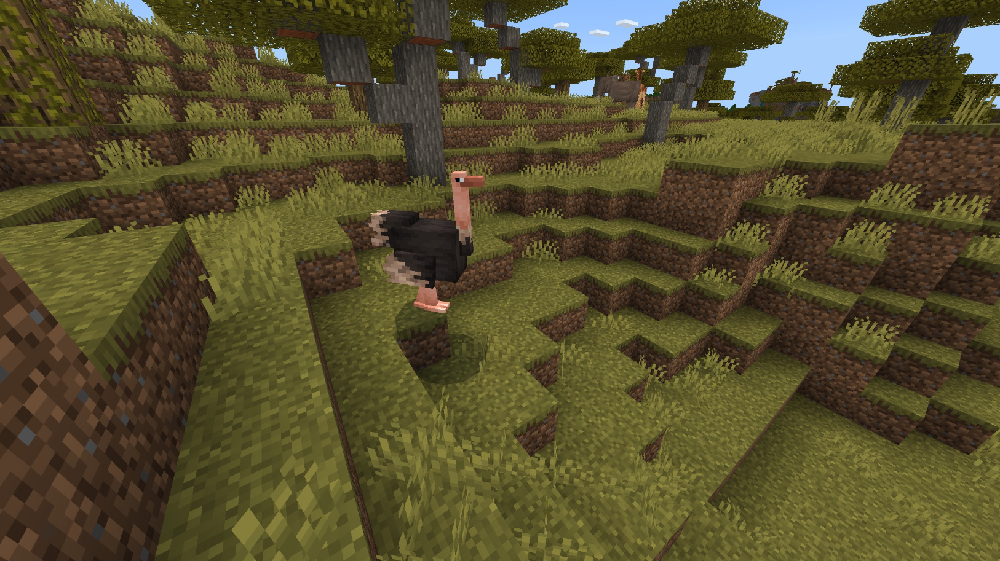
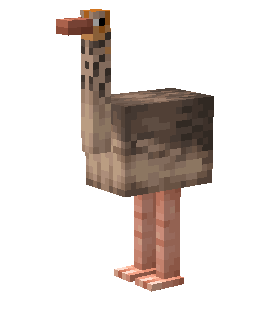
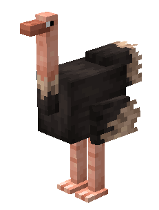

# Ostrich

Last Updated: April 22, 2025 8:47 PM

---

**Return**

🐻 [Naturalist Add-On Wiki](/www.notion.so/1a7a9a61c3f1800c8e32e893d6e7f430?pvs=21)

---

Ostriches are the world's largest bird that reside in Australia. They can run up to 43.5 mph while they only have two toes!  Ostriches love seeds and they swallow sand and pebbles to help break down food as they do not have teeth. These birds are often called “Camel Birds” due to their similar anatomy to camels, and luckily, if you can tame one of these birds, you can ride it!

<aside>

### **Ostrich**

---

**Health: 25** [♥️♥️♥️]

---

**Classification:**  [Animal](/minecraft.fandom.com/wiki/Animal) 

---

**Behavior:** Neutral

---

**Spawn:** [Savanna](/minecraft.wiki/w/Savanna)

---

</aside>

---

### 🌎 Spawning

A flock of 1-2 ostriches will spawn in the [savanna](/minecraft.wiki/w/Savanna) biome. They will spawn during the daytime with [light levels](/minecraft.fandom.com/wiki/Light) between 7-15.

---

### ⚔️ Drops

Ostrich [drops](/minecraft.fandom.com/wiki/Drops) upon death:

- 0 - 1 Raw Drumstick
    - ⚔️ The maximum amount is increased by 1 per level of [Looting](/minecraft.fandom.com/wiki/Looting), for a maximum of 0-3 with Looting III.
- 0 - 1 Cooked Drumstick
    - ⚔️ Cooked Drumstick can be dropped when killed on land with [Smelting](/minecraft.fandom.com/wiki/Fire_Aspect) or [Flame](/minecraft.fandom.com/wiki/Flame) enchantment.
- 0 - 2 [Feather](/minecraft.wiki/w/Feather)
    - ⚔️ The maximum amount is increased by 1 per level of [Looting](/minecraft.fandom.com/wiki/Looting), for a maximum of 1-6 with Looting III.
- 1 [Saddle](/minecraft.wiki/w/Saddle)
    - A saddle will only drop if the animal was saddled before death.

*Only Feathers & Saddle will drop if the Ostrich is tamed.*

- 🟢 1 - 3 [Experience](/minecraft.fandom.com/wiki/Experience) Orbs if killed by Player.
- 🟢 1 - 7 Experience Orbs upon [breeding](/minecraft.fandom.com/wiki/Breeding).

*Hatchlings yield no items nor experience.*

---

### 🧠 Behavior

Ostriches are neutral animals that are protective of their young. They will stay near their eggs and attack players who get too close to them. Additionally, they will attack players who attack them first, charging at high speeds until either the player is out of sight or dies. Baby ostriches will follow their parents until they are mature adults.

If a player approaches an ostrich without an egg, they will bury its head in the ground and will stay in the ground until the player walks away. They will occasionally check to see if the player has walked away by raising their head, but if the player is still present, they will rebury their head in the ground. Ostriches can be tempted to raise their heads out of the ground with seeds.

Ostriches can be [saddled](/minecraft.wiki/w/Saddle) once they are tamed.

---

### ❤️ Taming, Healing, & Feeding

Ostriches can be tamed with [beetroot seeds](/minecraft.wiki/w/Beetroot_Seeds), [melon seeds](/minecraft.wiki/w/Melon_Seeds), [pumpkin seeds](/minecraft.wiki/w/Pumpkin_Seeds), [torchflower seeds](/minecraft.wiki/w/Torchflower_Seeds), and [wheat seeds](/minecraft.wiki/w/Wheat_Seeds). There is a 20% chance of successful taming. Once they are tamed, you will see hearts appear and a ribbon around their neck signifying you have tamed the ostrich. You can [dye](/minecraft.fandom.com/wiki/Dye) the ribbon to your color of choice or use [shears](/minecraft.fandom.com/wiki/Shears) to cut off the ribbon. If you shear off the ribbon, it can be reapplied by using a dye color of your choice.

Tamed ostriches can be commanded to sit or roam.

- Ostriches will not teleport to the player if they are commanded to roam or sit.
- To keep your ostrich within a certain area but not sitting, you can put a lead on them and tie them to a fence or build a corral around them.

If an ostrich you have tamed gets injured, you can feed the ostrich beetroot seeds, melon seeds, pumpkin seeds, torchflower seeds, or wheat seeds to increase its [health](/minecraft.fandom.com/wiki/Health) until it is maxed. 1 seed increases the ostrich’s health points by 2. An injured ostrich will be unable to breed until it is healed.

---

### 🥚Breeding

Ostriches are required to be tamed before they can be [bred](/minecraft.fandom.com/wiki/Breeding). Adult ostriches can be bred with [beetroot seeds](/minecraft.wiki/w/Beetroot_Seeds), [melon seeds](/minecraft.wiki/w/Melon_Seeds), [pumpkin seeds](/minecraft.wiki/w/Pumpkin_Seeds), [torchflower seeds](/minecraft.wiki/w/Torchflower_Seeds), and [wheat seeds](/minecraft.wiki/w/Wheat_Seeds). There is a 5-minute cooldown for breeding, during which the ostrich does not accept any seeds for breeding but will if they get injured and need to heal. 

Upon successful breeding, the ostrich will find [sand](/minecraft.wiki/w/Sand), [grass](/minecraft.fandom.com/wiki/Grass_Block), or [dirt](/minecraft.wiki/w/Dirt) to lay their egg on. If in survival mode, the egg can be broken with 1 hit, and it will drop as an item. Once the egg is placed in the world, the egg hatch timer will restart. There are visuals for the egg hatching, and a cracking sound will be emitted when the egg hatches and a hatchling appears.

Once the hatchling emerges from its egg, the growth rate can be slowly accelerated by using beetroot seeds, melon seeds, pumpkin seeds, torchflower seeds, and wheat seeds.

---

### 🖼️ Gallery

---

### 🎨 Variants

                       Baby Ostrich

                        Ostrich

---

<aside>
 Have additional questions? Want to be a part of our community? → [Join our Discord!](/discord.com/invite/starfishstudios)

</aside>

<aside>

[**Marketplace](/www.minecraft.net/en-us/marketplace/creator?name=Starfish%20Studios)      [CurseForge](/www.curseforge.com/members/starfish_studios/projects)      [TikTok](/www.tiktok.com/@starfishstudios)      [Instagram](/www.instagram.com/starfishstudiosinc/)      [Twitter](/twitter.com/starfishstudios)      [YouTube](/www.youtube.com/@starfishstudios)      [Website](/starfish-studios.com/)**

</aside>
