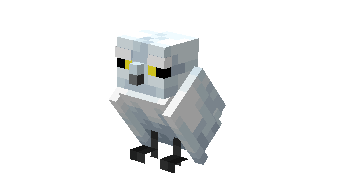
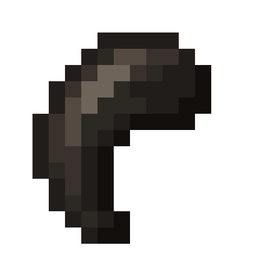
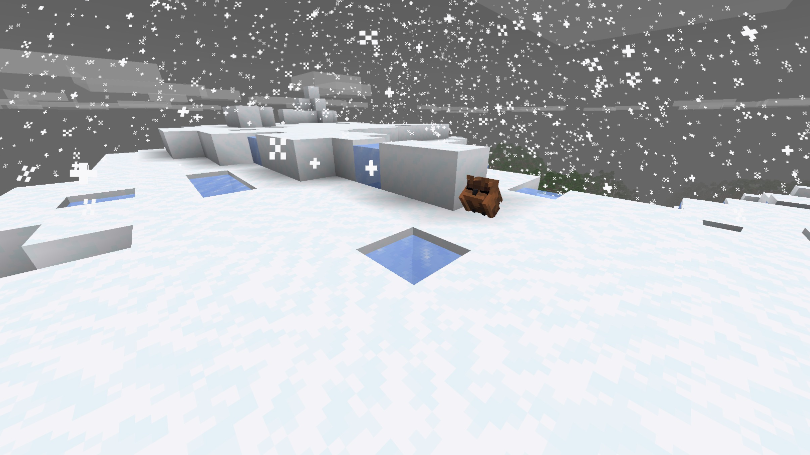
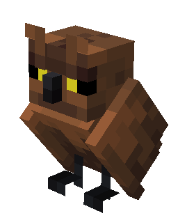
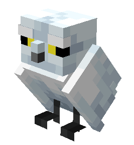

# Owl

Last Updated: April 22, 2025 8:47 PM

---

**Return**

🐻 [Naturalist Add-On Wiki](/www.notion.so/1a7a9a61c3f1800c8e32e893d6e7f430?pvs=21)

---

Owls are nocturnal birds and use their exceptional eyesight to hunt at night. They can turn their heads 135 degrees in each direction, totaling 270 degrees, which helps them keep an eye out for predators. Due to the structure of their eyes, they must turn their heads to see as they do not have peripheral vision, but they highly depend on their ears to hear the faintest noise near them. Their diets depend on raw meat that they can hunt by snatching it up with their powerful talons. 

<aside>

### **Owl**

---

**Health: 12** [♥️♥️♥️]

---

**Classification:** [Animal](/minecraft.fandom.com/wiki/Animal)

---

**Behavior:** Passive

---

**Spawn:** [Forest](/minecraft.wiki/w/Forest), [Snowy Slopes](/minecraft.wiki/w/Snowy_Slopes), [Taiga](/minecraft.wiki/w/Taiga), & [Taiga Hills](/minecraft.wiki/w/Taiga_Hills)

---

</aside>

---

### 🌎 Spawning

An owl will spawn in the [forest](/minecraft.wiki/w/Forest), [snowy slopes](/minecraft.wiki/w/Snowy_Slopes), [taiga](/minecraft.wiki/w/Taiga), and [taiga hills](/minecraft.wiki/w/Taiga_Hills) biomes. They will spawn during the daytime with [light levels](/minecraft.fandom.com/wiki/Light) between 7-15. 

---

### ⚔️ Drops

Owl [drops](/minecraft.fandom.com/wiki/Drops) upon death:

- 1 - 2 [Feather](/minecraft.wiki/w/Feather)
    - ⚔️ The maximum amount is increased by 1 per level of [Looting](/minecraft.fandom.com/wiki/Looting), for a maximum of 1-4 with Looting III
- 1 Talon

*Note: The talon has a chance to drop but is not guaranteed upon death.*

- 🟢 1 - 3 [Experience](/minecraft.fandom.com/wiki/Experience) Orbs if killed by Player.

---

### 🧠 Behavior

Owls are passive birds that can be found on the ground or flying up onto trees to perch. Occasionally, you may find one taking a small nap during the day.

Owls are nocturnal birds that fly about at night. They occasionally land on leaves before taking off again. Players can tempt owls by holding meat items, defined below, at which point the owl will follow the player. 

**Items for tempting:**

[Raw Beef](/minecraft.wiki/w/Raw_Beef), [Raw Porkchop](/minecraft.wiki/w/Raw_Porkchop), [Raw Chicken](/minecraft.wiki/w/Raw_Chicken), [Raw Cod](/minecraft.wiki/w/Raw_Cod), [Raw Salmon](/minecraft.wiki/w/Raw_Salmon), [Raw Rabbit,](/minecraft.wiki/w/Raw_Rabbit) [Raw Mutton](/minecraft.wiki/w/Raw_Mutton), [Cooked Beef](/minecraft.wiki/w/Steak), [Cooked Porkchop](/minecraft.wiki/w/Cooked_Porkchop), [Cooked Chicken](/minecraft.wiki/w/Cooked_Chicken), [Cooked Cod](/minecraft.wiki/w/Cooked_Cod), [Cooked Salmon](/minecraft.wiki/w/Cooked_Salmon), [Cooked Rabbit](/minecraft.wiki/w/Cooked_Rabbit), and [Cooked Mutton](/minecraft.wiki/w/Cooked_Mutton).

---

### ❤️ Taming, Healing, & Feeding

Owls can be tamed with a variety of raw and uncooked meats. There is a 100% chance of successful taming. Once they are tamed, you will see hearts appear. There is no visual indication they are tamed other than the hearts, however, an owl will follow you around once it is tamed.

Tamed owls can be commanded to sit or to follow.

- Owls will teleport to the player if the player is further than 15 blocks away.
- Owls will not teleport to the player if they are commanded to sit.

If an owl you have tamed gets injured, you can feed it a variety of raw and uncooked meats to increase its [health](/minecraft.fandom.com/wiki/Health) until it is maxed. The amount of health points returned to the owl depends on the variety of meat given, which is defined below.

**List of items for taming & applicable health points:**

**2 Health Points:** [Raw Beef](/minecraft.wiki/w/Raw_Beef), [Raw Porkchop](/minecraft.wiki/w/Raw_Porkchop), [Raw Chicken](/minecraft.wiki/w/Raw_Chicken), [Raw Cod](/minecraft.wiki/w/Raw_Cod), [Raw Salmon](/minecraft.wiki/w/Raw_Salmon), and [Raw Rabbit](/minecraft.wiki/w/Raw_Rabbit). [Raw Mutton](/minecraft.wiki/w/Raw_Mutton) (for taming only).

**3 Health Points:** [Cooked Beef](/minecraft.wiki/w/Steak), [Cooked Porkchop](/minecraft.wiki/w/Cooked_Porkchop), [Cooked Chicken](/minecraft.wiki/w/Cooked_Chicken), [Cooked Cod](/minecraft.wiki/w/Cooked_Cod), [Cooked Salmon](/minecraft.wiki/w/Cooked_Salmon), and [Cooked Rabbit](/minecraft.wiki/w/Cooked_Rabbit). [Cooked Mutton](/minecraft.wiki/w/Cooked_Mutton) (for taming only).

Feeding these birds a [cookie](/minecraft.wiki/w/Cookie) will cause [Fatal Poison](/minecraft.wiki/w/Fatal_Poison) particles to be emitted, and they will lose health points. Chocolate is toxic to birds.

---

### 🖼️ Gallery

---

### 🎨 Variants

                       Brown Owl

                         White Owl

---

<aside>
 Have additional questions? Want to be a part of our community? → [Join our Discord!](/discord.com/invite/starfishstudios)

</aside>

<aside>

[**Marketplace](/www.minecraft.net/en-us/marketplace/creator?name=Starfish%20Studios)      [CurseForge](/www.curseforge.com/members/starfish_studios/projects)      [TikTok](/www.tiktok.com/@starfishstudios)      [Instagram](/www.instagram.com/starfishstudiosinc/)      [Twitter](/twitter.com/starfishstudios)      [YouTube](/www.youtube.com/@starfishstudios)      [Website](/starfish-studios.com/)**

</aside>
