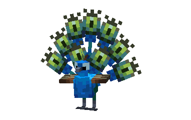
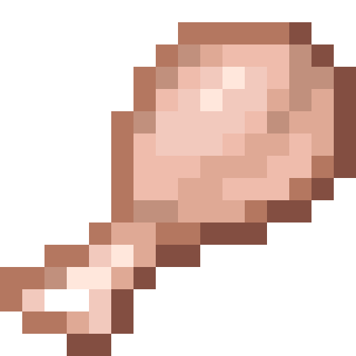
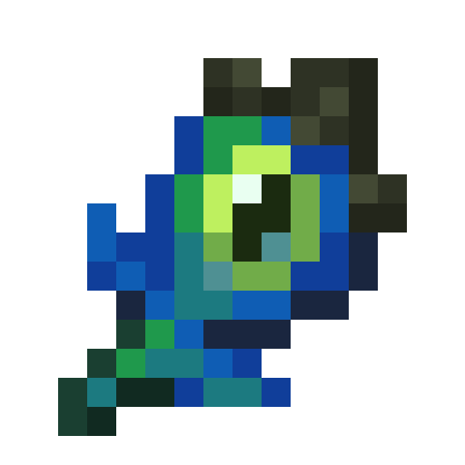
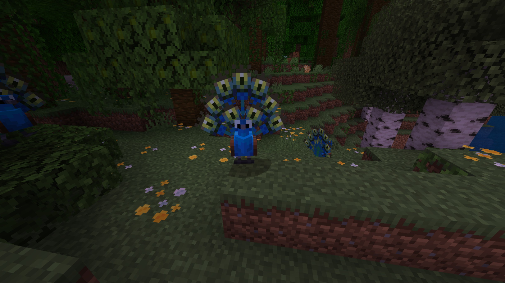

# Peafowl

Last Updated: April 22, 2025 8:47 PM

---

**Return**

🐻 [Naturalist Add-On Wiki](/www.notion.so/1a7a9a61c3f1800c8e32e893d6e7f430?pvs=21)

---

Peafowls are beautiful birds that are fully capable of flight but like to stay on the ground most of the time. They have excellent eyesight that can detect movement from a long distance. Their train (tail feathers) can reach up to 6 feet long!

<aside>

### **Peafowl**

---

**Health: 18** [♥️♥️♥️]

---

**Classification:** [Animal](/minecraft.fandom.com/wiki/Animal)

---

**Behavior:** Passive

---

**Spawn:** [Flower Forest](/minecraft.wiki/w/Flower_Forest) & [Jungle Edge](/minecraft.wiki/w/Sparse_Jungle)

---

</aside>

---

### 🌎 Spawning

A muster of peafowls will spawn in the [flower forest](/minecraft.wiki/w/Flower_Forest) or [jungle edge](/minecraft.wiki/w/Sparse_Jungle) biomes. These birds have no chance at camouflaging as their distinct blue-green feathers stand out. A passerby may mistake them for ender eyes! They will spawn during the day with [light levels](/minecraft.fandom.com/wiki/Light) of 7-15.

---

### ⚔️ Drops

Peafowls [drops](/minecraft.fandom.com/wiki/Drops) upon death:

- 0 - 2 Peacock Feather
- 1 Drumstick
- 🟢 1 - 3 [Experience](/minecraft.fandom.com/wiki/Experience) Orbs if killed by Player

---

### 🧠 Behavior

Peafowls are colorful, passive birds that roam forest biomes. They can be found with their feathers upright and ready to sway! Peacocks love to dance, so they can be spotted occasionally dancing, swaying, and flapping their wings.

Tamed peafowls will occasionally spread their tails to their owner, giving their owner 10 seconds of regeneration and having a chance to drop a peacock feather.

---

### ❤️ Taming, Healing, & Feeding

Peafowls can be tamed by dancing! The player will need to crouch multiple times to dance with the peafowl for taming to be successful. Once they are tamed, you will see hearts appear and a bow on their chest signifying you have tamed the bird. You can [dye](/minecraft.fandom.com/wiki/Dye) the bow to your color of choice or use [shears](/minecraft.fandom.com/wiki/Shears) to cut off the bow. If you shear off a bow, it can be reapplied by using a dye color of your choice.

Tamed peafowls cannot be commanded, nor will they follow a player at any time. To keep your peafowls within a certain area, you can put a [lead](/minecraft.wiki/w/Lead) on them and tie them to a [fence](/minecraft.wiki/w/Wooden_Fence) or build a corral around them. 

If a peafowl you have tamed gets injured, you can feed the bird [wheat seeds](/minecraft.wiki/w/Wheat_Seeds), [pumpkin seeds](/minecraft.wiki/w/Pumpkin_Seeds), [melon seeds](/minecraft.wiki/w/Melon_Seeds), [beetroot seeds](/minecraft.wiki/w/Beetroot_Seeds), [pitcher pods](/minecraft.wiki/w/Pitcher_Pod), or [torchflower seeds](/minecraft.wiki/w/Torchflower_Seeds) to increase its [health](/minecraft.fandom.com/wiki/Health) until it is maxed. 1 seed increases the bird’s health points by 2.

---

### 🖼️ Gallery

---

<aside>
 Have additional questions? Want to be a part of our community? → [Join our Discord!](/discord.com/invite/starfishstudios)

</aside>

<aside>

[**Marketplace](/www.minecraft.net/en-us/marketplace/creator?name=Starfish%20Studios)      [CurseForge](/www.curseforge.com/members/starfish_studios/projects)      [TikTok](/www.tiktok.com/@starfishstudios)      [Instagram](/www.instagram.com/starfishstudiosinc/)      [Twitter](/twitter.com/starfishstudios)      [YouTube](/www.youtube.com/@starfishstudios)      [Website](/starfish-studios.com/)**

</aside>
