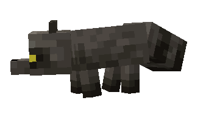
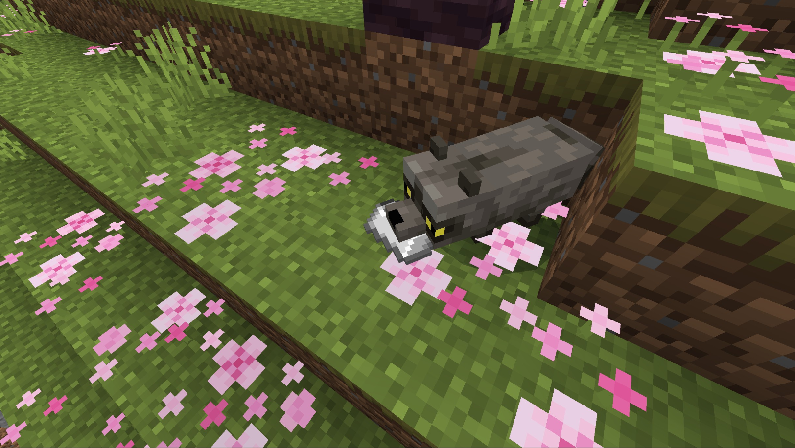
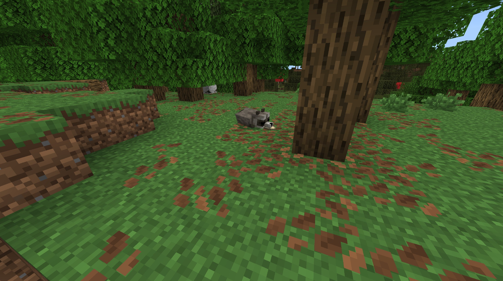
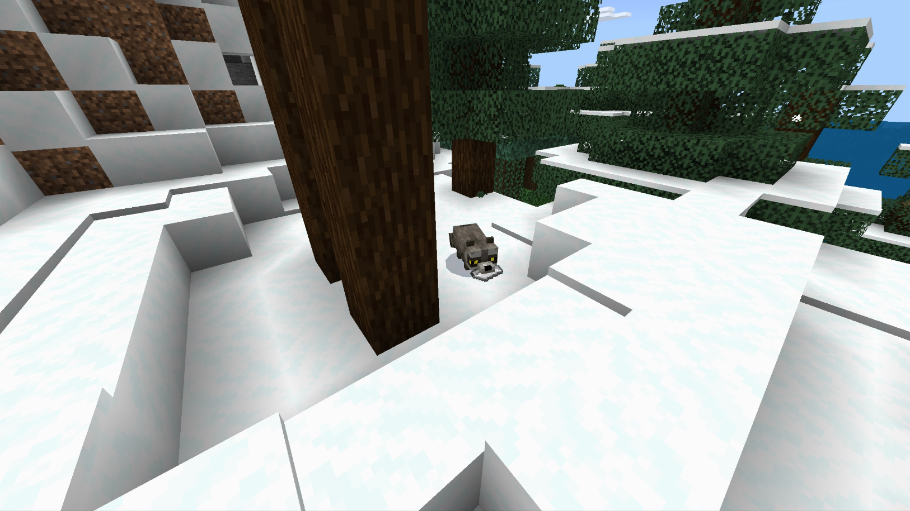

# Racoon

Last Updated: April 22, 2025 8:47 PM

---

**Return**

🐻 [Naturalist Add-On Wiki](/www.notion.so/1a7a9a61c3f1800c8e32e893d6e7f430?pvs=21)

---

Racoons are devious animals that are distinct by their black mask markings around their eyes. They have five fingers, much like humans, and scrounge urban and rural areas to find food. These animals love to open containers, especially those they find challenging, to reach their goal. Raccoons are known to dip their food in water before they eat, and they inspect their food after watching them before eating. 

<aside>

### **Racoon**

---

**Health: 18** [♥️♥️♥️]

---

**Classification:** [Animal](/minecraft.fandom.com/wiki/Animal)

---

**Behavior:** Passive

---

**Spawn:** [Forest](/minecraft.wiki/w/Forest), [Flower Forest](/minecraft.wiki/w/Flower_Forest), [Mega Taiga](/minecraft.wiki/w/Taiga), [Mountains](/minecraft.wiki/w/Mountains), & [Taiga](/minecraft.wiki/w/Taiga)

---

</aside>

---

### 🌎 Spawning

A gaze of 1-2 raccoons will spawn in the [forest](/minecraft.wiki/w/Forest), [flower forest](/minecraft.wiki/w/Flower_Forest), [mega taiga](/minecraft.wiki/w/Taiga), [mountains](/minecraft.wiki/w/Mountains), and [taiga](/minecraft.wiki/w/Taiga) biomes. They spawn on [grass](/minecraft.fandom.com/wiki/Grass_Block), [sand](/minecraft.wiki/w/Sand), and [snow](/minecraft.wiki/w/Snow_Block) during the daytime with [light levels](/minecraft.fandom.com/wiki/Light) of 7-15.

---

### ⚔️ Drops

Raccoon [drops](/minecraft.fandom.com/wiki/Drops) upon death:

- 0 - 2 Morsel
- 0 - 1 Fur
- 🟢 1 - 3 [Experience](/minecraft.fandom.com/wiki/Experience) Orbs if killed by Player.
- 🟢 1 - 7 Experience Orbs upon [breeding](/minecraft.fandom.com/wiki/Breeding).

*Cubs yield no items nor experience.* 

Raccoons are thieves and can be found with items in their mouths. The only way to obtain these items is when they are dropped via death. These are the following items that can be obtained:

- [Apple](/minecraft.wiki/w/Apple)
- [Bone](/minecraft.wiki/w/Bone)
- [Egg](/minecraft.wiki/w/Egg)
- [Iron Ingot](/minecraft.wiki/w/Iron_Ingot)
- [Stick](/minecraft.fandom.com/wiki/Stick)
- [Sweet Berries](/minecraft.wiki/w/Sweet_Berries)

---

### 🧠 Behavior

Raccoons are adventurous, passive animals that can be found with items in their mouths. 

Raccoons will scrounge around inside barrels, chests, and trapped chests until they find an item to steal. If a player hits a raccoon that is actively searching a container, they will stop searching and try to flee from the player. Baby raccoons will not search inside containers, but they will follow their parents until they are mature adults.

Raccoons sleep between the [ticks](/minecraft.fandom.com/wiki/Tick) of 6000-13000. If hit while sleeping, they will wake up, attempt to flee, and go back to sleep once they are successful.

---

### 🥚Breeding

Adult raccoons can be [bred](/minecraft.fandom.com/wiki/Breeding) with [glow berries](/minecraft.wiki/w/Glow_Berries) and [sweet berries](/minecraft.wiki/w/Sweet_Berries). There is a 5-minute cooldown for breeding, during which the raccoon does not accept any berries for breeding. 

Upon successful breeding, a cub will be born. The growth of cubs can be slowly accelerated by using berries. 

---

### 🖼️ Gallery

---

<aside>
 Have additional questions? Want to be a part of our community? → [Join our Discord!](/discord.com/invite/starfishstudios)

</aside>

<aside>

[**Marketplace](/www.minecraft.net/en-us/marketplace/creator?name=Starfish%20Studios)      [CurseForge](/www.curseforge.com/members/starfish_studios/projects)      [TikTok](/www.tiktok.com/@starfishstudios)      [Instagram](/www.instagram.com/starfishstudiosinc/)      [Twitter](/twitter.com/starfishstudios)      [YouTube](/www.youtube.com/@starfishstudios)      [Website](/starfish-studios.com/)**

</aside>
