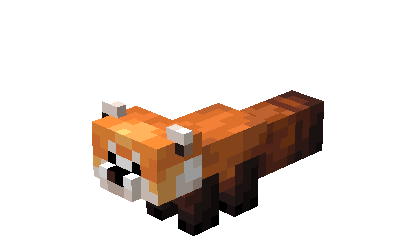
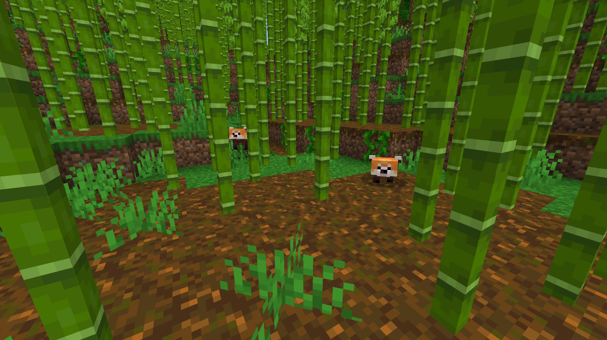
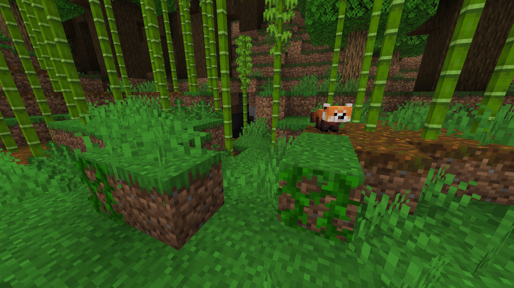
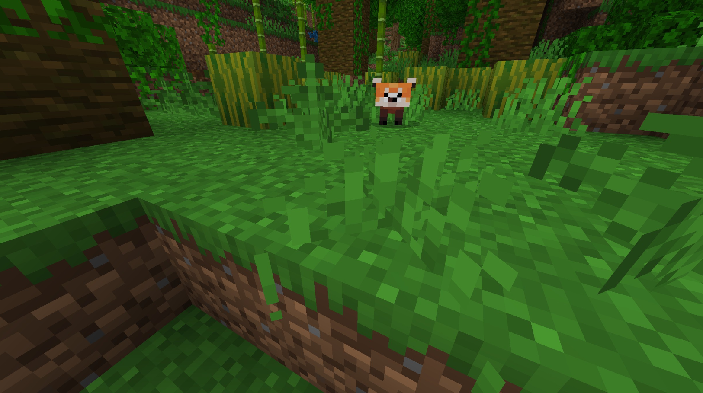

# Red Panda

Last Updated: April 22, 2025 8:47 PM

---

**Return**

🐻 [Naturalist Add-On Wiki](/www.notion.so/1a7a9a61c3f1800c8e32e893d6e7f430?pvs=21)

---

Red pandas are endangered animals that reside in Asia. They are nocturnal animals that love munching on bamboo leaves as their main food source. They utilize their tails as blankets in colder weather, even though they prefer the winter season!

<aside>

### **Red Panda**

---

**Health: 12** [♥️♥️♥️]

---

**Classification:** 

---

**Behavior:** 

---

**Spawn:** [Bamboo Jungle](/minecraft.wiki/w/Bamboo_Jungle), [Bamboo Jungle Hills](/minecraft.wiki/w/Bamboo_Jungle_Hills), & [Jungle](/minecraft.wiki/w/Jungle)

---

</aside>

---

### 🌎 Spawning

A pack of 1-2 red pandas will spawn in the [bamboo jungle](/minecraft.wiki/w/Bamboo_Jungle), [bamboo jungle hills](/minecraft.wiki/w/Bamboo_Jungle_Hills), and [jungle](/minecraft.wiki/w/Jungle) biomes. They will spawn during the daytime with [light levels](/minecraft.fandom.com/wiki/Light) between 9-15.

---

### ⚔️ Drops

Red Panda [drops](/minecraft.fandom.com/wiki/Drops) upon death:

- 0 - 1 Fur
    - ⚔️ The maximum amount is increased by 1 per level of [Looting](/minecraft.fandom.com/wiki/Looting), for a maximum of 1-3 with Looting III
- 0 - 1 Bushmeat
    - ⚔️ The maximum amount is increased by 1 per level of [Looting](/minecraft.fandom.com/wiki/Looting), for a maximum of 1-3 with Looting III
- 0 - 1 Cooked Bushmeat
    - ⚔️ Cooked Bushmeat can be dropped when killed on land by [Smelting](/minecraft.fandom.com/wiki/Fire_Aspect) or [Flame](/minecraft.fandom.com/wiki/Flame) enchantment.
- 🟢 1 - 3 [Experience](/minecraft.fandom.com/wiki/Experience) Orbs if killed by Player
- 🟢 1 - 7 Experience Orbs upon [breeding](/minecraft.fandom.com/wiki/Breeding).

*Cubs yield no items nor experience.* 

---

### 🧠 Behavior

Red pandas are passive animals that thrive in bamboo-ridden biomes. They are skittish animals that avoid players unless the player is holding bamboo. They will quickly approach in hopes they will be fed bamboo as that is their favorite snack! If a player attacks a red panda, they will attempt to flee.

Red pandas are full of energy, but they will burn through energy and require naps. If a player approaches a red panda while they are napping, they will jolt awake and run away.

Tamed red pandas will not run away from players.

---

### ❤️ Taming, Healing, & Feeding

Red Pandas can be tamed with [bamboo](/minecraft.wiki/w/Bamboo). There is a 30% chance of successful taming. Once they are tamed, you will see hearts appear. There is no visual indication that they are tamed other than the hearts, however, the red panda will follow you once it is tamed.

Tamed red pandas can be commanded to sit or to follow.

- Red pandas will teleport to the player if the player is further than 8 blocks away.
- Red pandas will not teleport to the player if they are commanded to sit.

If a red panda you have tamed gets injured, you can feed it bamboo to increase its [health](/minecraft.fandom.com/wiki/Health) until it is maxed. 1 bamboo increases the red panda’s health points by 2. An injured red panda will be unable to breed until it is healed.

---

### 🥚Breeding

Red pandas are required to be tamed before they can be [bred](/minecraft.fandom.com/wiki/Breeding). Adult red pandas can be bred with bamboo. There is a 5-minute cooldown for breeding, during which the red panda will not accept bamboo but will if they get injured and need to heal.

Upon successful breeding, a cub will be born. The growth of cubs can be slowly accelerated by using bamboo.

---

### 🖼️ Gallery

---

<aside>
 Have additional questions? Want to be a part of our community? → [Join our Discord!](/discord.com/invite/starfishstudios)

</aside>

<aside>

[**Marketplace](/www.minecraft.net/en-us/marketplace/creator?name=Starfish%20Studios)      [CurseForge](/www.curseforge.com/members/starfish_studios/projects)      [TikTok](/www.tiktok.com/@starfishstudios)      [Instagram](/www.instagram.com/starfishstudiosinc/)      [Twitter](/twitter.com/starfishstudios)      [YouTube](/www.youtube.com/@starfishstudios)      [Website](/starfish-studios.com/)**

</aside>
