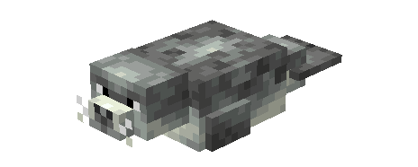
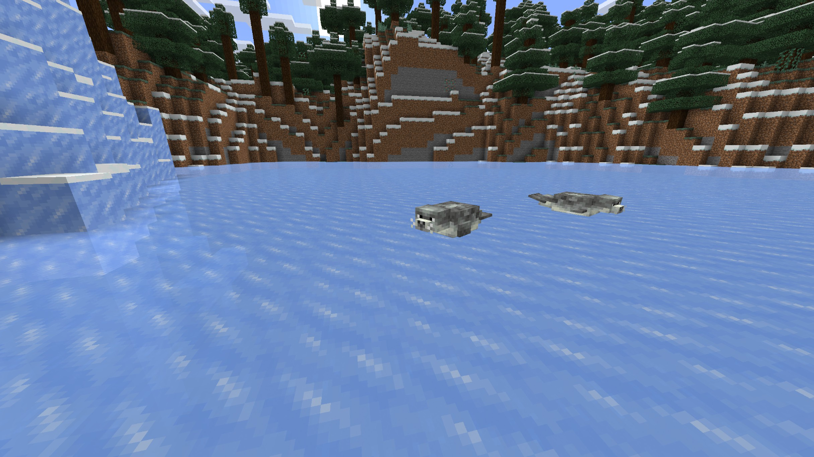
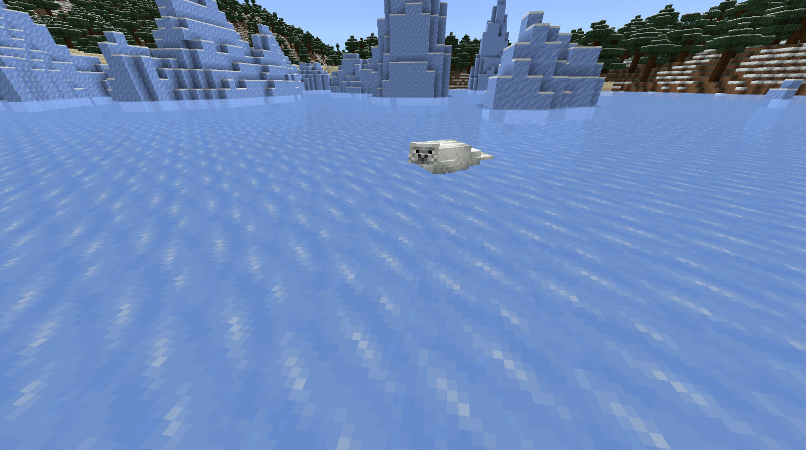
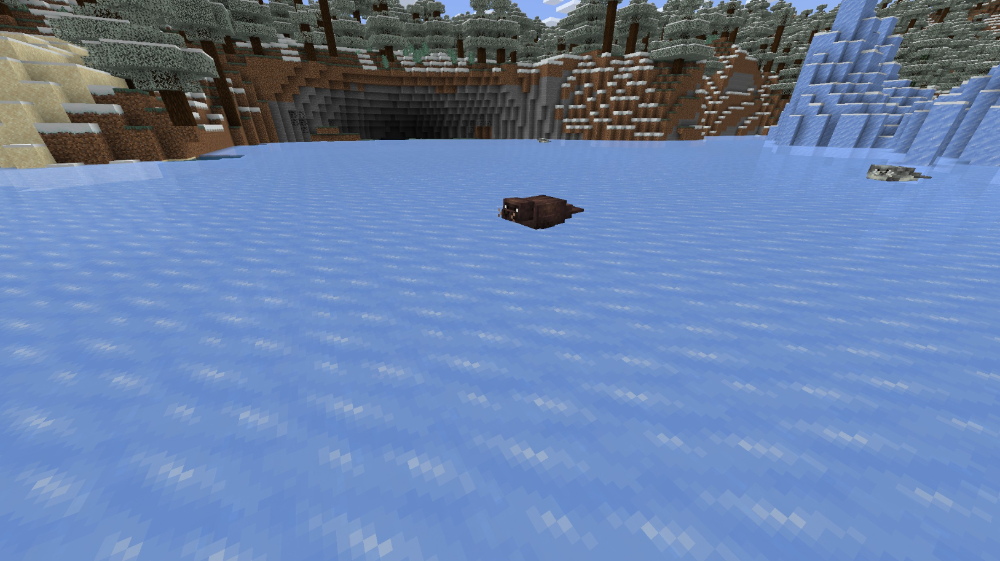
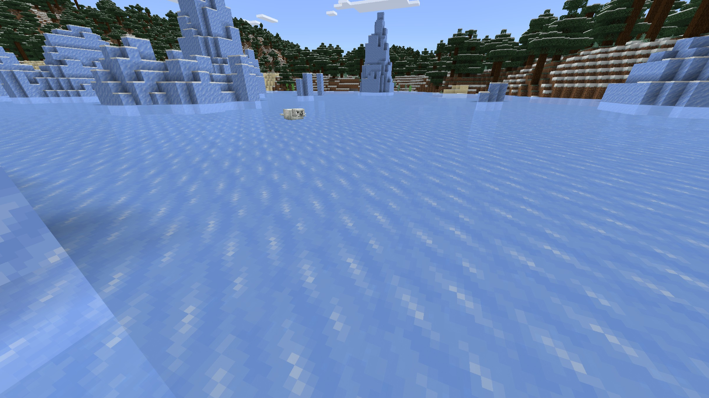
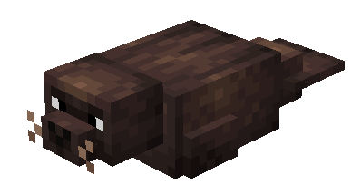
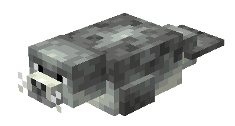
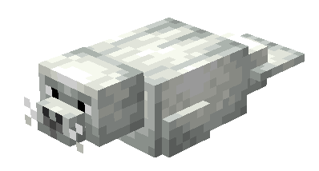

# Seals

Last Updated: April 22, 2025 8:47 PM

---

**Return**

🐻 [Naturalist Add-On Wiki](/www.notion.so/1a7a9a61c3f1800c8e32e893d6e7f430?pvs=21)

---

Seals are semi-aquatic mammals with thick, streamlined bodies that help them navigate the waters. They have a thick layer of blubber that acts as insulation to keep them warm and provides buoyancy. They have highly sensitive long whiskers which helps them navigate murky waters to find their prey consisting of primarily fish.

<aside>

### **Seals**

---

**Health: 10** [♥️♥️♥️]

---

**Classification:** [Animal](/minecraft.fandom.com/wiki/Animal) / [Aquatic](/minecraft.fandom.com/wiki/Aquatic)

---

**Behavior:** Passive

---

**Spawn:** [Cold Beach](/minecraft.wiki/w/Snowy_Beach), [Frozen River](/minecraft.wiki/w/Frozen_River), & [Frozen Ocean](/minecraft.wiki/w/Frozen_Ocean)

</aside>

---

### 🌎 Spawning

A herd of 1-3 seals will spawn on the [cold beach](/minecraft.wiki/w/Snowy_Beach), in [frozen rivers](/minecraft.wiki/w/Frozen_River), and in [frozen oceans](/minecraft.wiki/w/Frozen_Ocean). In cold beach biomes, you will find them between Y coordinates Y 0 and Y 64. In frozen rivers and frozen oceans, you will find them between Y coordinates Y -20 and Y 64.

---

### ⚔️ Drops

Adult seal [drops](/minecraft.fandom.com/wiki/Drops) upon death:

- 1 - 2 [Raw Cod](/minecraft.wiki/w/Raw_Cod), [Raw Salmon](/minecraft.wiki/w/Raw_Salmon), [Tropical Fish](/minecraft.fandom.com/wiki/Tropical_Fish), Raw Catfish, Raw Bass, or Hide
- 🟢 1 - 3 [Experience](/minecraft.fandom.com/wiki/Experience) Orbs if killed by Player
- 🟢 1 - 7 Experience Orbs upon [breeding](/minecraft.fandom.com/wiki/Breeding).

*Pups yield no items nor experience.*

---

### 🧠 Behavior

Seals are passive semi-aquatic animals that flop around on ice or swim in water. They are much like dolphins and will swim with the player in the water until the player reaches land or if the player is outside of their swimming radius. 

Seals can be found with pups, and these pups will follow their parents until they are mature. 

Seals will panic if they are attacked by a player and will attempt to run away.

---

### 🥚Breeding

Adult seals can be [bred](/minecraft.fandom.com/wiki/Breeding) with [raw cod](/minecraft.wiki/w/Raw_Cod), [raw salmon](/minecraft.wiki/w/Raw_Salmon), raw catfish, raw bass, and [tropical fish](/minecraft.fandom.com/wiki/Tropical_Fish). There is a 5-minute cooldown during which the seal will not accept fish for breeding.

Upon successful breeding, a pup will be born. The growth of pups can be accelerated by feeding them raw cod, raw salmon, raw catfish, raw bass, and tropical fish.

---

### 🖼️ Gallery

---

### 🎨 Variants

               Brown Seal

              Spotted Seal

                  White Seal

---

<aside>
 Have additional questions? Want to be a part of our community? → [Join our Discord!](/discord.com/invite/starfishstudios)

</aside>

<aside>

[**Marketplace](/www.minecraft.net/en-us/marketplace/creator?name=Starfish%20Studios)      [CurseForge](/www.curseforge.com/members/starfish_studios/projects)      [TikTok](/www.tiktok.com/@starfishstudios)      [Instagram](/www.instagram.com/starfishstudiosinc/)      [Twitter](/twitter.com/starfishstudios)      [YouTube](/www.youtube.com/@starfishstudios)      [Website](/starfish-studios.com/)**

</aside>
