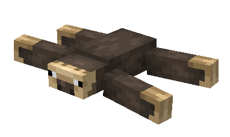
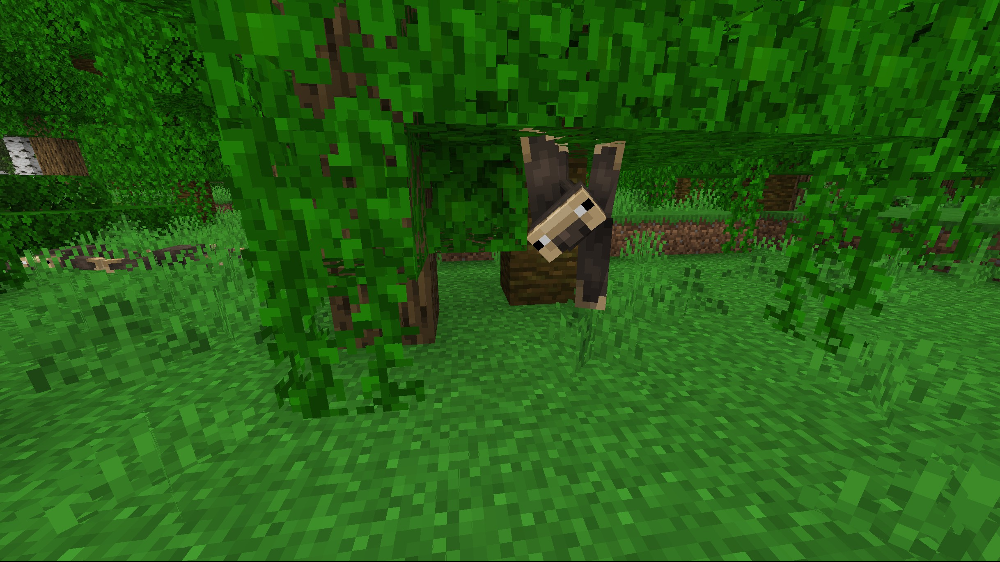
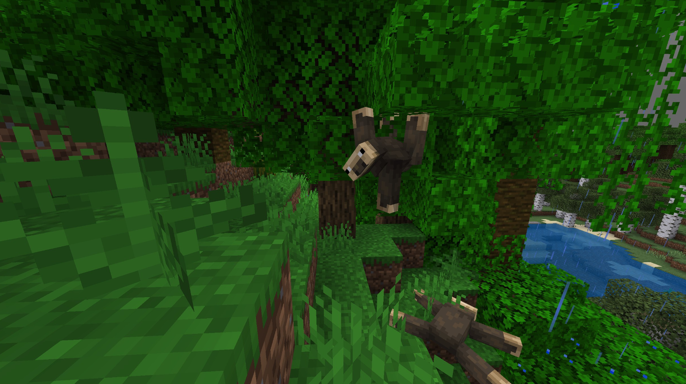
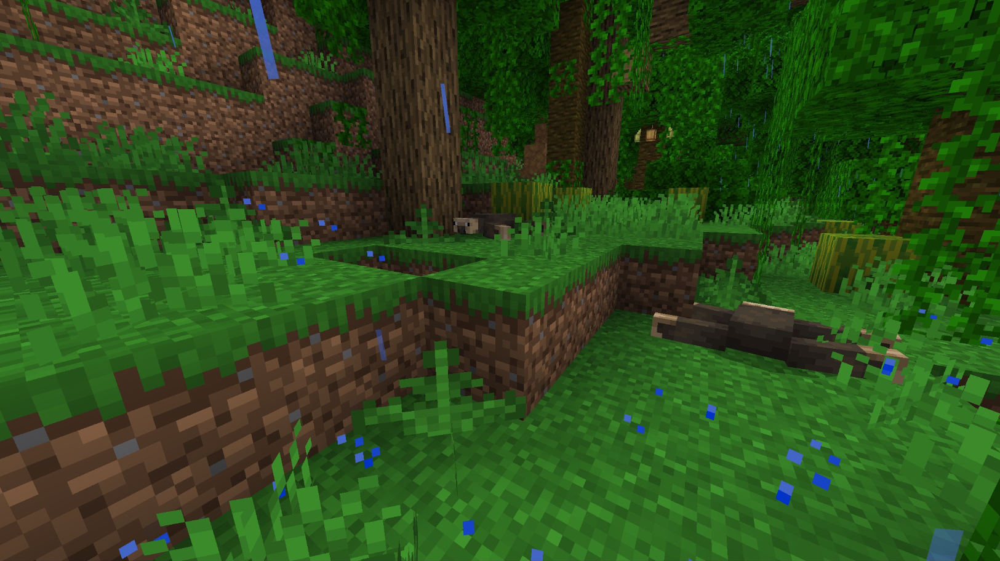

# Sloth

Last Updated: April 22, 2025 8:47 PM

---

**Return**

🐻 [Naturalist Add-On Wiki](/www.notion.so/1a7a9a61c3f1800c8e32e893d6e7f430?pvs=21)

---

Sloths reside in Central and South America, within thick jungles with plenty of vegetation. They have slow metabolisms, but when they do need to eat, they’ll thrive on a variety of fruits, vegetables, and leaves. Sloths enjoy lounging around and hanging from tree limbs in a dreamlike state, but are content sleeping all day!

<aside>

### **Sloth**

---

**Health: 12** [♥️♥️♥️]

---

**Classification:** [Animal](/minecraft.fandom.com/wiki/Animal)

---

**Behavior:** Passive

---

**Spawn:** [Jungle](/minecraft.wiki/w/Jungle)

---

</aside>

---

### 🌎 Spawning

Sloths will spawn in the [jungle](/minecraft.wiki/w/Jungle) biome during the daytime with [light levels](/minecraft.fandom.com/wiki/Light) between 7-15.

---

### ⚔️ Drops

Sloth [drops](/minecraft.fandom.com/wiki/Drops) upon death:

- 1 - 2 Bushmeat
- 1 - 2 Fur
- 🟢 1 - 3 [Experience](/minecraft.fandom.com/wiki/Experience) Orbs if killed by Player
- 🟢 1 - 7 Experience Orbs upon [breeding](/minecraft.fandom.com/wiki/Breeding)

*Kittens yield no items nor experience.*

---

### 🧠 Behavior

Sloths are passive animals that move slowly around the jungle. They can be spotted hanging from trees or lounging around, taking an afternoon nap (except during thunderstorms).

Sloths will avoid players if they are spotted, but they aren’t very quick to get away. They can be tempted with apples, carrots, eggs, and reptile tails. 

Baby sloths will follow their parents until they are mature adults.

---

### ❤️ Taming, Healing, & Feeding

Sloths can be tamed with [cocoa beans](/minecraft.wiki/w/Cocoa_Beans). There is a 70% chance of successful taming. Once they are tamed, you will see hearts appear. There is no visual indication that they are tamed other than the hearts, however, you can now command the sloth to stay. 

Tamed sloths can be commanded to stay or to roam.

- Sloths will not teleport to players while roaming.
- Sloths will not teleport to players while they are commanded to sit.

If a sloth you have tamed gets injured, you can feed the sloth cocoa beans to increase its [health](/minecraft.fandom.com/wiki/Health) until it is maxed. 1 cocoa bean increases the sloth’s health points by 2. An injured sloth will be unable to breed until it is healed.

---

### 🥚Breeding

Adult sloths can be [bred](/minecraft.fandom.com/wiki/Breeding) with [apples](/minecraft.wiki/w/Apple), [carrots](/minecraft.wiki/w/Carrot), [eggs](/minecraft.wiki/w/Egg), and raw reptile tails. There is a 5-minute cooldown for breeding, during which the sloth does not accept items for breeding, but will accept cocoa beans if they get injured and need to heal.

Upon successful breeding, a kitten will be born. The growth of kittens can be slowly accelerated by using apples, carrots, eggs, and raw reptile tails.

---

### 🖼️ Gallery

---

<aside>
 Have additional questions? Want to be a part of our community? → [Join our Discord!](/discord.com/invite/starfishstudios)

</aside>

<aside>

[**Marketplace](/www.minecraft.net/en-us/marketplace/creator?name=Starfish%20Studios)      [CurseForge](/www.curseforge.com/members/starfish_studios/projects)      [TikTok](/www.tiktok.com/@starfishstudios)      [Instagram](/www.instagram.com/starfishstudiosinc/)      [Twitter](/twitter.com/starfishstudios)      [YouTube](/www.youtube.com/@starfishstudios)      [Website](/starfish-studios.com/)**

</aside>
