# Snail

Last Updated: April 22, 2025 8:47 PM

---

**Return**

🐻 [Naturalist Add-On Wiki](/www.notion.so/1a7a9a61c3f1800c8e32e893d6e7f430?pvs=21)

---

Snails are small gastropods with hard shells that almost always twist clockwise. Each shell is unique in its own way, with special coloration that makes no two snails alike. They grow the size of their shell throughout their entire life, and they will hide in these shells when they are scared. They have slimy, moist skin that helps them glide over surfaces and stay hydrated.

<aside>

### **Snail**

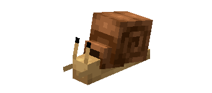

---

**Health: 2** [♥️♥️♥️]

---

**Classification:** [Animal](/minecraft.fandom.com/wiki/Animal)

---

**Behavior:** Passive

---

**Spawn:** [Forest](/minecraft.wiki/w/Forest), [Mangrove Swamp](/minecraft.wiki/w/Swamp), [Mooshroom Island](/minecraft.wiki/w/Mushroom_Fields), [Plains](/minecraft.wiki/w/Plains), [Savanna](/minecraft.wiki/w/Savanna), & [Swamp](/minecraft.wiki/w/Swamp)

---

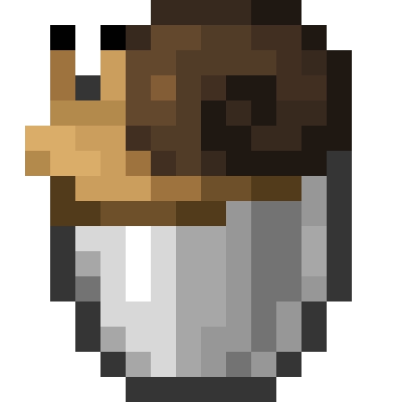

</aside>

---

### 🌎 Spawning

A walk of 1-3 snails spawn in the [forest](/minecraft.wiki/w/Forest), [mangrove swamp](/minecraft.wiki/w/Swamp), [mooshroom island](/minecraft.wiki/w/Mushroom_Fields), [plains](/minecraft.wiki/w/Plains), [savanna](/minecraft.wiki/w/Savanna), and [swamp](/minecraft.wiki/w/Swamp) biomes. They spawn all day and night, so if you find one, scoop it up with a bucket and bring it home with you!

---

### ⚔️ Drops

Snail [drops](/minecraft.fandom.com/wiki/Drops) upon death:

- 0 - 1 Snail Shell
- 🟢 1 - 3 [Experience](/minecraft.fandom.com/wiki/Experience) Orbs if killed by Player.
- 🟢 1 - 7 Experience Orbs upon [breeding](/minecraft.fandom.com/wiki/Breeding).

*Snail hatchlings yield no items nor experience.*

---

### 🧠 Behavior

Snails are passive gastropods with hard shells that slide their way across the ground. They will avoid players, but they aren’t very fast in doing so. Players will find snails in the wild only in their standard variant, but the player can use dye to dye their shells!

The player may collect a snail by using a [bucket](/minecraft.fandom.com/wiki/Bucket) on it, which gives the player a bucket of snail (in their shell color variant). Snails placed with buckets do not despawn naturally. When that bucket is used against a block, it empties the bucket, placing the snail on the ground. Snails cannot be put in a [cauldron](/minecraft.fandom.com/wiki/Cauldron).

---

### 🥚Breeding

Snails can be [bred](/minecraft.fandom.com/wiki/Breeding) with [beetroot](/minecraft.wiki/w/Beetroot). There is a 5-minute cooldown for breeding, during which the snail does not accept any beetroot for breeding. 

Upon successful breeding, the snail will find [sand](/minecraft.wiki/w/Sand), [grass](/minecraft.fandom.com/wiki/Grass_Block), [dirt](/minecraft.wiki/w/Dirt), [mud](/minecraft.fandom.com/wiki/Mud), [snow](/minecraft.wiki/w/Snow_Block), [ice](/minecraft.wiki/w/Ice), [packed ice](/minecraft.wiki/w/Packed_Ice), [blue ice](/minecraft.wiki/w/Blue_Ice), [stone](/minecraft.wiki/w/Stone), [deepslate](/minecraft.wiki/w/Deepslate), [netherrack](/minecraft.wiki/w/Netherrack), or [end stone](/minecraft.wiki/w/End_Stone) to lay their egg on. If in survival mode, the egg can be broken with 1 hit, and it will drop as an item. Once the egg is placed in the world, the egg hatch timer will restart. When the hatchling is viable, it will emerge from its egg!

---

### 🖼️ Gallery

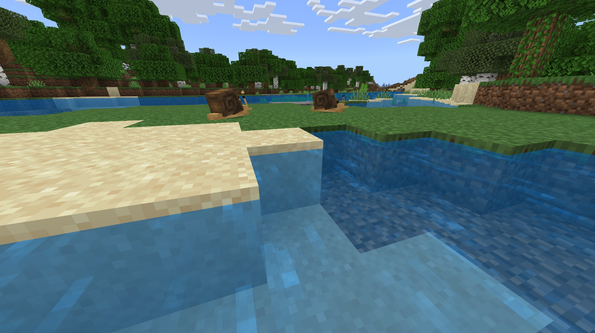

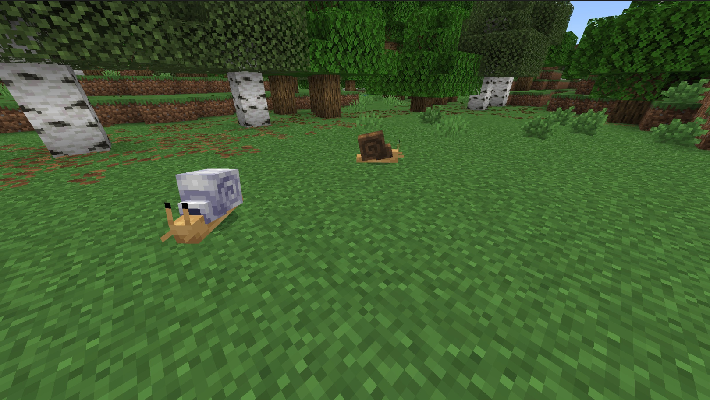

---

### 🎨 Variants

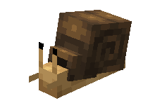

               Snail

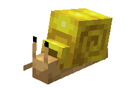

         Yellow Snail

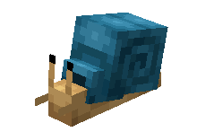

          Cyan Snail

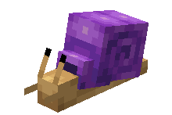

         Purple Snail

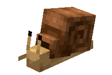

          Brown Snail

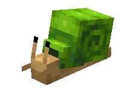

           Lime Snail

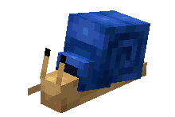

           Blue Snail

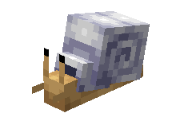

          White Snail

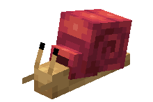

          Red Snail

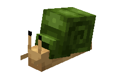

         Green Snail

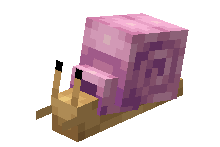

           Pink Snail

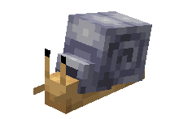

       Light Gray Snail

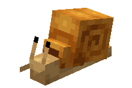

        Orange Snail

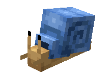

        Light Blue Snail

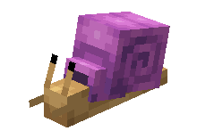

        Magenta Snail

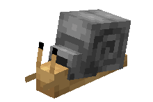

           Gray Snail

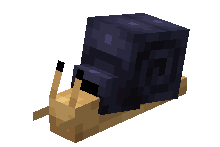

          Black Snail

---

<aside>
 Have additional questions? Want to be a part of our community? → [Join our Discord!](/discord.com/invite/starfishstudios)

</aside>

<aside>

[**Marketplace](/www.minecraft.net/en-us/marketplace/creator?name=Starfish%20Studios)      [CurseForge](/www.curseforge.com/members/starfish_studios/projects)      [TikTok](/www.tiktok.com/@starfishstudios)      [Instagram](/www.instagram.com/starfishstudiosinc/)      [Twitter](/twitter.com/starfishstudios)      [YouTube](/www.youtube.com/@starfishstudios)      [Website](/starfish-studios.com/)**

</aside>
