# Starfish

Last Updated: April 22, 2025 8:47 PM

---

**Return**

🐻 [Naturalist Add-On Wiki](/www.notion.so/1a7a9a61c3f1800c8e32e893d6e7f430?pvs=21)

---

Starfish are the stars of the oceans, scattered all about at varying depths. Starfish travel across the ocean floor utilizing their tube feet. If something happens to one of their legs, it can be regenerated! Starfish do not have a brain or a nervous system, but they are pretty skilled in navigating waters to avoid predators. They have hundreds of tubed feet attached to the underside of their bodies, which help them grab ahold of their prey or suction onto their surroundings in turbulent waters.

<aside>

### **Starfish**

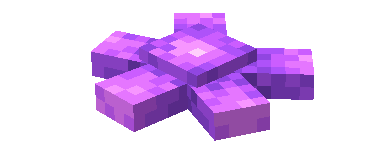

---

**Health: 4** [♥️♥️♥️]

---

**Classification:** [Animal](/minecraft.fandom.com/wiki/Animal) / [Aquatic](/minecraft.fandom.com/wiki/Aquatic)

---

**Behavior:** Passive

---

**Spawn:** [Ocean](/minecraft.wiki/w/Ocean)

---

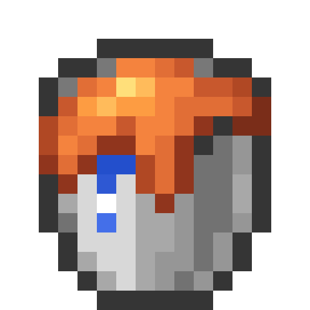

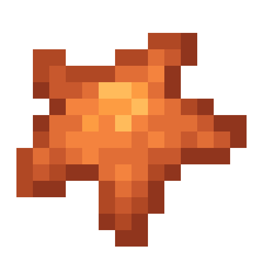

</aside>

---

### 🌎 Spawning

Starfish spawn in the ocean between Y coordinates Y -20 and Y 64.

---

### ⚔️ Drops

Starfish [drops](/minecraft.fandom.com/wiki/Drops) upon death:

- 1 Starfish

*Note: The color of starfish will drop their color variant as an item upon death.*

- 🟢 3 [Experience](/minecraft.fandom.com/wiki/Experience) Orbs if killed by Player

---

### 🧠 Behavior

Starfish are slow-moving aquatic creatures that exist in oceans. Starfish relax near coral reefs and on the ocean floor. They move so slowly that you may want to take a time-lapse video to see them move!

The player may collect starfish by using a [water bucket](/minecraft.fandom.com/wiki/Water_bucket) on it, which gives the player a bucket of starfish (with color variant). Starfish placed with buckets do not despawn naturally. When that starfish bucket is used against a block, it empties the bucket, placing water with the starfish in it.

**Weakness:**

Starfish are unable to survive out of water. Outside of water, they start to take damage from suffocation and die. Starfish cannot be put in a [cauldron](/minecraft.fandom.com/wiki/Cauldron).

---

### 🖼️ Gallery

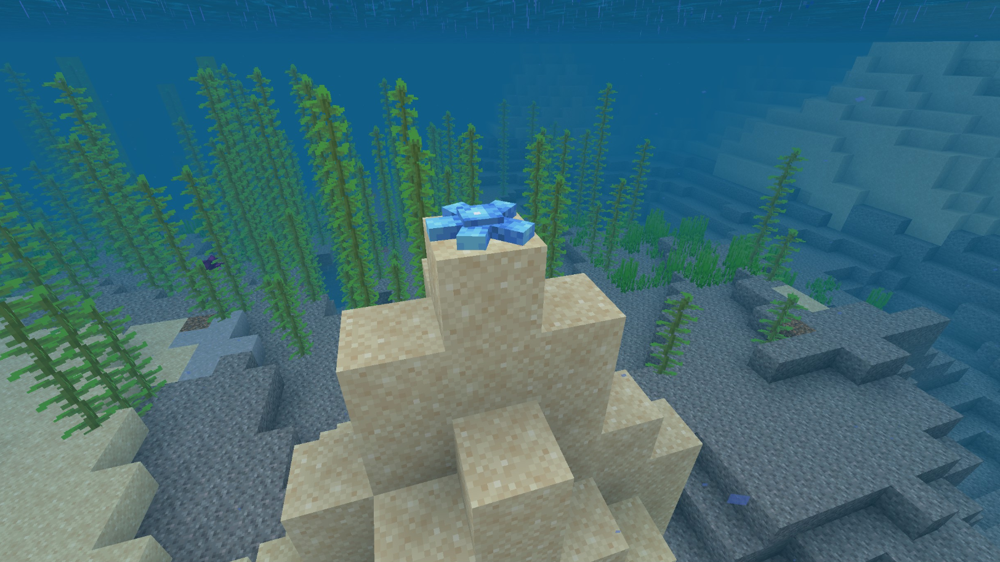

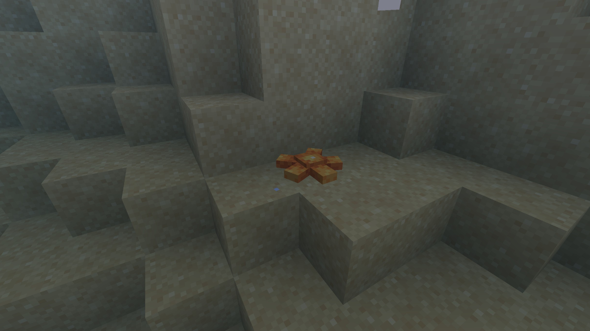

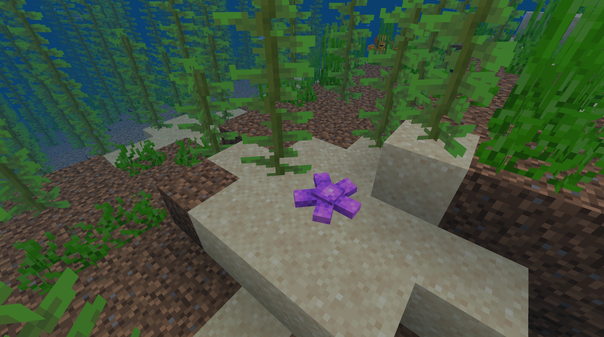

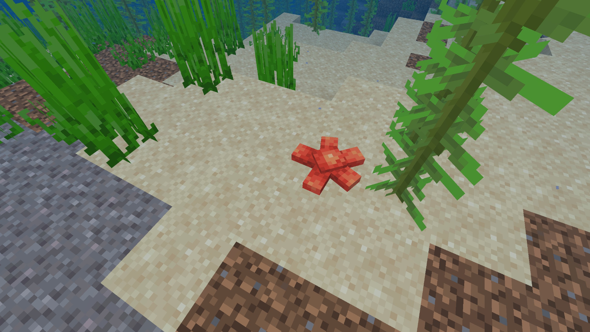

---

### 🎨 Variants

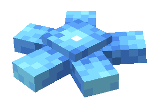

        Blue Starfish

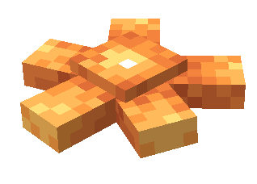

      Orange Starfish

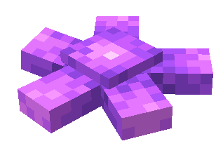

     Purple Starfish

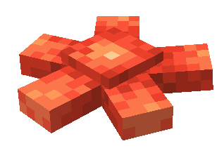

        Red Starfish

---

<aside>
 Have additional questions? Want to be a part of our community? → [Join our Discord!](/discord.com/invite/starfishstudios)

</aside>

<aside>

[**Marketplace](/www.minecraft.net/en-us/marketplace/creator?name=Starfish%20Studios)      [CurseForge](/www.curseforge.com/members/starfish_studios/projects)      [TikTok](/www.tiktok.com/@starfishstudios)      [Instagram](/www.instagram.com/starfishstudiosinc/)      [Twitter](/twitter.com/starfishstudios)      [YouTube](/www.youtube.com/@starfishstudios)      [Website](/starfish-studios.com/)**

</aside>
