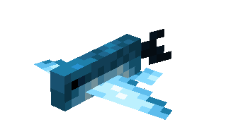
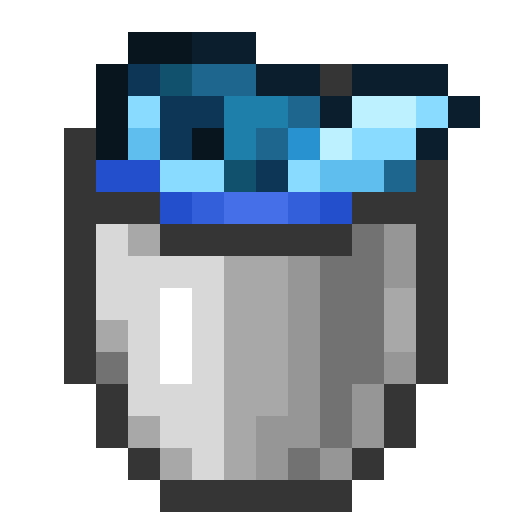
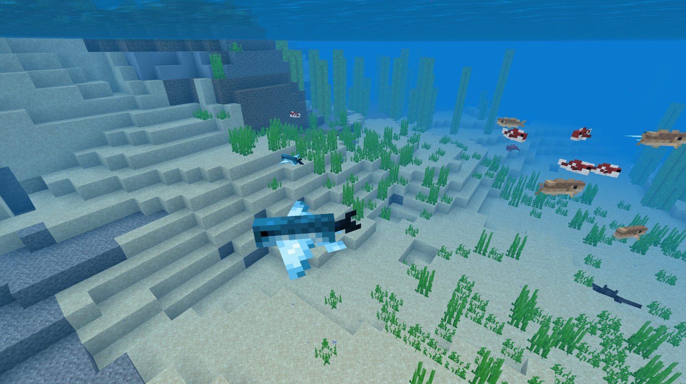

# Flying Fish

Last Updated: April 22, 2025 8:47 PM

---

**Return**

🐻 [Naturalist Add-On Wiki](/www.notion.so/1a7a9a61c3f1800c8e32e893d6e7f430?pvs=21)

---

Contrary to popular belief, flying fish do not actually fly. These fish can leap out of the water and glide through the air and can stay in the air for up to 200 meters. They can reach up to 37 miles per hour just below the surface and leap out of the water to help them avoid predators. Flying fish are attracted to light, which fishers utilize to help catch them. 

<aside>

### **Flying Fish**

---

**Health: 15** [♥️♥️♥️]

---

**Classification:** [Animal](/minecraft.fandom.com/wiki/Animal) / [Aquatic](/minecraft.fandom.com/wiki/Aquatic)

---

**Behavior:** Passive

---

**Spawn:** [Ocean](/minecraft.wiki/w/Ocean)

---

</aside>

---

### 🌎 Spawning

Flying fish spawn underwater in the [ocean](/minecraft.wiki/w/Ocean) biome. They spawn between coordinates Y 0 & Y 64.

---

### ⚔️ Drops

Flying Fish [drops](/minecraft.fandom.com/wiki/Drops) upon death:

- 0 - 2 [Feather](/minecraft.wiki/w/Feather)
    - ⚔️ The maximum amount is increased by 1 per level of [Looting](/minecraft.fandom.com/wiki/Looting), for a maximum of 0-6 with Looting III.
- 🟢 1 - 3 [Experience](/minecraft.fandom.com/wiki/Experience) Orbs if killed by Player.

---

### 🧠 Behavior

Flying fish are passive fish that swim in the ocean.

The player may collect flying fish by using a [water bucket](/minecraft.fandom.com/wiki/Water_bucket) on it, which gives the player a bucket of flying fish. Flying fish placed with buckets do not despawn naturally. When that fish bucket is used against a block, it empties the bucket, placing water with the flying fish swimming in it.

**Weakness:**

Flying fish are unable to survive out of water. Outside of water, they flop around for a while until, eventually, they start to suffocate and die. Flying fish will flop on their sides. They cannot be put in a [cauldron](/minecraft.fandom.com/wiki/Cauldron).

---

### 🖼️ Gallery

---

<aside>
 Have additional questions? Want to be a part of our community? → [Join our Discord!](/discord.com/invite/starfishstudios)

</aside>

<aside>

[**Marketplace](/www.minecraft.net/en-us/marketplace/creator?name=Starfish%20Studios)      [CurseForge](/www.curseforge.com/members/starfish_studios/projects)      [TikTok](/www.tiktok.com/@starfishstudios)      [Instagram](/www.instagram.com/starfishstudiosinc/)      [Twitter](/twitter.com/starfishstudios)      [YouTube](/www.youtube.com/@starfishstudios)      [Website](/starfish-studios.com/)**

</aside>
