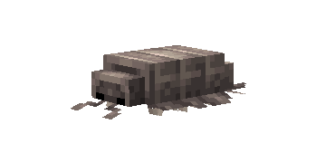
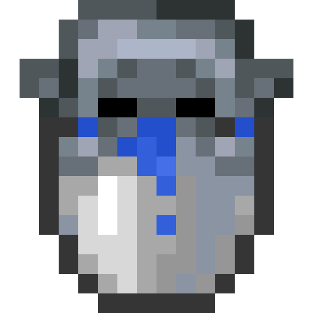
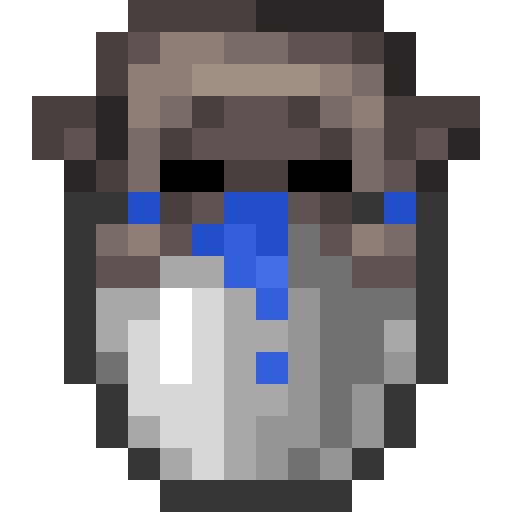
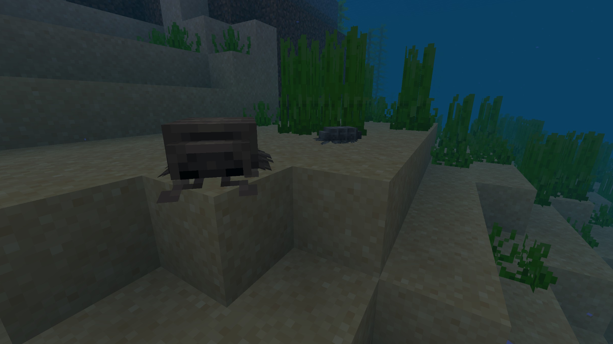
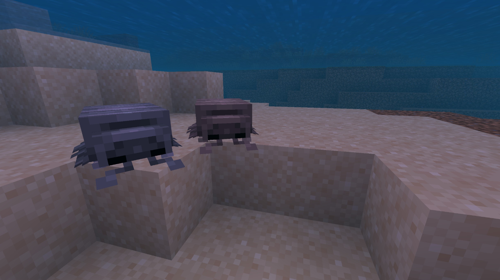
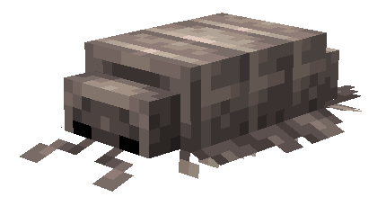
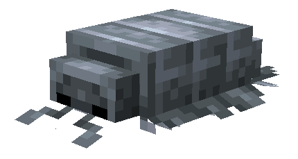

# Giant Isopod

Last Updated: April 22, 2025 8:47 PM

---

**Return**

🐻 [Naturalist Add-On Wiki](/www.notion.so/1a7a9a61c3f1800c8e32e893d6e7f430?pvs=21)

---

Giant isopods are not bugs; they are crustaceans, much like crabs are. They are bottom dwellers and prefer mud or clay floors that they burrow into for shelter. Giant isopods live up to their name, they are between 7.5 to 14.2 inches in length. These crustations are carnivores, which is why they can be bred with fish!

<aside>

### **Giant Isopod**

---

**Health: 10** [♥️♥️♥️]

---

**Classification:** [Aquatic](/minecraft.fandom.com/wiki/Aquatic)

---

**Behavior:** Passive

---

**Spawn:** [Ocean](/minecraft.wiki/w/Ocean)

---

</aside>

---

### 🌎 Spawning

The Giant Isopod will spawn underwater in the [ocean](/minecraft.wiki/w/Ocean) biome. If you are searching for one, stay out of frozen oceans, as they will not spawn there. They can be found between coordinates Y -20 & Y 64.

---

### ⚔️ Drops

Giant Isopod [drops](/minecraft.fandom.com/wiki/Drops) upon death:

- 0 - 1 Bone Meal
- 🟢 1 - 3 [Experience](/minecraft.fandom.com/wiki/Experience) Orbs if killed by Player.
- 🟢 1 - 7 Experience Orbs upon [breeding](/minecraft.fandom.com/wiki/Breeding).

*Baby isopods yield no items nor experience.* 

---

### 🧠 Behavior

Giant isopods are passive crustaceans that crawl around on the sea floors. They will flee from players if they get too close, and they coil up into a ball if they get attacked as a form of self-defense. 

The player may collect a giant isopod by using a [water bucket](/minecraft.fandom.com/wiki/Water_bucket) on it, which gives the player a bucket of Blue Giant Isopod/Bucket of Brown Giant Isopod.  Giant isopods placed with buckets do not despawn naturally. When that fish bucket is used against a block, it empties the bucket, placing water with the giant isopod swimming in it.

**Weakness:**

Giant isopods are unable to survive out of water. Outside of water, they curl up in a ball once they start to suffocate and die. Giant isopods cannot be put in a [cauldron](/minecraft.fandom.com/wiki/Cauldron).

---

### 🥚Breeding

Giant isopods can be [bred](/minecraft.fandom.com/wiki/Breeding) with [raw cod](/minecraft.wiki/w/Raw_Cod), [raw salmon](/minecraft.wiki/w/Raw_Salmon), raw bass, raw catfish, raw anglerfish, and [tropical fish](/minecraft.fandom.com/wiki/Tropical_Fish). There is a 5-minute cooldown for breeding, during which the giant isopod does not accept fish for breeding.

Upon successful breeding, a baby isopod will be born. The growth of baby isopods can be slowly accelerated by using fish.

---

### 🖼️ Gallery

---

### 🎨 Variants

                        Brown Giant Isopod

                     Blue Giant Isopod

---

<aside>
 Have additional questions? Want to be a part of our community? → [Join our Discord!](/discord.com/invite/starfishstudios)

</aside>

<aside>

[**Marketplace](/www.minecraft.net/en-us/marketplace/creator?name=Starfish%20Studios)      [CurseForge](/www.curseforge.com/members/starfish_studios/projects)      [TikTok](/www.tiktok.com/@starfishstudios)      [Instagram](/www.instagram.com/starfishstudiosinc/)      [Twitter](/twitter.com/starfishstudios)      [YouTube](/www.youtube.com/@starfishstudios)      [Website](/starfish-studios.com/)**

</aside>
