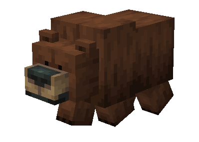
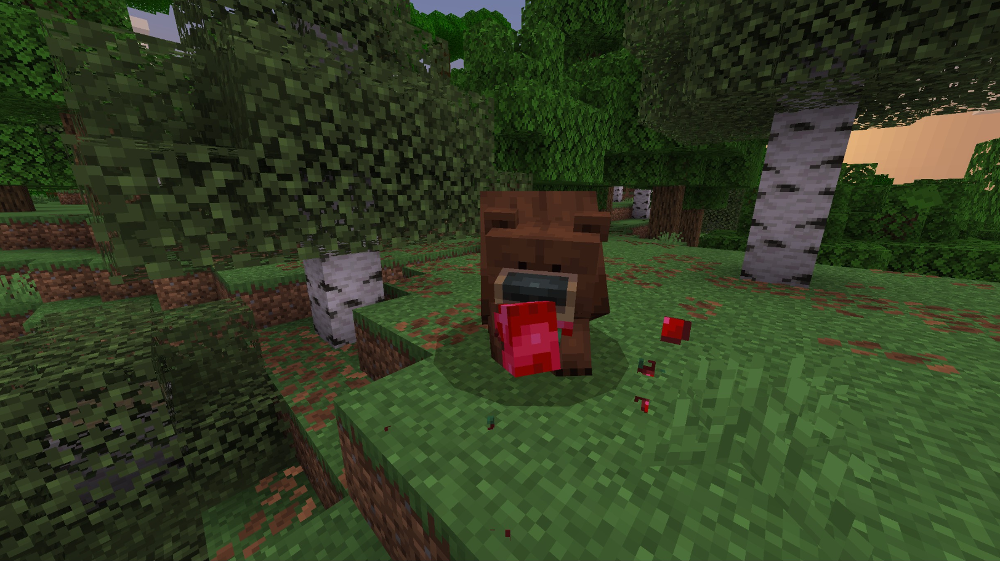
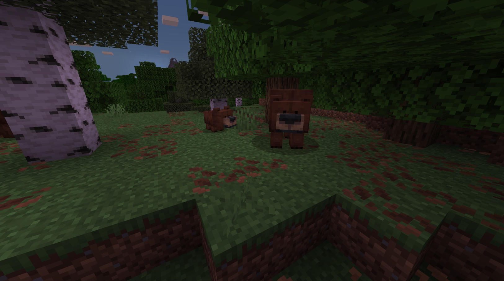
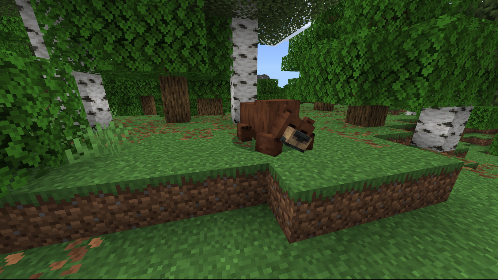
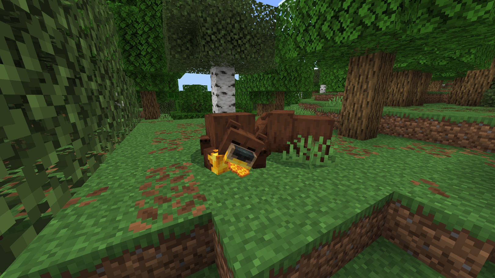

# Grizzly Bear

Last Updated: April 22, 2025 8:47 PM

---

**Return**

🐻 [Naturalist Add-On Wiki](/www.notion.so/1a7a9a61c3f1800c8e32e893d6e7f430?pvs=21)

---

Grizzly bears originally got their name based on the word “grisly” which means gruesome or scary. These bears are known as apex predators and will hunt large animals or fish when near rivers. They enjoy scrounging around for fresh berries and honeycomb with their long, straight claws. These bears are distinguished by a large hump in their back which is a large muscle which controls their forearms. These bears can run up to 30 mph, so be sure to keep your distance as they get angry when you are too close to their cubs!

<aside>

### **Grizzly Bear**

---

**Health: 30** [♥️♥️♥️]

---

**Classification:** 

---

**Behavior:** 

---

**Spawn:** [Forest](/minecraft.wiki/w/Forest), [Flower Forest](/minecraft.wiki/w/Flower_Forest), [Grove](/minecraft.wiki/w/Grove), & [Taiga](/minecraft.wiki/w/Taiga)

---

</aside>

---

### 🌎 Spawning

Grizzly bears will spawn in a sleuth of 1-2 in the [forest](/minecraft.wiki/w/Forest), [flower forest](/minecraft.wiki/w/Flower_Forest), [grove](/minecraft.wiki/w/Grove), and [taiga](/minecraft.wiki/w/Taiga) biomes. You will not find them in frozen biomes, but you will still find them in cold biomes. They spawn on [grass](/minecraft.fandom.com/wiki/Grass_Block), [sand](/minecraft.wiki/w/Sand), and [snow](/minecraft.wiki/w/Snow_Block).

---

### ⚔️ Drops

Adult grizzly bear [drops](/minecraft.fandom.com/wiki/Drops) upon death:

- 1 - 2 Fur
    - ⚔️ The maximum amount is increased by 1 per level of [Looting](/minecraft.fandom.com/wiki/Looting), for a maximum of 2-4 with Looting III.
- 1 - 3 Fur
    - 1 - 3 fur will drop when you [shear](/minecraft.fandom.com/wiki/Shears) a grizzly bear.
- 🟢 1 - 3 [Experience](/minecraft.fandom.com/wiki/Experience) Orbs if killed by Player.
- 🟢 1 - 7 Experience Orbs upon [breeding](/minecraft.fandom.com/wiki/Breeding).

*Cubs yield no items nor experience.*

---

### 🧠 Behavior

Grizzly bears can exist in a passive or hostile state. The cubs are passive; adults are hostile when provoked with cubs *(unless killed in one hit‌)*. — If a cub is attacked, unless killed in one hit‌, all adults within the area become hostile toward the player or mob, regardless of [difficulty](/minecraft.fandom.com/wiki/Difficulty). Players are not a grizzly bear’s only target, they will occasionally attack salmon, cod, bass, and deer.

They are animals that roam forests in search of food sources. You will spot them pulling berries off berry bushes and munching on honeycomb from nearby bee hives. When eating, they will sit down and chew on the food while it’s in their hand. Some items will give the bear special textures, like jelly on their paws while eating sweet berries or honey while eating honeycombs.

Bears sleep between the [ticks](/minecraft.fandom.com/wiki/Tick) of 6000-12000 and 18000-23000. While sleeping, they snore similar to [foxes](/minecraft.fandom.com/wiki/Fox). If hit while sleeping, they will wake up in an aggressive state and will go back to sleep once they either kill their target or lose sight of them.

---

### 🥚Breeding

Adult grizzly bears with full health can be [bred](/minecraft.fandom.com/wiki/Breeding) with [honeycomb](/minecraft.wiki/w/Honeycomb), [sweet berries](/minecraft.wiki/w/Sweet_Berries), [raw salmon](/minecraft.wiki/w/Raw_Salmon), [cooked salmon](/minecraft.wiki/w/Cooked_Salmon), and raw venison. There is a 5-minute cooldown for breeding, during which the grizzly bear will not accept any items for breeding.

Upon successful breeding, a cub will be born. The growth of cubs can be slowly accelerated by feeding them honeycomb, sweet berries, raw salmon, cooked salmon, and raw venison.

---

### 🖼️ Gallery

---

<aside>
 Have additional questions? Want to be a part of our community? → [Join our Discord!](/discord.com/invite/starfishstudios)

</aside>

<aside>

[**Marketplace](/www.minecraft.net/en-us/marketplace/creator?name=Starfish%20Studios)      [CurseForge](/www.curseforge.com/members/starfish_studios/projects)      [TikTok](/www.tiktok.com/@starfishstudios)      [Instagram](/www.instagram.com/starfishstudiosinc/)      [Twitter](/twitter.com/starfishstudios)      [YouTube](/www.youtube.com/@starfishstudios)      [Website](/starfish-studios.com/)**

</aside>
