# Jellyfish & Small Jellyfish

Last Updated: April 22, 2025 8:47 PM

---

**Return**

🐻 [Naturalist Add-On Wiki](/www.notion.so/1a7a9a61c3f1800c8e32e893d6e7f430?pvs=21)

---

Jellyfish are aquatic creatures but are not classified as fish. They are invertebrates that move gelatinously through the water. They come in many shapes and bright, vibrant colors. They utilize tentacles to catch their food along with their bodies that deliver stings to any creature that brushes against it.

<aside>

### **Jellyfish**

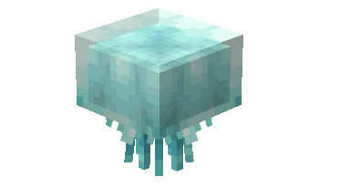

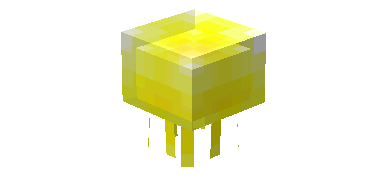

---

**Health: 10** [♥️♥️♥️]

---

**Classification:** [Animal](/minecraft.fandom.com/wiki/Animal) / [Aquatic](/minecraft.fandom.com/wiki/Aquatic)

---

**Behavior:** Passive

---

**Spawn:** 

Jellyfish: [Ocean](/minecraft.wiki/w/Ocean)

Small Jellyfish: [Warm Ocean](/minecraft.wiki/w/Warm_Ocean) & [Lukewarm Ocean](/minecraft.wiki/w/Lukewarm_Ocean)

---

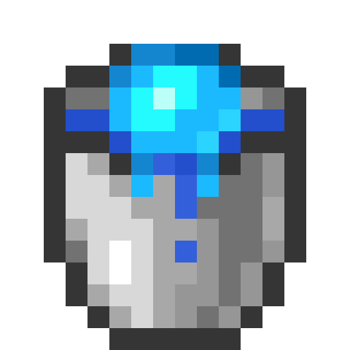

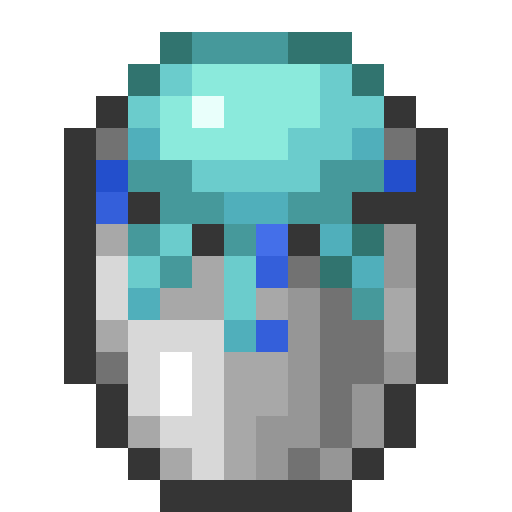

</aside>

---

### 🌎 Spawning

Jellyfish spawn between coordinates Y -20 & Y 64.

| Variant | Group | Biome |
| --- | --- | --- |
| Jellyfish | 1 | [Ocean](/minecraft.wiki/w/Ocean) |
| Small Jellyfish | 1 - 3 | [Warm Ocean](/minecraft.wiki/w/Warm_Ocean)
[Lukewarm Ocean](/minecraft.wiki/w/Lukewarm_Ocean) |

---

### ⚔️ Drops

Jellyfish [drops](/minecraft.fandom.com/wiki/Drops) upon death:

- 1 [Slime Ball](/minecraft.wiki/w/Slimeball)

*Note: The slime ball has a chance to drop but is not guaranteed upon death.*

- 🟢 1 - 2 [Experience](/minecraft.fandom.com/wiki/Experience) Orbs if killed by Player.

---

### 🧠 Behavior

Jellyfish move in clusters across the ocean. Their bright colors make them easily identifiable, but they tend to blend in with coral reefs. 

Jellyfish are passive aquatic creatures; however, if a player brushes up against one, they will be stung. This damage mimics running into a cactus. 

The player may collect jellyfish and small jellyfish by using a [water bucket](/minecraft.fandom.com/wiki/Water_bucket) on it, which gives the player a bucket of jellyfish/bucket of small jellyfish (with their variant color). Jellyfish placed with buckets do not despawn naturally. When that bucket is used against a block, it empties the bucket, placing water with the jellyfish swimming in it.

**Weakness:**

Jellyfish are unable to survive out of water. Outside of water, they lay with tentacles splayed around them until, eventually, they start to suffocate and die. Jellyfish cannot be put in a [cauldron](/minecraft.fandom.com/wiki/Cauldron).

---

### 🖼️ Gallery

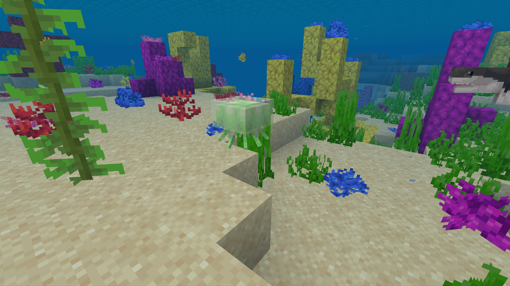

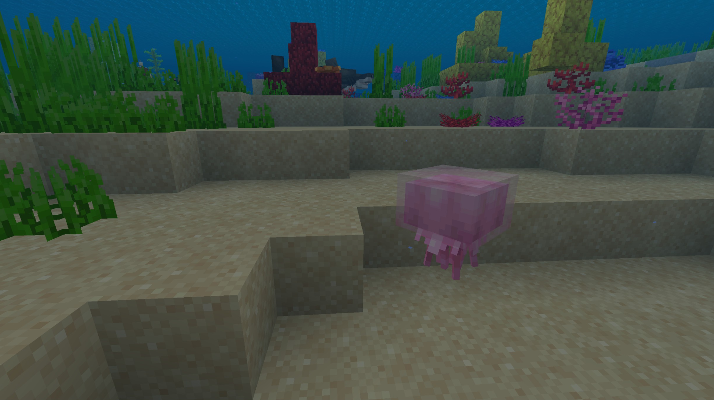

---

### 🎨 Variants

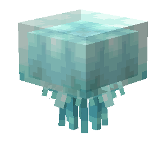

               Blue Jellyfish

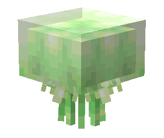

              Green Jellyfish

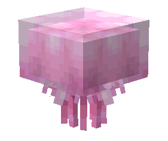

                Pink Jellyfish

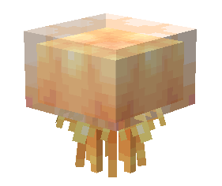

                        Yellow Jellyfish

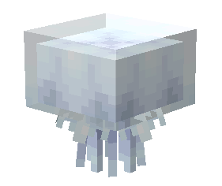

                         White Jellyfish

---

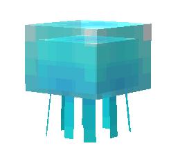

          Small Blue Jellyfish

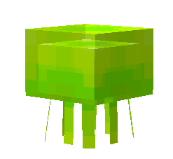

         Small Green Jellyfish

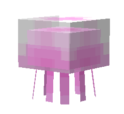

           Small Pink Jellyfish

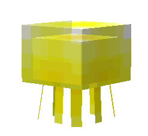

                Small Yellow Jellyfish

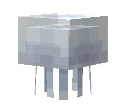

                Small White Jellyfish

---

<aside>
 Have additional questions? Want to be a part of our community? → [Join our Discord!](/discord.com/invite/starfishstudios)

</aside>

<aside>

[**Marketplace](/www.minecraft.net/en-us/marketplace/creator?name=Starfish%20Studios)      [CurseForge](/www.curseforge.com/members/starfish_studios/projects)      [TikTok](/www.tiktok.com/@starfishstudios)      [Instagram](/www.instagram.com/starfishstudiosinc/)      [Twitter](/twitter.com/starfishstudios)      [YouTube](/www.youtube.com/@starfishstudios)      [Website](/starfish-studios.com/)**

</aside>
