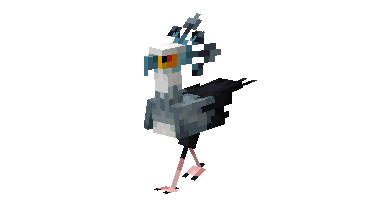
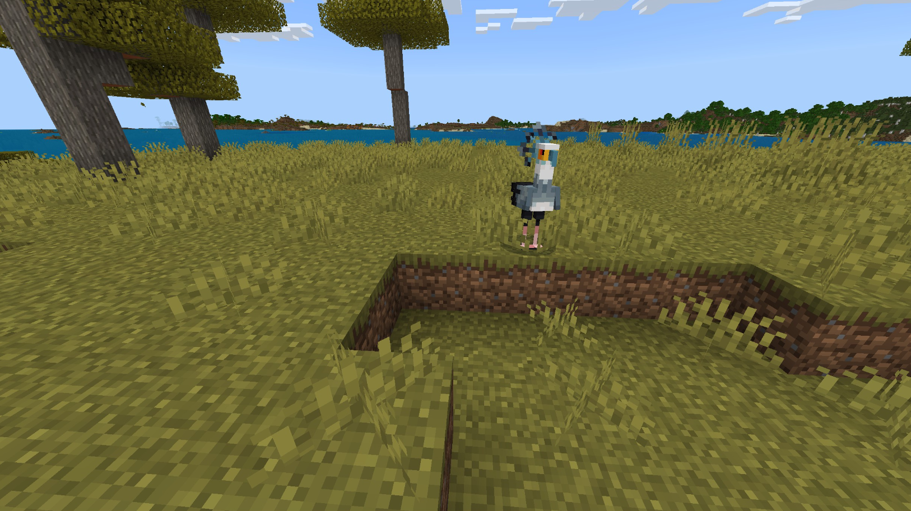
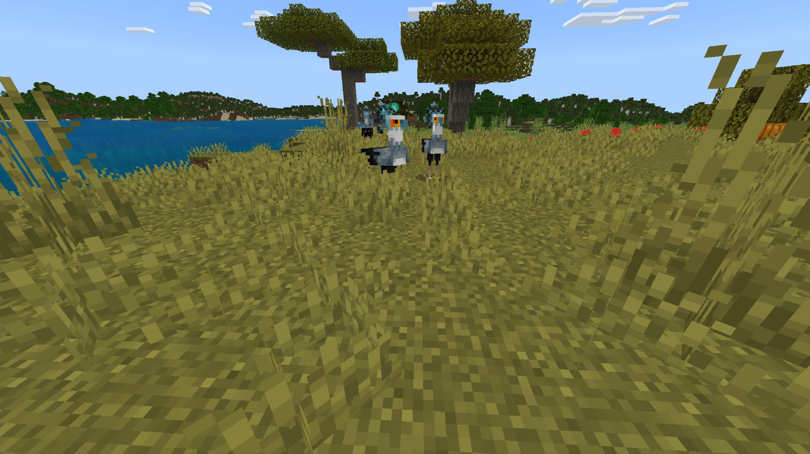

# Secretary Bird

Last Updated: April 22, 2025 8:47 PM

---

**Return**

🐻 [Naturalist Add-On Wiki](/www.notion.so/1a7a9a61c3f1800c8e32e893d6e7f430?pvs=21)

---

Secretary birds are native to Africa and are well known for their long legs and bright white feathers covering their bodies. Secretary birds have tough scales on their legs, which helps protect them from snake bites while they hunt. When they hunt their prey, they will swallow it whole!

<aside>

### **Secretary Bird**

---

**Health: 12** [♥️♥️♥️]

---

**Classification:** [Animal](/minecraft.fandom.com/wiki/Animal)

---

**Behavior:** Neutral

---

**Spawn:** [Savanna](/minecraft.wiki/w/Savanna)

---

</aside>

---

### 🌎 Spawning

A flock of 1-3 secretary birds will spawn in the [savanna](/minecraft.wiki/w/Savanna) biome. There is a 25% chance of a chick spawning if the group consists of 2-3 secretary birds. Their bright, unique coloration makes them easily identifiable in the savannas. They will spawn exclusively during the day with [light levels](/minecraft.fandom.com/wiki/Light) of 7-15.

---

### ⚔️ Drops

Peafowls [drops](/minecraft.fandom.com/wiki/Drops) upon death:

- 1 - 2 Feather
- 1 Drumstick
- 🟢 1 - 3 [Experience](/minecraft.fandom.com/wiki/Experience) Orbs if killed by Player

*Chicks yield no items nor experience.*

---

### 🧠 Behavior

Secretary birds are brightly colored neutral mobs that roam the savanna with their long legs. When they are hungry, they will stalk snakes, desert scorpions, and rats before pouncing on them. Luckily, these birds are immune to poison so they are safe from snake bites and scorpion stings!

---

### 🥚Breeding

Adult secretary birds with full health can be [bred](/minecraft.fandom.com/wiki/Breeding) with [phantom membranes](/minecraft.wiki/w/Phantom_Membrane). There is a 5-minute cooldown for breeding, during which the secretary bird does not accept phantom membranes for breeding.

The growth of chicks cannot be accelerated.

---

### 🖼️ Gallery

---

<aside>
 Have additional questions? Want to be a part of our community? → [Join our Discord!](/discord.com/invite/starfishstudios)

</aside>

<aside>

[**Marketplace](/www.minecraft.net/en-us/marketplace/creator?name=Starfish%20Studios)      [CurseForge](/www.curseforge.com/members/starfish_studios/projects)      [TikTok](/www.tiktok.com/@starfishstudios)      [Instagram](/www.instagram.com/starfishstudiosinc/)      [Twitter](/twitter.com/starfishstudios)      [YouTube](/www.youtube.com/@starfishstudios)      [Website](/starfish-studios.com/)**

</aside>
